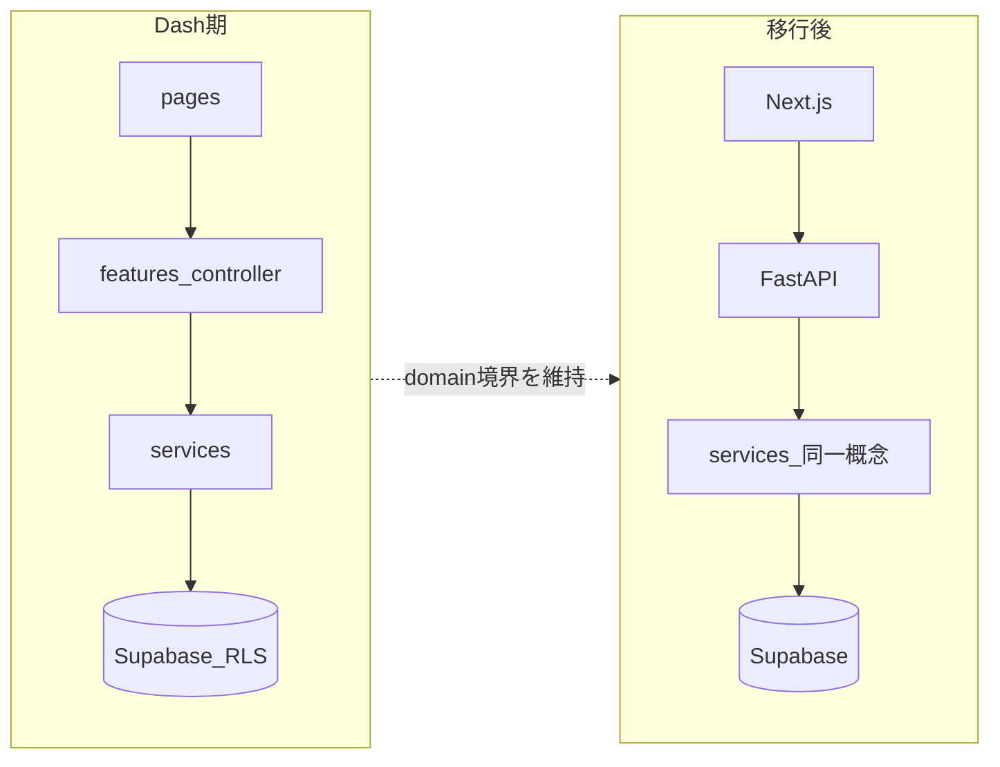

# AGENTS.md に書く内容（優秀な Web 開発者視点）

## 役割の切り分け（重複を避ける）

| ドキュメント | 役割 |
|-------------|------|
| [AGENTS.md](AGENTS.md) | **AI/エージェント向けの「常に守るルール」**：アーキ境界、認可・秘密情報、UI の正本、参照先へのリンク。短く保つ。 |
| [.cursor/rules/spec.md](.cursor/rules/spec.md) | 製品仕様・機能要件・登録フロー等の**詳細正本**（ファイル上は修正禁止の宣言あり）。AGENTS からは「必ず読む」とリンクのみでよい。 |
| [.cursor/rules/file_structure.md](.cursor/rules/file_structure.md) | **URL・ディレクトリ・Dash Pages 制約**の正本。 |
| [.cursor/rules/database_configuration.md](.cursor/rules/database_configuration.md) | **スキーマ・テーブル用語**の正本。 |
| [.cursor/rules/OAuth.md](.cursor/rules/OAuth.md) | **認証・環境変数・デプロイ**手順の正本。 |
| [DESIGN.md](DESIGN.md) | **デザインシステム**の正本（既に AGENTS で言及済み）。 |

方針: AGENTS.md に長文の仕様表を貼らず、**「どこを読めば十分か」**を明示する。

---

## 推奨セクション構成（本文イメージ）

### 1. プロダクト一文と技術スタック（現在）

- 推し活グッズ管理（概要は [spec.md](.cursor/rules/spec.md) に委譲）。
- **現在**: Python 3.11 想定、Flask（[`server.py`](server.py)）＋ Dash Pages（[`app.py`](app.py)）、dash-bootstrap-components、Bootswatch、Bootstrap Icons、Supabase（Auth / Postgres RLS / Storage）、Render デプロイ。
- **UI 実装**: モバイルファースト。テーマは Bootswatch 全件許容方針は [DESIGN.md](DESIGN.md) に従う。

### 2. 将来アーキテクチャ（Next.js × FastAPI）と「いまから守ること」

- **目標**: フロント Next.js、API FastAPI、認証・DB は Supabase を継続する想定（JWT 検証を API に載せるパターンが一般的）。
- **Dash 期にやるべきこと（エージェント向け要約）**:
  - **ドメイン・DB・外部 API**は [`services/`](services/) に置き、[`features/*/controller.py`](features/) と [`pages/`](pages/) は入力・表示・遷移・Dash 状態に寄せる（[file_structure.md](.cursor/rules/file_structure.md) の意図と一致）。
  - **テナント境界**: 行の `members_id` と RLS を前提にし、ユーザークライアント（[`get_supabase_client()`](services/supabase_client.py) 等）で触る。サービスロールは診断・限定用途のみ（詳細はコード・運用メモに委譲可）。
  - **URL クエリ・Store 由来の ID**で取得する場合は、認可・エラーメッセージの情報漏えいに注意（`Cursor.md` のセキュリティゲートと整合させてもよい）。

これにより、将来 FastAPI のルートが「`services` の薄いラッパ」になりやすい。

### 3. ファイルとルーティングのルール（短く）

- レイアウト・ページ・コールバックの置き場: [file_structure.md](.cursor/rules/file_structure.md) の `pages/` / `features/` / `components/` / `services/` / `assets/` に従う。
- Dash Pages の制約（存在しない ID をコールバックが参照しない等）を**変更時は必ず意識**する旨を1文（詳細は file_structure へ）。

### 4. データとストレージ

- DB スキーマ・用語は [database_configuration.md](.cursor/rules/database_configuration.md) を正とする。
- Storage: Private bucket + object path 保存 + signed URL 方針は [file_structure.md](.cursor/rules/file_structure.md) の「Storage の設定」節と整合。実装の手を入れるときは既存の `photo_service` 等の流儀に合わせる。

### 5. 認証・秘密情報・環境

- OAuth / PKCE / HttpOnly Cookie / 必須環境変数は [OAuth.md](.cursor/rules/OAuth.md) を正とする。
- **禁止事項を明文化**: `.env` の秘密を Git に含めない、本番ログにトークン・Cookie・署名 URL・`registration-store` 全文・画像 base64 を出さない（デバッグフラグ方針は [Cursor.md](Cursor.md) 等と役割分担）。

### 6. デザイン（既存の強化）

- 現行の「`DESIGN.md` に従う」を維持し、必要なら1行追加: **主要カードは `card-main-*`、例外は DESIGN の Neutral 方針**など（詳細は DESIGN に任せ、AGENTS では重複を最小化）。

### 7. 品質・変更時の姿勢（短いチェックリスト）

- 変更は依頼範囲に留める。仕様変更が疑わしいときは spec / DESIGN と矛盾がないか確認。
- 外部 API・IO は HTTPS、エラーは業務/システムを区別（ユーザー方針と整合）。
- パフォーマンス変更時は認可・オープンリダイレクト・テーマ URL 許可リスト等を崩さない（プロジェクト内の「PR レビュー観点」があれば AGENTS から1行リンク）。

### 8. 人間向けメモとの関係

- 日々の運用・計測・トラブルは [Cursor.md](Cursor.md) / [cursor_error.md](cursor_error.md)。AGENTS には「詳細は Cursor.md」と書く程度でよい。

---

## 実装時の注意（このプラン承認後の作業）

- [AGENTS.md](AGENTS.md) を上記セクションで**日本語・箇条書き中心**に拡張する（目安: 80〜150 行程度。spec の複製はしない）。
- `.cursor/rules` 内の「修正禁止」は**触らない**。AGENTS 側から相対パスでリンクする（例: `.cursor/rules/spec.md`）。
- [DESIGN.md](DESIGN.md) のバージョン番号は AGENTS に固定で書かず、「DESIGN.md の最新に従う」表現にするとメンテ負荷が下がる。

---

## 完了条件

- エージェントが **AGENTS.md だけ読んでも**「どこにコードを書くか」「何を絶対に壊してはいけないか」「詳細はどのファイルを読むか」が分かる。
- Dash 前提と Next/FastAPI 移行の**両方**が一文以上でつながっている。
- spec / file_structure / DB / OAuth / DESIGN への参照が揃っており、AGENTS が肥大化しすぎない。
