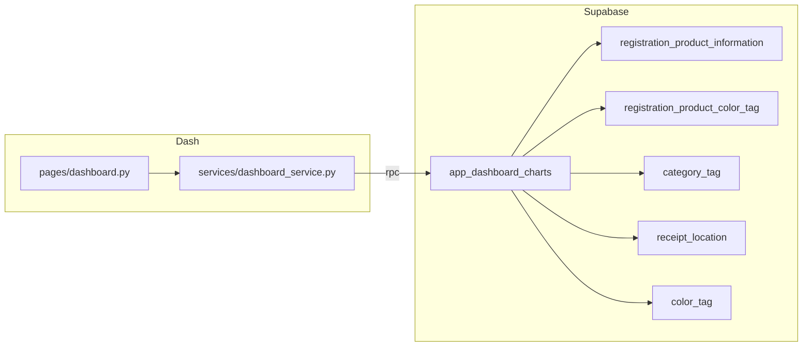

# ダッシュボード：ユーザー別実データグラフ化## 現状

- [`pages/dashboard.py`](pages/dashboard.py): `random` によるプレ��ン�「表示ボタン押下後のみ Plotly マウント」の1カードのみ。
- データ正本: [`registration_product_information`](.cursor/rules/database_configuration.md) に `purchase_price`, `purchase_date`, `registration_quantity`, `product_type`, `product_group_name`（他画面で利用実��あり）, `category_tag_id`, `receipt_location_id` 等。カラータグは [`registration_product_color_tag`](.cursor/rules/database_configuration.md) の多対多が正。
- 既存パターン: [`services/photo_service.py`](services/photo_service.py) の `get_product_stats` が [`app_registration_product_stats`](supabase/migrations/20260417120000_app_registration_product_stats.sql) を RPC 呼び出しし、失敗時はフォールバック。**`security invoker` + `where members_id = auth.uid()`** で RLS と整合。

## 実装方��（アー��テクチャ）

- **集計は DB 側（1 RPC・JSON 返却）**に寄せる。理由:コレクションが大きいときの全行 `select` 回避はプロジェクト方��（[`Cursor.md`](Cursor.md) のホーム統計記述と同趣旨）。
- **サービス��**:新規 [`services/dashboard_service.py`](services/dashboard_service.py�名）で `get_supabase_client()` 利用、`supabase.rpc("app_dashboard_charts", {...})` を実行。`members_id` は **クライアントに渡さず** RPC 内の `auth.uid()` のみ（情報漏えい・改��んリ�）。RPC 未デプロイ／例外時は **空データ�ユーザー向け短いエラー表示**（既存の業務/システムエラー区分に合わせる）。
- **ページ�**: [`pages/dashboard.py`](pages/dashboard.py) でレイアウトを複数カードに分割し、[DESIGN.md](DESIGN.md) の `card-main-*` / 中立カードのルールに沿う。未ログイン時は [`flask.g.user_id`](pages/gallery/detail.py) と同�いで、�線のみ（ホーム等と�える）。

## グラフ仕様（提案）

| 要件 | 実装案 |
|------|--------|
|累計��入金��（月別・日別・折れ線） | **期間ごとの��入��**を棒/折れ線の第2系列にし、**累計は折れ線の主系列**（ソート済み日付上の running sum）。切替: `dbc.RadioItems` またはタブで「月次 / 日次」。日次は **直近 90 日**（または 30 日）に限定して可読性を担保。 |
| 製品割合（キー��ルダー等） | **ドーナツ**（`go.Pie`）で `coalesce(nullif(trim(product_group_name),''), nullif(trim(product_type),''), '未分類')` をキーに **件数**（`registration_product_id` 数）を集計。金��ベースの割合が必要なら第2タブで切替可能にする（任意）。 |
| タグ集計 | **カテゴリタグ**: `category_tag`  join で名前別件数の横棒。**収��場所**: `receipt_location` join で同様。**カラータグ**: `registration_product_color_tag` × `color_tag` で **製品数**（`count(distinct registration_product_id)`）の横棒。件数0のタグはグラフから除外。�定（実装前にあなたの確認が欲しい点）

以下は **仕様確定**のため実装前に合意すると安全です。

1. **1行あ�入��**: `purchase_price` を「1点あたり」とみなし、**行の�入�� = `purchase_price * coalesce(registration_quantity, 1)`** とする（`purchase_price` / `registration_quantity` が NULL の行は 0 ��いで集計から除外するか要確認）。
2. **日付キー**: 時系列は原�� **`purchase_date`**。NULL の行は **時系列には含めない**（別途�入日未設定 N 件」など小さな注記をカード下に出す選択肢あり）。
3. **通��**:集計は整数�前提（`currency_unit` はグラフタイトル注記のみでも可）。

## DB マイグレーション（新規）

- 新ファイル例: `supabase/migrations/YYYYMMDDHHMMSS_app_dashboard_charts.sql`
- `create or replace function public.app_dashboard_charts(p_granularity text default 'month', p_daily_limit int default 90) returns jsonb`（引数は必要最小限。`p_granularity` は `'month'|'day'` のみ許可し、それ以外は `'month'` にフォールバックするチェックを関数内で）。
- 本体は **CTE** で各系列を構��し、最後に `jsonb_build_object('spend_series', ..., 'product_mix', ..., 'tags', ...)`。
- `security invoker`、[`search_path = public`](supabase/migrations/20260417120000_app_registration_product_stats.sql) と同様。
- `grant execute ... to authenticated`。

## Dash ページ変更（[`pages/dashboard.py`](pages/dashboard.py)）

- デモ用 `random` /旧トグル・旧ボタンを削除または「再読み込み」ボタンに置換。
- `dcc.Location` の `pathname` を `Input` にし **`/dashboard` 到達時**にサービス経由で RPC 実行（初回 POST は発生するが、ペイロードは集約 JSON のみ）。パフォーマンス方��を崩さないよう、**グラフは必要最小の `dcc.Graph`数**（例: 4〜5）に抑える。
- 月/日切替・（任意）再取得は `prevent_initial_call` の�いを整理し、[docs/dash_initial_callbacks_inventory.md](docs/dash_initial_callbacks_inventory.md) のダッシュボード行を実装後に更新する。

## 検証

- リポジトリルートで [`.cursor/skills/post-change-verify/SKILL.md`](.cursor/skills/post-change-verify/SKILL.md) に��い `compileall` と `pytest tests/`。
- 手動: ログイン済みで�入日・�格・タグが入ったデータで各グラフが期待どおりか、未�線のみか。

## スコープ外（今回含めない unless要望）

- 管理者向け全ユーザー横断集計。
- ローカル SQLite デモ DB との同期（[`services/local_storage.py`](services/local_storage.py) は本番フロー外なら触らない）。
