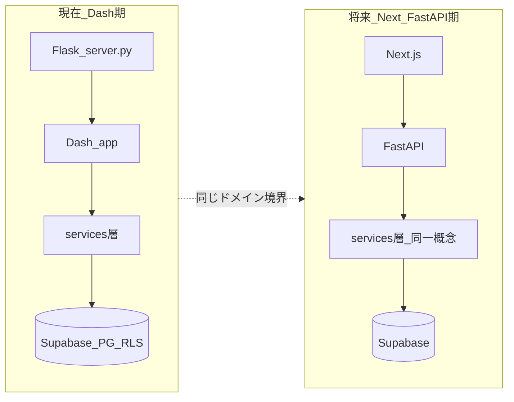

# Dash継続 × Supabase継続 × 将来 Next.js + FastAPI 向け実装順

## 前提（この計画が立てる土台）

- **認証・DB**: Supabase Auth + Postgres **RLS** + 行の **`members_id`**（[`services/supabase_client.py`](c:\Users\ryone\Desktop\oshi-app\services\supabase_client.py) のユーザークライアントで `auth.uid()` が効く）を継続する。
- **当面**: UI は Dash（[`app.py`](c:\Users\ryone\Desktop\oshi-app\app.py)、`features/*/controller.py`、`pages/`）。
- **将来**: FastAPI が「HTTP + 認可 + ユースケース」、Next が UI。Supabase は **Auth の発行体** と **DB/Storage** として残す想定が自然（JWT検証を FastAPI の依存注入に載せるパターンが多い）。

---

## フェーズ1: テナンシーとクライアント生成の「正」を一本化（最優先・移行コストが最も下がる）

**目的**: 「誰のデータか」と「どの Supabase クライアントで触るか」を漏れなく揃え、FastAPI にそのまま持ち上げられる骨格にする。

1. **現在ユーザーIDの取得を1か所に集約**  
   現状は [`services/photo_service.py`](c:\Users\ryone\Desktop\oshi-app\services\photo_service.py)、[`services/tag_service.py`](c:\Users\ryone\Desktop\oshi-app\services\tag_service.py)、[`services/registration_service.py`](c:\Users\ryone\Desktop\oshi-app\services\registration_service.py) などに `_current_members_id()` が分散。  
   **例**: `services/auth_context.py`（名前は任意）に `get_current_members_id() -> Optional[str]` / `require_members_id() -> str` を置き、各サービスはそこだけを import する。

2. **モジュール先頭の `supabase` 固定を避ける**  
   [`app.py`](c:\Users\ryone\Desktop\oshi-app\app.py) 23行付近の `supabase = get_supabase_client()` は、import 時点では Flask リクエストコンテキストが無く、**ユーザークライアントにならない**可能性がある。  
   **方針**: リクエスト処理・コールバック実行時に毎回 `get_supabase_client()` を呼ぶ（または「現在リクエスト用クライアント」ファクトリ1つに寄せる）。将来 FastAPI の `Depends(get_supabase)` に相当する形になる。

3. **`theme_service` のように `members_id` を引数で受ける層**  
   [`services/theme_service.py`](c:\Users\ryone\Desktop\oshi-app\services\theme_service.py) は呼び出し側依存が強い。**内部では必ず `get_current_members_id()` をデフォルトにする**か、**Dash 側は常に同じヘルパー経由でだけ呼ぶ**ルールを決める（呼び出し漏れ対策）。

4. **RLS とアプリ条件のギャップ棚卸し**  
   共有マスタ想定（例: [`services/icon_service.py`](c:\Users\ryone\Desktop\oshi-app\services\icon_service.py) が触る `icon_tag`）とユーザーデータを **一覧表で分類**（意図的に緩い / 緩いのは暫定で直す）。README の `owner_id` 表記と実装の `members_id` のズレも、将来のオンボーディングコストなので **どちらかに用語統一**（ドキュメントかスキーマのどちらか）。

---

## フェーズ2: Dash は薄く、ドメインは `services/` に寄せる（Next 移行時の最大の資産）

**目的**: 将来 FastAPI のルートハンドラが **ほぼ「サービス関数1呼び出し」** になる状態を目指す。

1. **コールバック（`features/*/controller.py`）の責務**  
   - 入力の受け取り、ローディング、エラー表示、リダイレクトのみ。  
   - DB・外部API・バリデーション・トランザクション相当のまとまりは **`services/` の関数** に寄せる（既に一部はその形）。

2. **「ユースケース単位」の関数シグネチャ**  
   例: `register_product(...)`, `list_products_for_current_user()` のように、**セッションから ID を取るのはサービス内（または薄い引数 `members_id` の1箇所）** に限定。Next の Server Action / Route Handler からも同じ関数を呼べる境界になる。

3. **デモ用フォールバックの方針を明文化**  
   [`services/data_service.py`](c:\Users\ryone\Desktop\oshi-app\services\data_service.py) のインメモリ `PHOTOS_STORAGE` は開発便利だが、本番挙動と二重管理になりやすい。**「Supabase 無し時だけ」** など条件を README かコメントで固定し、将来 FastAPI では別設定フラグに寄せる。

---

## フェーズ3: 将来 FastAPI にそのまま載せる「契約」の下準備（オーバーヘッド小・効果大）

**目的**: OpenAPI / 型でフロントとバックの接続を後で楽にする（いまから段階導入可能）。

1. **入出力のデータ構造を pydantic（または TypedDict）で定義**  
   最初は **新規機能・変更が大きい箇所だけ** でよい。同じモデルを後で FastAPI の `response_model` / `Body` に移す。

2. **エラー型の統一**  
   業務エラー（バリデーション）とシステムエラー（DB・外部API）を区別し、将来は HTTP ステータスにマッピングしやすい形（例: 独自例外 + メッセージコード）に寄せていく。

3. **環境変数と秘密情報の境界**  
   引き続き **サービスロールはサーバー専用**（[`get_secret_client`](c:\Users\ryone\Desktop\oshi-app\services\supabase_client.py) は診断・管理用途に限定）。Next 化後も **ブラウザに渡さない** 前提を維持。

---

## フェーズ4: 実際の Next.js × FastAPI 移行時の「一般的な」実行順（参考ロードマップ）

このフェーズは Dash 完成後でもよいが、**上記1〜3が済んでいると短時間で済む**。

1. **FastAPI プロジェクト新設** → 認証依存（Supabase JWT 検証、`sub` = `members_id`）を1か所に実装。  
2. **既存 `services/` をインポート**してルートを薄くラップ（OpenAPI 自動生成）。  
3. **Next.js** は生成クライアントまたは `fetch` で FastAPI のみ呼ぶ（または同一オリジン BFF）。  
4. **Dash ルートを機能単位で削除**（ストラングラーパターン）。  
5. **Cookie ドメイン / CORS / リフレッシュ**を本番 URL に合わせて整理（いまの [`server.py`](c:\Users\ryone\Desktop\oshi-app\server.py) HttpOnly 方針を FastAPI 側に移すか、Next BFF に寄せるかを決める）。

---

## 推奨する全体の順番（要約）

| 順番 | 内容 |
|------|------|
| 1 | テナンシー: `members_id` 取得の単一化 + クライアント取得のリクエストスコープ化 + RLS/テーブル棚卸し |
| 2 | アーキ: Dash コールバック薄型化、`services` にドメイン集約 |
| 3 | 契約: pydantic 等で入出力・エラー形式を新規中心に導入 |
| 4 | 移行: FastAPI で JWT + 既存 services ラップ → Next 接続 → Dash 縮小 |

---

## 意図的に「後回し」でよいもの

- ピクセル単位のデザイン刷新や大規模コンポーネント整理（**データ境界が固まってから**の方が手戻りが少ない）。  
- FastAPI / Next のリポジトリ物理分割（**モノレポのまま `api/` と `web/` を追加**でも十分一般的）。
