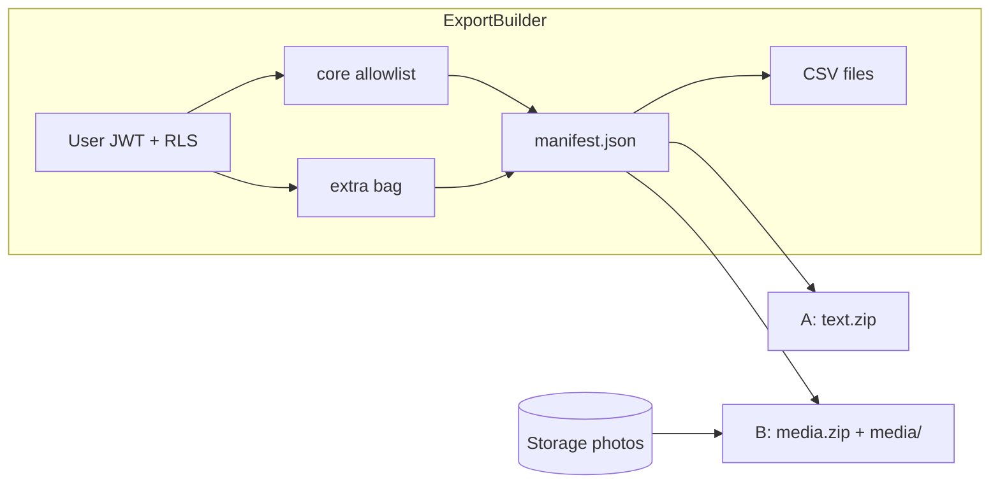

# データ書き出し（A テキスト＋ B 写真 ZIP）

## だれ向けか（画面上の説明にも使う）

| 種類 | だれ向け | 中身 | 待ち方 |
|------|----------|------|--------|
| **A テキスト** | 在庫・一覧管理 | 製品＋タグ／収納の JSON＋CSV。写真は ID／パスのみ | 押したらすぐダウンロード |
| **B 写真付き** | 推しキャラ整理・見た目も残したい | A と同じ文字データ ＋ 画像ファイルを ZIP | 「準備中」→ 完了後ダウンロード |

**共通方針:** 書き出しのみ（再取り込みはしない）。署名 URL はアーカイブに入れない。退会（`account_delete`）とは別機能。

## スキーマ変化に耐える契約（最重要）

単一の機械可読文書 `manifest.json` を正とする。

```text
format: "oshi_collection_export"
format_version: 1          ← 破壊的変更時だけ上げる
kind: "text" | "media"
exported_at, app: "oshi_app"
entities:
  category_tags / storage_locations / color_tags
  products / product_color_tags
  photos（meta。media 時は media_path で ZIP 内相対パス）
```

各レコードは次の形に固定する。

- **core**: 製品価値として安定させたい列だけ（名前・バーコード・値段・`currency_code`・メモ・タグ ID／名前スナップショット・日付など）。コード内の allowlist で明示。
- **extra**: DB 行のそれ以外をそのまま入れる（列追加しても古い読者は壊れない／新しい列は extra に現れる）。
- **写真**: path／`photo_id` のみ。期限付き signed URL は禁止。

人間向け（在庫）は同じスナップショットから生成する CSV（`products.csv` ほか）を同梱。CSV は「いまの一覧の見やすさ」優先で、将来の機械再取り込み用ではない。

将来インポートするときは `format_version` ＋ core を読む想定だが、**今回は実装しない**（UI／API にも誘導しない）。



## API（Web 本線・モバイル後続可）

共有定数を [`packages/shared/src/index.ts`](packages/shared/src/index.ts) に追加。

| メソッド | パス | 役割 |
|----------|------|------|
| `POST` | `/exports` | body `{ "kind": "text" \| "media" }`。JWT 必須 |
| `GET` | `/exports/{export_id}` | 状態 `pending` / `running` / `ready` / `failed` ＋完了時の取得情報 |
| `GET` | `/exports/{export_id}/file` | 成果物ダウンロード（`Content-Disposition`）。本人のみ |

振る舞い:

- **text**: 同期で ZIP（`manifest.json` ＋ CSV）を組み立て、ジョブをすぐ `ready` にしてファイルを返すか、短いジョブ＋即 `ready`（実装は同一ジョブ表に揃える）。
- **media**: 非同期。ジョブ作成 → 裏で Storage `photos` からバイト取得 → ZIP を一時置き場へ → `ready`。失敗は `failed` ＋ユーザー向け短文。
- 一覧ページング上限（100）をバイパスし、**サービス層で members_id 全件**をページング取得（既存 list API の cap に依存しない）。
- 同時実行: ユーザーあたり media は **1 本まで**（進行中があれば 409）。text は短時間レート制限のみ。
- 成果物 TTL: 例 24h で失効（期限後は 410）。秘密・メール・トークンは含めない。

業務は [`apps/api/app/services/`](apps/api/app/services/) の `export_service.py`。ルータは薄く。TDD: [`apps/api/tests/`](apps/api/tests/) で manifest 形・extra 振り分け・他ユーザー不可・signed URL 非含有・media 同時実行を先に Red。

## DB（ジョブ＋一時成果物）

新規表 `data_export`（命名は glossary／`docs/db` に合わせる。skill `db-schema-change`）:

- `export_id`, `members_id`, `kind`, `status`, `storage_path`（またはバイト保管方針）, `error_code`, `created_at`, `expires_at`
- RLS: `members_id = auth.uid()`。authenticated 最小 GRANT。
- 成果物: 専用 private バケット `exports`（path `{members_id}/{export_id}.zip`）。ダウンロードは API がユーザー JWT で読み出してストリーム（signed URL をクライアントに長寿命で渡さない／渡す場合は短命）。

ジョブ実行: 既存にキュー無しのため **FastAPI `BackgroundTasks` + DB 状態**で v1。プロセス再起動で orphan になり得る点は status を `failed` に寄せるタイムアウト掃除を入れる。本格ワーカーは後続。

## Web UI

- 設定ハブ [`apps/web/src/app/[locale]/settings/page.tsx`](apps/web/src/app/[locale]/settings/page.tsx) に「データ」節 → `/settings/export`
- ページ: 初学者向けに A／B の違いを短文で説明＋2 ボタン
  - 「一覧を書き出す（表・JSON）」→ text
  - 「写真付きで書き出す（ZIP）」→ media（進捗表示・完了後ダウンロード）
- i18n: `messages/ja.json` 正本 → skill `i18n-web-sync` で en
- 見た目は既存 settings のリンクカード／Button パターンに合わせる（`design-change`。Lab 3 案は不要な小画面）

## 製品仕様

- 新 ID `data_export`（Must 寄り・退会より先）。`planned` → 実装後 `partial`/`shipped`
- 更新: [`docs/product/roadmap.md`](docs/product/roadmap.md), [`docs/product/meta/feature_status.json`](docs/product/meta/feature_status.json), [`docs/product/acceptance/settings.md`](docs/product/acceptance/settings.md)（書き出し DoD）, 必要なら短い `flows/export.md`
- `expected_web_paths`: `/settings/export` / `expected_api_paths`: `/exports`, `/exports/{export_id}`, `/exports/{export_id}/file`
- 完了時 `python scripts/generate_product_docs.py`

**含めない（今回）:** インポート UI、設定 prefs（テーマ等）の完全ダンプ、退会連携、Expo 画面（API 契約だけモバイル可）。

## 実装順

1. 仕様ドキュメント＋ acceptance（feature `planned`）
2. migration `data_export` ＋ Storage バケット方針ドキュメント
3. Red: export_service / router テスト
4. Green: builder（core/extra）→ text ZIP → API
5. Green: media 非同期＋写真同梱＋同時実行制限
6. Web `/settings/export` ＋ i18n
7. `api-contract-sync` / `post-change-verify` /（Storage・認可）`secure-change-checklist`

## リスクと抑え方

| リスク | 抑え方 |
|--------|--------|
| 写真多くてタイムアウト | media は非同期＋TTL。件数上限を最初に設け必要なら段階緩和 |
| 列追加で壊れ | core allowlist + extra |
| 署名 URL 混入 | テストで `https://` 署名っぽいフィールドを禁止 |
| BackgroundTasks 消失 | expires／stale を `failed` にする掃除 |
