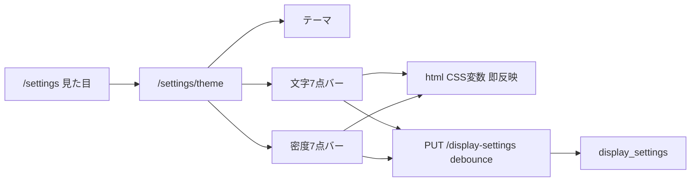

# 見た目設定（文字サイズ・UI密度）追加計画

## UX 判断（採用）

### 他社の「UI密度」7段階は参考になるか？

**結論: なる。行間だけの2〜3択より、密度として一括する方がこのアプリに合う。**

| 観点 | 判断 |
|------|------|
| 何が変わるか | 行間だけでなく、リスト行の縦余白・カード内パディング・セクション間隔まで連動させる |
| なぜよいか | ギャラリーで「たくさん見たい／ゆったり読みたい」は行間だけでは足りない。他社の密度バーはまさにその軸 |
| やらないこと | 文字サイズと密度を1本に混ぜない（大きい字＋コンパクト一覧は両立させたい a11y 要求） |
| ラベル | UI 文言は「UI密度」（補助: つめつめ ← → ゆったり）。「行間」単独名は使わない |

旧案の「行間 標準/広め」は **廃止**し、**UI密度 7段階**に置き換える。以前「後続候補」だった一覧密度も、今回このバーに吸収する。

### 文字の大きさ — 幅を広げる

**結論: Lab の3段階（1〜1.25）は狭い。7段階スナップに拡張。**

- 両端ラベル: **小** ← → **大**（中央が標準）
- 倍率（ルート基準）:

| level | 倍率 | 役割 |
|------:|-----:|------|
| 1 | 0.875 | いちばん小 |
| 2 | 0.9375 | |
| 3 | 1.0 | **標準（既定）** |
| 4 | 1.0625 | |
| 5 | 1.125 | 旧 Lab「大きめ」 |
| 6 | 1.25 | 旧 Lab「さらに大」 |
| 7 | 1.375 | いちばん大 |

連続値は保存しない。バーは7定点にスナップし、ドラッグ中も即 CSS 反映。

### 見た目は **1画面にまとめる**

ハブ「見た目」→ `/settings/theme` 1本。見出しを「見た目」に。

**画面構成（上→下）**

1. **テーマ** — 既存 `ThemePicker`
2. **文字の大きさ** — 7点スナップバー（即反映）
3. **UI密度** — 7点スナップバー（即反映）
4. **プレビュー** — 短文＋仮のリスト行2〜3本（字と余白の両方が見える）

### バー挙動

- 定点スナップ（見た目はスライダー、値は離散 1〜7）
- ドラッグ中から `html` の data 属性／CSS 変数へ即適用
- サーバーは debounce upsert（テーマと同型）

---

## データモデル（新規テーブル）

`theme_settings` と並列。テーマ表への列追加はしない。

| 列 | 型 | 既定 | 備考 |
|----|-----|------|------|
| `members_id` | uuid（PK構成） | — | `auth.users` CASCADE |
| `members_type_name` | text（PK構成） | `'default'` | テーマと同じ固定キー |
| `text_scale` | smallint | `3` | CHECK 1〜7 |
| `ui_density` | smallint | `4` | CHECK 1〜7（中央寄りを標準） |
| `created_at` / `updated_at` | timestamptz | now() | |

- 密度 level → CSS: `--line-height-body` / `--space-density` / リスト `gap` 倍率のテーブル（実装時にトークン定義。1=つめつめ … 7=ゆったり）
- RLS: `display_settings_self_all`
- migration で CREATE + GRANT authenticated + wire
- テンプレ: [`docs/db/new-table-template.sql`](docs/db/new-table-template.sql)
- 後: `table_labels.json` → `generate_db_docs.py`

---

## API / 共有契約

- `GET/PUT /display-settings` → `{ text_scale, ui_density }`（整数 1〜7、snake_case）
- allowlist（範囲外は 400）+ upsert
- `API_PATHS.displaySettings`
- テスト先書き: auth・範囲外・成功（[`test_theme_settings.py`](apps/api/tests/test_theme_settings.py) 型）

---

## Web 実装

| 層 | 内容 |
|----|------|
| CSS | `html[data-text-scale="1"…"7"]` / `html[data-ui-density="1"…"7"]` で倍率変数 |
| Hook | `useDisplaySettings` — localStorage + GET + debounce PUT |
| UI | 共用 `SteppedPresetSlider`（stops=7）×2 + プレビュー |
| Hub | 「見た目（テーマ・文字・密度）」 |

未ログインは local のみ。ログイン後サーバーとマージ。

**今回やらない:** モバイル設定 UI。

---

## 製品・デザイン文書

- acceptance: 文字7・密度7・見た目1画面・即反映
- `feature_status`: `display_settings`
- `docs/design/tokens.md` / a11y: 本番スケール表を記載
- `generate_product_docs.py` + DB docs

---

## 実装ステップ

1. docs（acceptance / feature_status）
2. Red: API pytest
3. DB migration + docs
4. Green: service / router / shared
5. CSS + hook
6. UI（バー＋プレビュー＋見た目画面化）
7. `post-change-verify`

---

## 友好的な UX 提案（今回スコープ外）

1. 読みやすさの短いヒント文（密度バー下の1行説明）
2. reduced motion の明示トグル
3. テーマ上部の「いまの見た目」ミニカード（色＋字＋密度の同時確認）

密度そのものは **今回実装に含む**（後回しにしない）。
