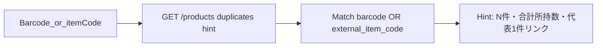

# ダブり土台＋照合・Oshi項目のUI公開

## 決めたこと

- **スコープは A（土台）**。交換／メルカリ専用画面・SNS・CLIP 類似検索は作らない（将来）。
- **同じグッズ判定キー**: バーコード **または** 楽天 `external_item_code` のどちらか一致でグループ化（両方あるときはどちらでもヒット）。
- **数量＋フラグ**:
  - 所持数 = 既存 `registration_quantity`（未設定時は UI 上 1 扱い）
  - 交換OK = `sales_desired_flag` + `sales_desired_quantity`（個数入力可）
  - 欲しい = `want_object_flag` のみ（専用数量列は無いので今回はフラグのみ。列追加はしない）
- **設定（きめ細かい人は個別上書き）**:
  - `keep_at_hand_count`（手元に残したい数。既定 1）
  - `auto_sales_desired`（ON なら、登録／更新時に `registration_quantity > keep_at_hand_count` のとき交換OKを自動ONし、余剰個数を `sales_desired_quantity` に入れる。ユーザーがフラグ／個数を手で触ったらその製品は「手調整済み」として自動上書きしない）
- 併せて: `works_series_name` / `title` / `purchase_date` の登録・詳細UI公開、キーワード照合の Web 配線、`genre_id`→カテゴリの緩い自動マッチ。

## データ／設定

### 製品列（既存を配線。migration で列は増やさない）

| 用途 | 列 |
|------|-----|
| 所持数 | `registration_quantity` |
| 交換OK | `sales_desired_flag`, `sales_desired_quantity` |
| 欲しい | `want_object_flag` |
| 作品 | `works_series_name`, `title` |
| 購入日 | `purchase_date` |

手調整済み判定: 新規 bool 列は増やさず、**設定ON時のみ「空／未設定からの初回保存」で自動適用**。詳細で一度でも交換OK欄を保存したら以降はユーザー値優先（簡易ルールを [`docs/product/register_fields.md`](docs/product/register_fields.md) に明記）。

### 表示設定（`display_settings`）

migration で2列追加（`db-schema-change`）:

- `keep_at_hand_count` smallint NOT NULL DEFAULT 1（1〜99）
- `auto_sales_desired` boolean NOT NULL DEFAULT false

[`display_settings` API / Web `/settings/register` 付近](apps/web/src/app/[locale]/settings/register/page.tsx) に「手元に残す数」「余剰を交換OKにする」を追加。

## 同じグッズ・所持ヒント強化

- 現状: [`findOwnedProductsByBarcode`](apps/web/src/lib/products/findOwnedByBarcode.ts) + 文言1件。
- 変更:
  - API: 製品一覧に `barcode` フィルタはあるので、**`external_item_code` での検索**を追加するか、専用 soft エンドポイント `GET /products/duplicate-hints?barcode=&external_item_code=`（認証必須・自分の行のみ）を追加して件数＋合計 `registration_quantity`＋代表IDを返す（推奨: 専用ヒントで Web を薄く保つ）。
  - 登録ウィザード（バーコード手順・確認）で「同じグッズが N 件（合計 M 個）あります」と表示。追加登録は妨げない（現行どおり）。

## 登録・詳細 UI

- [`StepConfirm`](apps/web/src/components/register/StepConfirm.tsx) / [`ProductDetailEditor`](apps/web/src/components/ProductDetailEditor.tsx):
  - 作品シリーズ名・タイトル・購入日
  - 所持数、交換OK（チェック＋個数）、欲しい（チェック）
- create/patch API・schemas・export core keys に上記を追加（TDD）。
- 優先順位: 手入力 > 自動（設定）> 空。楽天／Vision は数量フラグを触らない。

## キーワード照合（Web）

- API 既存: `POST /assist/barcode/keyword`（[`assist.py`](apps/api/app/routers/assist.py)）。
- 確認画面に「キーワードで楽天検索」入力＋実行。結果は既存候補ストリップと同じ適用（[`applyBarcodeCandidateToDraft`](apps/web/src/components/register/assist/applyBarcodeCandidate.ts)）。
- バーコード手順を壊さない（スキップ後の救済が主用途）。

## genre_id → カテゴリ自動マッチ

- Item Search は `genreId` のみ → サーバーで楽天 Genre Search（公式）を **soft fail** で名前取得し、既存 `category_tag_name` と完全一致／部分一致で `category_tag_id` 候補を返す（照合レスポンスに `suggested_category_name` 程度）。
- キー未設定・LIVEオフ・不一致時は何もしない（Vision の種類提案と共存。優先は user > barcode(genre) > vision）。
- Genre API キーは既存楽天 credentials を流用。失敗しても登録は通す。

## 仕様・ロードマップ

- [`register_fields.md`](docs/product/register_fields.md): Oshi／ダブり土台を「UI公開」に更新。CLIPは将来と明記。
- [`flows/register.md`](docs/product/flows/register.md) / acceptance: 数量・フラグ・所持ヒント件数・キーワード。
- `duplicate_exchange`: status を `planned` → **`partial`**（土台のみ。一覧フィルタ／交換画面は未）。
- `product-spec-sync` + as-built 再生成。

## 実装順（TDD）

1. 仕様ドキュメント更新（フィールド・自動付与ルール・判定キー）
2. `display_settings` migration + API/Web 設定UI
3. products create/patch/detail + export に数量・フラグ・作品・購入日
4. duplicate-hints API + 登録ヒントUI強化
5. キーワード照合 UI
6. genre soft match（余裕枠だが本計画に含める）
7. i18n / acceptance / post-change-verify

## やらないこと

- CLIP／画像類似によるダブり判定
- 交換・貸出・メルカリ専用フロー画面
- `want` 用の新数量列
- Amazon
- legacy 列 DROP
