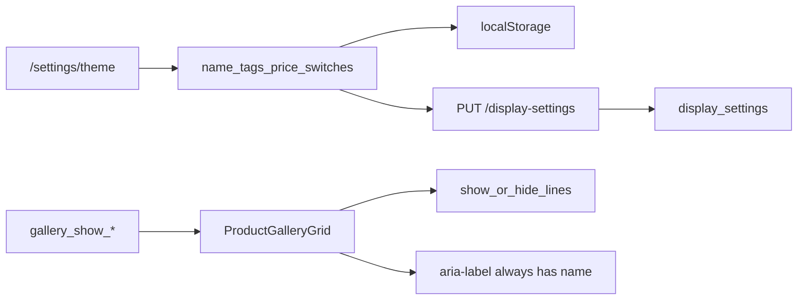

# ギャラリーカード表示項目（独立 ON/OFF）

## 確定方針

- **操作:** 独立スイッチ（名前 / タグ / 価格）。プリセット段階は使わない
- **名前も OFF 可**（見た目で探す・スクショ用）。**既定はすべて ON**（現状カードと同じ見え方を維持）
- **タグ** = 現状どおりカテゴリ＋収納を **1スイッチ**（色タグ分割・日付・バーコードは今回やらない）
- **保存:** JSON 黒箱は増やさない。既存 [`display_settings`](apps/api/app/services/display_settings_service.py) に boolean 列を足し、localStorage + debounced PUT（[`useDisplaySettings`](apps/web/src/hooks/useDisplaySettings.ts)）
- **設定 UI:** [`/settings/theme`](apps/web/src/app/[locale]/settings/theme/page.tsx) のレイアウト直下（「何を並べるか」の隣に「何を載せるか」）
- **モバイル専用 UI は今はやらない**（API 列は後から共有可）
- **ギャラリー画面内のクイック切替は今回やらない**（レイアウトと同様、設定が本線）



## UX（グッズ管理の便利さ）

| 観点 | 方針 |
|------|------|
| 初回 | 全部 ON → 今までのカードと変わらない |
| 写真で探す | 名前 OFF（必要ならタグ・価格も OFF）で情報を削る |
| 収納・分類を一覧で見る | タグ ON（名前 OFF でもチップだけ残せる） |
| コレクション金額 | 価格だけ ON/OFF |
| 発見性 | レイアウトの下に短いヒント「カードに載せる情報。写真だけの表示もできます」 |
| プレビュー | 既存見た目プレビュー付近に、ミニカード1枚で ON/OFF の結果を即確認（即反映は既存 hook と同じ） |
| a11y | 見た目で名前を消しても、リンクの **`aria-label` には常に商品名**（フォールバック含む）を載せる。スクリーンリーダーとフォーカスは壊さない |

**価格の意味:** OFF のときは `purchase_price` があっても出さない。ON でも価格未入力なら従来どおり非表示。

## データ / API

### `display_settings` 追加列（skill `db-schema-change`）

| 列 | 型 | 既定 | 意味 |
|----|-----|------|------|
| `gallery_show_name` | boolean | `true` | カードに名前 |
| `gallery_show_tags` | boolean | `true` | カテゴリ＋収納チップ |
| `gallery_show_price` | boolean | `true` | 購入価格行 |

- NOT NULL + DEFAULT true
- glossary（`gallery` / `show` / `name` / `tags` / `price`）→ docs/db 再生成
- `SELECT_COLS` / normalize / upsert に追加。非 boolean は 400（既存 allowlist 型）

### API TDD（先に Red）

[`apps/api/tests/test_display_settings.py`](apps/api/tests/test_display_settings.py): 成功 PUT、型不正、GET で既定 true、既存フィールドとの共存。

## Web（拡張しやすい形）

将来「日付」「バーコード」等がデータ連携できたら、**同じ手順で列＋1スイッチ**を足せるようにする（JSON は使わない）。

1. [`displayPrefs.ts`](apps/web/src/lib/displayPrefs.ts) にレジストリ:

```ts
export const GALLERY_CARD_FIELD_IDS = ["name", "tags", "price"] as const;
// sanitizeGalleryShow*(raw) → boolean（既定 true）
```

2. [`useDisplaySettings`](apps/web/src/hooks/useDisplaySettings.ts) / context に3フィールド＋ setter
3. [`ProductGalleryGrid.tsx`](apps/web/src/components/ProductGalleryGrid.tsx): props または hook から prefs を受け、`itemTitle` / `TagRow` / `PriceLine` をゲート。全レイアウト共通。**情報ゼロでもサムネ＋リンクは残す**
4. SSR の [`gallery/page.tsx`](apps/web/src/app/[locale]/gallery/page.tsx) / [`search/page.tsx`](apps/web/src/app/[locale]/search/page.tsx): `display_settings` 取得済みなので `galleryShow*` を `GalleryBrowse` → grid へ渡す（レイアウトと同型）
5. [`DisplaySettingsPanel.tsx`](apps/web/src/components/settings/DisplaySettingsPanel.tsx): `galleryLayout` の下に「カードに表示」セクション（Switch ×3＋1行ヒント＋簡易プレビュー）
6. i18n（`DisplaySettings`）— skill **`i18n-web-sync`** + `check_i18n_message_keys.py`
7. 小さな selftest（sanitize 既定・不正値）を prefs 側に足すなら既存 `*.selftest.ts` パターンに合わせる

UI は既存トークン／shadcn Switch。大きな見た目刷新や Design Lab 3案は不要（設定パネル追加）。skill **`design-change`** の軽いチェック＋ a11y（名前非表示時の `aria-label`）のみ。

## Docs / ステータス

- feature id `gallery_card_fields` → planned → shipped
- [`docs/product/acceptance/gallery.md`](docs/product/acceptance/gallery.md): 「設定で名前／タグ／価格の表示を切替。既定 ON。名前 OFF 時も a11y 名は維持」
- [`docs/product/acceptance/settings.md`](docs/product/acceptance/settings.md): 見た目画面にカード表示スイッチ
- [`docs/design/components.md`](docs/design/components.md) または tokens: 「情報は二次＋ユーザーが載せ方を選べる」を1行
- `generate_product_docs.py` / `generate_db_docs.py`、`cursor.md` 1行

## 将来追加のレシピ（今回実装しないが枠を意識）

候補例: `creation_date`、バーコード、色タグ。手順は毎回:

1. migration boolean 列 `gallery_show_<id>` DEFAULT true
2. API SELECT / sanitize / pytest
3. `GALLERY_CARD_FIELD_IDS` に id 追加＋ Switch ＋ i18n
4. `ProductGalleryGrid` に行をゲート

データが API の list item に乗るまで UI スイッチだけ先出ししない（空スイッチを増やさない）。

## 実装ステップ

1. docs（acceptance / feature_status）を先に更新可
2. Red: API pytest
3. DB migration + docs/db
4. Green: service / router body
5. Web prefs + hook + grid ゲート + SSR props
6. Settings UI + i18n + プレビュー
7. `post-change-verify` + product docs 再生成

skill 順: `tdd-workflow` → `db-schema-change` → `product-spec-sync` → `i18n-web-sync` → `design-change`（軽）→ `post-change-verify`。

## 検証

```powershell
$env:PYTHONPATH="apps/api"
python -m pytest apps/api/tests/test_display_settings.py -q
pnpm -C apps/web exec tsc --noEmit
python scripts/check_i18n_message_keys.py
python scripts/generate_product_docs.py
python scripts/generate_db_docs.py
```

手動: 見た目設定で名前 OFF → ギャラリーが写真中心／タグだけ残せる／価格 OFF で金額が消える／全部 OFF でもタップで詳細へ／SR で名前が読めること。
