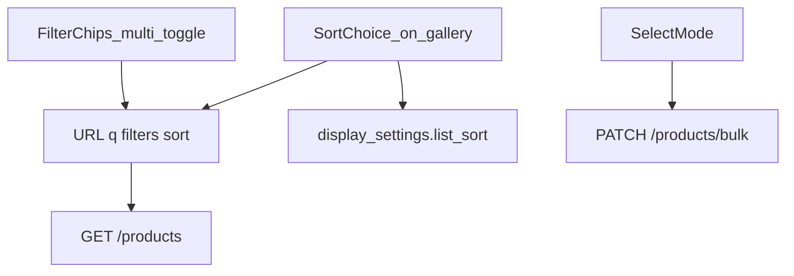

# ギャラリー：絞り込み強化＋並び UI＋一括収納

## 確定方針（合意済み）

| 項目 | 方針 |
|------|------|
| 並び | ギャラリー上で変更 → **URL `sort` に載せる** ＋ **`display_settings.list_sort` も更新**（次回も同じ） |
| 一括収納 | **専用 bulk エンドポイント**（1リクエスト）。今回は収納のみ。将来カテゴリ等を同 body に足せる allowlist 設計 |
| 複数フィルタ | **同種 OR・異種 AND**（例: カテゴリA\|\|B）∧（収納X\|\|Y）∧（色スロット…） |
| URL | 既存キーのまま **カンマ区切り**（`category_tag_id=1,2`）。単一 ID の旧 URL は互換 |
| 色 | **スロット番号**（`registered_product_color_tag` 正本）。カードへの色チップ表示は今回やらない |
| モバイル専用 UI | 今回やらない（API 契約は共有可） |



## UX

### フィルタチップ（カテゴリ／収納／色）

- 行ごとに「すべて」＋チップ。**トグル**：未選択→追加、選択中→外す（単一置換はやめる）
- 他次元・`q`・`sort` は常に保持（いまチップが `sort` を落とす穴を直す）
- 色行: ユーザの `color_tag` マスター（slot 1–7）を swatch＋名で表示。未設定スロットは出さない
- a11y: 行は `group`＋各チップ `aria-pressed`（複数可）

### 並び

- フィルタ直下に 3 択（新しい順／名前順／登録日古い順）。見た目は既存チップ／`ChoiceGroup` と同系
- 変更時: `router` で URL 更新 ＋ `useDisplaySettings().setListSort`（debounce PUT 既存）
- `buildGalleryListSearch` は **常に `sort` を書く**（既定 `newest` も省略しない方が詳細戻りでずれにくい。または常に明示——実装は「常に明示」）

### 一括収納

- 「選択」トグル → カードタップが詳細遷移ではなく選択切替（チェック／リング）
- バー: 「N件選択」「収納を変更…」「クリア」「キャンセル」
- 収納ピッカーは既存 [`TagChipPicker`](apps/web/src/components/tags/TagChipPicker.tsx) 流用。「収納なし」も可
- 成功後: 選択解除＋一覧を再取得（または楽観的にローカル更新）。失敗は件数＋メッセージ

Lab B の写真主役カードは壊さない（選択モード時のみオーバーレイ／チェック）。

---

## クエリ契約（メンテの要）

[`galleryListQuery.ts`](apps/web/src/lib/galleryListQuery.ts) を配列化の単一正本にする。

```ts
export type GalleryListQuery = {
  q?: string;
  category_tag_ids?: number[];   // 空＝指定なし
  storage_location_ids?: number[];
  color_tag_slots?: number[];    // 1..7
  offset?: number;
  sort?: ListSortId;
};
```

- **parse:** `parseIdList("1,2")` / 単一 `"3"` も可。不正・重複は落とす。slot は 1–7 のみ
- **build / productsApiPath / galleryDetailHref:** すべて配列＋`sort` を通す（詳細戻りで条件復元）
- selftest: 単一互換・CSV・空・不正・ソート保持

API echo（list レスポンス）も配列に揃える（`category_tag_ids` 等）。旧キー単数は **出さない**（Web は新契約のみ。ブックマークの単数 URL は parse で配列化）。

---

## API

### 1. `GET /products` フィルタ拡張

[`products.py`](apps/api/app/routers/products.py) / [`product_service`](apps/api/app/services/product_service.py) / [`supabase_user.fetch_products_page`](apps/api/app/infra/supabase_user.py)

| クエリ | 意味 |
|--------|------|
| `category_tag_id` | カンマ区切り or 単一 → `list[int]` → `.in_()` |
| `storage_location_id` | 同上 |
| `color_tag_slot` | カンマ区切り → slots。junction 経由で product id を絞ってからページング |

色の実装方針（ページング正しさ優先）:

1. `registered_product_color_tag` で `slot.in_(…)` かつ `members_id` の product id 集合を取得
2. 本体クエリに `.in_("registered_product_id", ids)`（空集合なら即空ページ）
3. カテゴリ／収納の `.in_()` と AND

TDD: [`test_products.py`](apps/api/tests/test_products.py) 等にパススルー＋不正値。infra は mock で `.in_` 呼び出しを検証できる範囲で。

### 2. `PATCH /products/bulk`（新規）

```json
{
  "registered_product_ids": [1, 2, 3],
  "storage_location_id": 12,
  "clear_storage_location": false
}
```

- パス: [`API_PATHS`](packages/shared/src/index.ts) に `productsBulk: "/products/bulk"`（`{id}` ルートと衝突しない）
- **ids:** 1〜100、重複除去。所有外は無視せず **全体 400**（部分成功を避けて予測可能に）
- 収納: 既存 PATCH と同じ所有チェック。`clear_storage_location: true` で null
- 将来用にスキーマはフィールド追加しやすい形（今回は収納以外無視／未送出）
- レスポンス: `{ "updated_count": n, "registered_product_ids": [...] }`
- skill **`api-contract-sync`** + TDD 先書き

---

## Web 実装マップ

| 層 | 内容 |
|----|------|
| Query | `galleryListQuery` 配列化＋selftest。`ProductSearchForm` も `sort`/他フィルタ保持 |
| Chips | [`GalleryFilterChips`](apps/web/src/components/gallery/GalleryFilterChips.tsx): トグル href・色行・sort 行（または隣接 `GallerySortChips`） |
| Sort→prefs | 並びチップ onClick: `setListSort` ＋ `Link`/`router.push`（二重更新に注意: setListSort のみだと SSR 一覧は URL 必須） |
| SSR | [`gallery/page.tsx`](apps/web/src/app/[locale]/gallery/page.tsx): color tags 取得、新 query を Browse へ。search は sort 保持程度で色フィルタはギャラリー本線 |
| Grid | [`ProductGalleryGrid`](apps/web/src/components/ProductGalleryGrid.tsx): 任意 `selectionMode` / `selectedIds` / `onToggleSelect`。通常時は現行 Link |
| Bulk UI | `GalleryBulkBar` + Browse 内 state。収納一覧はページ SSR 済みを渡す |
| i18n | `Gallery` NS（色・並び・選択・一括）— **`i18n-web-sync`** |

---

## Docs / ステータス

- feature ids（例）: `gallery_filters_v2`（色＋複数）、`gallery_sort_ui`、`gallery_bulk_storage` — 実装後 `shipped`
- [`acceptance/gallery.md`](docs/product/acceptance/gallery.md) / [`flows/gallery.md`](docs/product/flows/gallery.md): OR/AND・URL・並び同期・一括
- `flows/gallery.md` の「Dash thumb/list」「やらない」注記を現状に合わせて修正（`gallery_layout` は設定済み）
- `generate_product_docs.py`、`cursor.md` 1行

DB migration **不要**（既存 FK / junction / display_settings のみ）。

---

## 実装ステップ（依存順）

1. **契約:** `galleryListQuery` 配列＋selftest、API list の多 ID／色スロット（Red→Green）
2. **UI 探す:** FilterChips トグル＋色行、Sort 行＋prefs 同期、SSR／detail href
3. **bulk:** API Red→Green、`API_PATHS`、契約同期
4. **選択 UI:** Grid 選択モード＋BulkBar
5. docs / i18n / `post-change-verify`

skill 順: `tdd-workflow` → `api-contract-sync` → `product-spec-sync` → `i18n-web-sync` → `design-change`（軽）→ `post-change-verify`。

## 検証

```powershell
$env:PYTHONPATH="apps/api"
python -m pytest apps/api/tests/test_products.py apps/api/tests/test_display_settings.py -q
node --experimental-strip-types apps/web/src/lib/galleryListQuery.selftest.ts
pnpm -C apps/web exec tsc --noEmit
python scripts/check_i18n_message_keys.py
python scripts/check_api_contract_sync.py
python scripts/generate_product_docs.py
```

手動: カテゴリ2つ OR／収納 AND／色スロット絞り／並び変更→設定画面でも同じ／選択して収納一括→詳細戻りでフィルタ維持。
