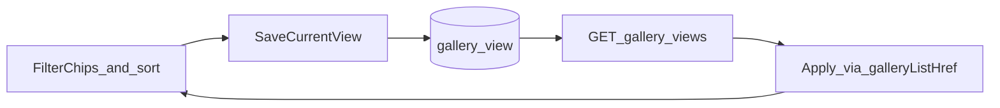

# ギャラリー保存済みビュー（無料・上限20）

## 確定方針

- **無料**（課金フラグなし）
- **上限 20件／メンバー**（API で拒否）
- **新表 `gallery_view`**（`display_settings` に JSON 黒箱を増やさない）
- **UI はギャラリー画面のみ**（設定ページ管理は後続）
- クエリ契約は既存のまま再利用（[galleryListQuery.ts](apps/web/src/lib/galleryListQuery.ts) ＋ `v=1`）

## 1. DB（skill `db-schema-change`）

migration 例: `supabase/migrations/20260904160000_create_gallery_view.sql`

| 列 | 型 | 備考 |
|----|-----|------|
| `gallery_view_id` | `bigint` identity PK | |
| `members_id` | `uuid` → `auth.users` CASCADE | |
| `view_name` | `text` | 1〜40文字、`(members_id, view_name)` UNIQUE |
| `q` | `text` null | 空は null |
| `category_tag_ids` | `integer[]` not null default `{}` | |
| `storage_location_ids` | `integer[]` not null default `{}` | |
| `color_tag_slots` | `integer[]` not null default `{}` | 要素は 1..7（CHECK） |
| `list_sort` | `text` | `newest` / `name` / `created_at` |
| `display_order` | `int` not null default 0 | 第1版は作成順＋この列で安定ソート |
| `created_at` / `updated_at` | `timestamptz` | |

- RLS: `gallery_view_self_all`（`auth.uid() = members_id`）
- GRANT: `authenticated` CRUD、`service_role` ALL、`anon` なし（[new-table-template.sql](docs/db/new-table-template.sql) に準拠）
- 即 **wired**: [table_labels.json](docs/db/meta/table_labels.json) に追加 → ライブ適用 → `generate_db_docs.py`（glossary 不足があれば追記）

タグ削除時の自動掃除はしない（無効 ID は適用時にそのまま URL へ。結果0件になり得る）。

## 2. API（TDD → Green）

- `packages/shared`: `API_PATHS.galleryViews = "/gallery-views"`、`galleryView(id)` 相当の定数
- 新規: `apps/api/app/services/gallery_view_service.py`、`routers/gallery_views.py`、`schemas`、tests
- `main.py` にルータ登録
- skill `api-contract-sync`

| メソッド | パス | 内容 |
|----------|------|------|
| GET | `/gallery-views` | 自分の一覧（`display_order`, `gallery_view_id`） |
| POST | `/gallery-views` | 作成。件数≥20 で 400。名前 trim・重複は 400 |
| PATCH | `/gallery-views/{gallery_view_id}` | 名前のみ変更可（第1版） |
| DELETE | `/gallery-views/{gallery_view_id}` | 削除 |

ボディ（snake_case）は表列と一致。配列は空配列可。`list_sort` 必須（既定 `newest` 可）。

## 3. Web UI

新規コンポーネント例: `GallerySavedViewsBar.tsx`（[GalleryFilterChips](apps/web/src/components/gallery/GalleryFilterChips.tsx) の直上または直下）

- 保存ビューをチップ／ボタンで列挙 → タップで `galleryListHref(viewToQuery(view))` へ遷移 ＋ `useDisplaySettings().setListSort(sort)`（並びチップと同契約）
- **現在の条件を保存**: 名前入力（簡易 prompt または短いインライン）→ POST。条件が空（フィルタなし・並びだけ）でも保存可
- **削除**: 各ビューに削除（確認は短く）
- 変換ヘルパ: `apps/web/src/lib/galleryViewQuery.ts`（view ↔ `GalleryListQuery`）。offset は適用時に落とす
- i18n: skill `i18n-web-sync`（ja 正本 → en）
- SSR: [gallery/page.tsx](apps/web/src/app/[locale]/gallery/page.tsx) で一覧を fetch してクライアントに渡すか、バー内で client fetch。既存タグ取得と同型なら SSR `apiFetch` が望ましい

## 4. 仕様・検証

- [flows/gallery.md](docs/product/flows/gallery.md) / [acceptance/gallery.md](docs/product/acceptance/gallery.md)
- `feature_status` + `roadmap`: `gallery_saved_views` = shipped（無料・上限20）
- [cursor.md](cursor.md) 追記
- `generate_product_docs.py` + `post-change-verify`（pytest / web lint+tsc / i18n / naming）
- DB 適用後 `get_advisors(security)`（skill どおり）

## やらない（第1版）

- 課金・プラン分岐
- 設定画面の管理 UI
- ビュー並び替え UI（列だけ用意）
- モバイル専用画面
- ビューの共有 URL 専用形式（適用結果は通常の `v=1` クエリ）
