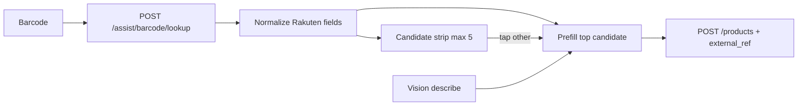

# グッズ登録項目の本格化（楽天必須参照＋任意リンク＋列整理）

## 決めたこと（今回の前提）

- **再購入が主目的。** アフィリエイトは楽天照合時にサーバーで付与されたURLをそのまま保存する（成果目的の別設計は後回し）。
- **楽天由来は必須セット**（照合で候補を選んだとき）: `product_url`（アフィ優先） / `rakuten_item_code` / `shop_name`。手入力だけの登録では楽天行は不要。
- **別の任意欄**: メルカリ等の発送・再購入用URL（ソース `manual`）。
- **将来Amazon等** → 列増殖せず [`product_external_ref`](docs/db/new-table-template.sql) 系の外部参照表。
- **候補UX（初学者向け・最良）**: 先頭1件を自動で入れる＋すぐ下に「ちがう商品？」候補リスト。詳細は後述。
- **見た目系**はDB列を増やさず、既存Vision（カテゴリ／色／見た目タグ→メモ）で提案継続。
- **48列の洗い出し**はこの計画に含め、UIは当面「出さない／廃止候補」を仕様に明記（破壊的DROPはしない）。

---

## 初学者向け: 候補の出し方（なぜこのUXか）

バーコード検索は「同じ番号で複数の店の商品」が返ることがあります。

| 方式 | 分かりやすさ | 速さ | 誤登録リスク |
|------|--------------|------|--------------|
| 先頭だけ自動入力 | 操作が少ない | 最速 | 違う店の商品でも気づきにくい |
| 毎回リストから選ぶ | 間違いにくい | 遅い・面倒 | 低い |
| **自動入力＋候補で差し替え（採用）** | 「もう入ってる。違うときだけ触る」 | 速い | 候補が見えるので低い |

**画面の動き（確認ステップ）**

1. 照合成功 → いちばん上の候補で商品名・価格・楽天URL／店名を自動入力（「楽天から入れました」と短い注記）。
2. その下に候補カード（最大5件・サムネ＋名前＋価格＋店名）。
3. 別カードをタップ → 入力欄ごと差し替え（手で直した欄は上書きしない＝既存の `user > barcode > vision`）。
4. 楽天を使わない／スキップ → 楽天必須セットは空のまま登録可。任意URLだけ手で入れられる。

これなら「何も選ばなくて登録できる」のに、「違う商品だったらここを押す」が一目で分かります。

---

## データモデル

### 新規表 `product_external_ref`（ユーザー所有・RLS）

テンプレ準拠: [`docs/db/new-table-template.sql`](docs/db/new-table-template.sql) + skill `db-schema-change`。

| 列 | 役割 |
|----|------|
| `product_external_ref_id` | PK |
| `members_id` | テナント |
| `registered_product_id` | FK → `registered_product` CASCADE |
| `source` | `rakuten` / `amazon`（将来） / `manual` |
| `external_item_code` | 楽天 `itemCode`。`rakuten` では必須 |
| `product_url` | 再購入用URL。楽天はアフィ優先。`manual` でも必須 |
| `shop_name` | 楽天 `shopName`。`rakuten` では必須 |
| `label` | 任意（例: メルカリ）。`manual` 向け |
| `is_primary` | 主リンク（再購入ボタン用）。製品あたり1つをアプリ側で維持 |
| `created_at` / `updated_at` | 監査 |

制約（アプリ＋DBで担保）:

- `source=rakuten` → `external_item_code` / `product_url` / `shop_name` NOT NULL
- `source=manual` → `product_url` NOT NULL、`external_item_code` は NULL 可
- 同一製品で `source=rakuten` は最大1行（Amazonも将来1行）。`manual` は当面1行（シンプル）
- `UNIQUE (registered_product_id, source)`（manual も1行ポリシー）

`registered_product` 本体へ楽天専用列は足さない（Amazon拡張のたびに列が増えない）。

### `purchase_location` との関係

楽天 `shop_name` は **外部参照に必須保存**しつつ、確認画面では既存 `purchase_location` へ **推奨プレフィル**（空のときのみ）。ユーザーが買った店と出品店が違う場合に直せる。

---

## 楽天API側（公式に沿った拡張）

正本: [Ichiba Item Search 2026-07-01](https://webservice.rakuten.co.jp/documentation/ichiba-item-search)  
実装: [`apps/api/app/services/barcode_lookup_service.py`](apps/api/app/services/barcode_lookup_service.py)

`_normalize_item` を拡張（snake_case）:

- `name` ← `itemName`（必要なら `catchcopy` は別キー `catchcopy` で返すのみ。名前自動結合はしない）
- `price` ← `itemPrice`
- `product_url` ← `affiliateUrl` があればそれ、なければ `itemUrl`
- `shop_name` ← `shopName`
- `external_item_code` ← `itemCode`
- `image_url` ← `mediumImageUrls[0]`（候補UI用・Storage保存しない）
- `genre_id` ← `genreId`（カテゴリ自動マッチは後続。今回は返すだけでも可、マッチ実装は余裕があれば）

既存どおり `affiliateId` はサーバー env のみ。モバイル／Webから楽天直叩きなし。

テスト: [`apps/api/tests/test_barcode_lookup_soft.py`](apps/api/tests/test_barcode_lookup_soft.py) を Red→Green で項目追加。

---

## 登録・詳細 UI / API

### Assist → Draft

- [`RegisterWizard.tsx`](apps/web/src/components/register/RegisterWizard.tsx): 先頭自動適用に加え候補ストリップ。
- [`types.ts`](apps/web/src/components/register/types.ts): アイテム型を上記フィールドに合わせる。
- [`assist/types.ts`](apps/web/src/components/register/assist/types.ts): `FieldSources` に `purchase_location` / 外部URL系を追加。優先順位は **user > barcode > vision > empty** を維持。
- Vision: [`applyAssistToDraft.ts`](apps/web/src/components/register/assist/applyAssistToDraft.ts) の見た目提案は現状維持（`product_type`→カテゴリ、色スロット、見た目タグ→メモ）。楽天URLはVisionで上書きしない。

### 確認画面の欄

1. **楽天ブロック（候補選択時は必須表示）**: URL・商品コード・店名（読み取り中心＋「楽天で開く」）。未選択時は非表示または「未連携」。
2. **任意リンク**: 「その他のURL（メルカリなど）」＋任意ラベル。
3. 既存 Core/Oshi 欄は維持。`shop_name`→`purchase_location` 推奨。

### 永続化

- `create_product_for_member` / patch 系: 製品保存後に `product_external_ref` を upsert（楽天行・manual行）。
- 詳細: [`ProductDetailEditor.tsx`](apps/web/src/components/ProductDetailEditor.tsx) で参照の表示・編集・主リンク。
- shared `API_PATHS` が必要ならネスト（例: 製品詳細に `external_refs[]` を同梱）を優先し、エンドポイント乱立を避ける。

### i18n

ja 正本→en: skill `i18n-web-sync`。

### 表記

[`docs/legal/services.json`](docs/legal/services.json) に「照合結果表示・再購入リンク（アフィID付与時）」の一文を足し notices 再生成。UIに短い「楽天市場の情報」注記。

---

## 48列: 当面のUI方針（DROPしない）

| 区分 | 列 | 方針 |
|------|-----|------|
| **現行UI維持** | `product_name`, `photo_id`, barcode, `purchase_price`, `currency_code`, `purchase_location`, `memo`, `category_tag_id`, `storage_location_id`, `character_name`, `product_group_name` + 色ジャンクション | そのまま |
| **推し活・近い将来UI候補（仕様に残す）** | `works_series_name`, `title`, `purchase_date`, `list_price`, 数量・want/ダブり系フラグ | 今は隠す。Phase2（支出・ダブり）で段階公開 |
| **Vision担当（DB列を増やさない）** | 見た目タグ、色、種類 | 既存Vision→カテゴリ／色／メモ |
| **廃止候補（UI非表示・APIも書かない）** | 旧FKスカラー（`works_series_id` 等）, `color_tag_id`, `storage_location_tag_id`, `currency_unit_id`, `campaign_id`, サイズ3列, `product_type` 列, `copyright_*`, `freebie_*`, `other_tag` | ドキュメントで「legacy・触らない」。物理DROPは別判断 |
| **システム** | `members_id`, `creation_date`, `updated_date` | 現状どおり |

成果物: [`docs/product/`](docs/product/) に短い **登録フィールド辞書**（Core / Oshi / External / Hidden-legacy）と [`docs/product/flows/register.md`](docs/product/flows/register.md) の更新。`feature_status` に `product_external_ref` / 候補UIを `planned`→実装後 `partial`/`shipped`。as-built は `python scripts/generate_product_docs.py`。

---

## 実装順序（TDD）

1. **仕様ドキュメント**（フィールド辞書・列方針・フロー追記）— 承認後すぐ
2. **APIテスト**（normalize 拡張・soft status維持）→ `_normalize_item` Green
3. **migration** `product_external_ref` + RLS + docs/db 再生成（`db-schema-change`）
4. **product create/patch/detail** で external_refs 読み書き（pytest）
5. **Web**: 型・候補ストリップ・任意URL欄・詳細編集（コンポーネントテスト／既存 selftest 流儀）
6. **legal / i18n / product-spec-sync / post-change-verify**

モバイルは同一API契約を前提に、今回は Web 登録・詳細を主戦場（モバイルはパス定数共有まで）。

---

## やらないこと（スコープ外）

- Amazon API 実装
- 楽天画像の Storage 自動保存
- レビュー点数・送料・ポイント倍率のDB化
- legacy 列の DROP migration
- 登録本保存を楽天成功必須化（スキップ登録は維持）
