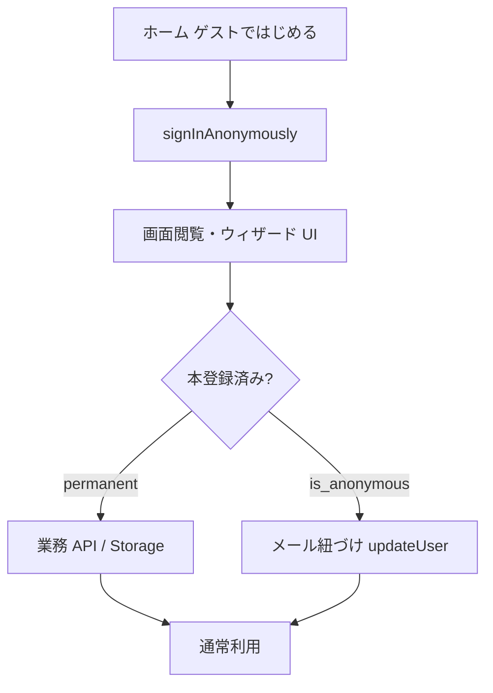

# ゲスト開始（Anonymous）＋本登録ゲート

## 採用方針（確定）

- **ゲストの正体:** Supabase [`signInAnonymously()`](https://supabase.com/docs/guides/auth/auth-anonymous)（JWT あり・`is_anonymous: true`）。ローカルのみゲストは採用しない。
- **できること:** ホーム／空のギャラリー・検索・設定シェル／**登録ウィザードの画面操作**（下書きは端末内）。
- **できないこと（本登録必須）:** 製品保存、写真アップロード、バーコード照合 API、Assist、タグ／収納のサーバー CRUD、書き出し・退会以外の業務 API 書き込み全般。
- **本登録:** 同一 `auth.users.id` にメール（＋パスワード）を紐づける（`updateUser` → メール確認 → パスワード）。`members_id` は変わらない。
- **スコープ:** Web 本線。Expo 画面は作らない（API 契約は共通）。
- **公開が限定的な前提:** Turnstile 等の匿名 abuse 対策は一般公開前の ToDo（[`docs/WAKE_UP.md`](docs/WAKE_UP.md)）。今回は Dashboard の Anonymous ON＋API／RLS ガードを正とする。

## なぜ二重ガードが必要か

Anonymous ユーザーは Postgres ロールが **`authenticated`**。現行 RLS は `members_id = auth.uid()` のみのため、Anonymous を有効化した瞬間に **業務表への CRUD が通ってしまう**。



## レイヤ別設計

### 1. DB / RLS（必須・Anonymous ON より先）

skill `db-schema-change` + `official-docs-first`。

- Migration: 全 wired ユーザー所有表に **RESTRICTIVE** ポリシーを追加（公式推奨。permissive OR 合成を避ける）。

```sql
-- 例（各表に同様）
create policy <table>_reject_anonymous
  on public.<table>
  as restrictive
  for all
  to authenticated
  using ( coalesce((auth.jwt()->>'is_anonymous')::boolean, false) = false )
  with check ( coalesce((auth.jwt()->>'is_anonymous')::boolean, false) = false );
```

対象（現行 [`grants_policies.md`](docs/db/generated/grants_policies.md)）: `registered_product`, `photo`, `color_tag`, `category_tag`, `storage_location`, 各 dismiss / junction、`display_settings`, `theme_settings`, `oshi_accent_settings`, `gallery_view`, `data_export`, `member` など authenticated 付き全表。

- Storage（`photos` / `exports`）のポリシーも同様に Anonymous 書き込み・読み取りを拒否（migration または Dashboard 手順を [`docs/db/storage.md`](docs/db/storage.md) に明記）。
- [`docs/db/new-table-template.sql`](docs/db/new-table-template.sql) / [`docs/db/security.md`](docs/db/security.md) に「Anonymous 拒否必須」を追記。
- 適用後 `generate_db_docs.py` + advisors。

### 2. API（JWT で `is_anonymous`）

- [`apps/api/app/deps/auth.py`](apps/api/app/deps/auth.py): `AuthenticatedUser` に `is_anonymous: bool` を追加（JWT claim。欠落は `false`）。
- 新依存 `require_permanent_user`（または同等）: anonymous → **403** `{ code: "REGISTRATION_REQUIRED", message: "..." }`。
- 保護対象: 現行の業務ルータほぼすべて（products / photos / tags / display / theme / oshi / gallery-views / exports / stats / assist / account 削除は **許可**して孤児ゲスト掃除可能にするか、退会も本登録後に限定—**退会は許可**を採用）。
- `GET /me`: `{ members_id, email, is_anonymous }` を返し UI がバナー表示できるようにする（[`packages/shared`](packages/shared/src/index.ts) の `MeResponse` 更新）。
- TDD: `test_auth_guest.py` — anonymous JWT mock で products POST が 403、`/me` は 200 + `is_anonymous: true`。

### 3. Web 認証 UX

- ホーム／ログイン画面: **「ゲストではじめる」** → `signInAnonymously()` → 着地（既定 home または register）。
- Middleware: 現状どおりセッション（claims）があれば保護ルート可。Anonymous も claims があるのでギャラリー等に入れる（中身は空＋本登録 CTA）。
- 共通: `useAuthSession` / バナー「ゲスト中。保存するには本登録が必要」＋ `/auth/upgrade` への導線。
- **本登録画面** [`/auth/upgrade`](apps/web/src/app/[locale]/auth/upgrade/page.tsx)（新規）:
  - ゲストのみ利用可。`updateUser({ email })` → 確認メール → 確認後 `updateUser({ password })`（公式フロー）。
  - 既存メール衝突時は「そのメールでログイン」誘導（ゲストデータは未保存なのでマージ不要）。
- 既存 [`sign-up-form.tsx`](apps/web/src/components/sign-up-form.tsx): 通常新規は従来どおり。ゲスト中は upgrade へ寄せる。
- Dashboard（人作業・WAKE_UP）: **Anonymous Sign-Ins ON**、メール確認設定、（必要なら）Manual linking。値はチャットに出さない。

### 4. 登録ウィザード（画面のみ）

[`RegisterWizard.tsx`](apps/web/src/components/register/RegisterWizard.tsx):

| 操作 | ゲスト | 本登録後 |
|------|--------|----------|
| ステップ移動・下書き入力 | 可（memory / sessionStorage） | 可 |
| タグ一覧 API | 呼ばない（ローカル空／プリセット表示のみ） | 現行どおり |
| カメラ UI・ローカルプレビュー | 可 | 可 |
| `POST /photos` / Assist / barcode lookup / `POST /products` | **本登録モーダル／upgrade へ** | 現行どおり |
| 購入済み判定 API | ゲート | 現行どおり |

ゲート UI: 共通 `RegistrationRequiredDialog`（理由＋本登録 CTA）。`router.push("/auth/login")` をゲスト時は upgrade に置き換え。

### 5. その他画面

- ギャラリー／検索／ダッシュボード: 空状態＋「本登録するとデータが残ります」。
- 設定のサーバー同期（display/theme 等）: API 403 を検知したらローカル prefs のみ＋本登録誘導（未ログイン時 localStorage 経路をゲストでも優先）。
- データ書き出し・退会: 書き出しはゲート。退会は Anonymous でも可（孤児掃除）。

### 6. 製品仕様

- 新 ID `guest_onboarding`（Must／UX）: `planned` → 実装後 `shipped`。
- flows: [`docs/product/flows/guest.md`](docs/product/flows/guest.md) 新規。
- acceptance: auth / register にゲスト DoD 追加。
- roadmap / feature_status / value の導線更新。
- `generate_product_docs.py`。

## やらないこと（今回）

- OAuth／マジックリンク本登録
- ゲスト中のサーバーへの製品下書き保存
- Anonymous → 既存アカウントへのデータマージ（未保存前提で不要）
- Expo ゲスト UI
- Turnstile 必須化（公開拡大時）

## 実装順序（安全のためこの順）

1. 仕様ドキュメント（flows / acceptance / feature_status）
2. **RLS RESTRICTIVE migration** → docs/db 再生成 → advisors
3. API: claim 解析 + `REGISTRATION_REQUIRED` + `/me` + テスト（Red→Green）
4. Web: ゲスト開始・upgrade・バナー・ウィザードゲート
5. WAKE_UP: Anonymous ON 手順（人）
6. post-change-verify + secure-change-checklist

## 敵対的検証（設計時）

| 重大度 | 指摘 | 対応 |
|--------|------|------|
| blocker | Anonymous ON だけだと RLS 素通し | migration を先に適用 |
| major | API だけ拒否で Web 直叩き | RLS + API 二重 |
| major | ゲストが `signUp` すると別 user になり下書き迷子 | upgrade は `updateUser` のみ |
| minor | 匿名ユーザー肥大 | 退会許可＋将来の古い anonymous 掃除 SQL（WAKE_UP メモ） |
| minor | abuse | 限定公開中は許容。公開前に CAPTCHA |

## 人作業（Dashboard）

- [ ] Authentication → Providers → **Anonymous Sign-Ins** 有効化
- [ ] メール確認が upgrade フローと整合していること
- [ ]（任意）古い anonymous 掃除バッチの検討
