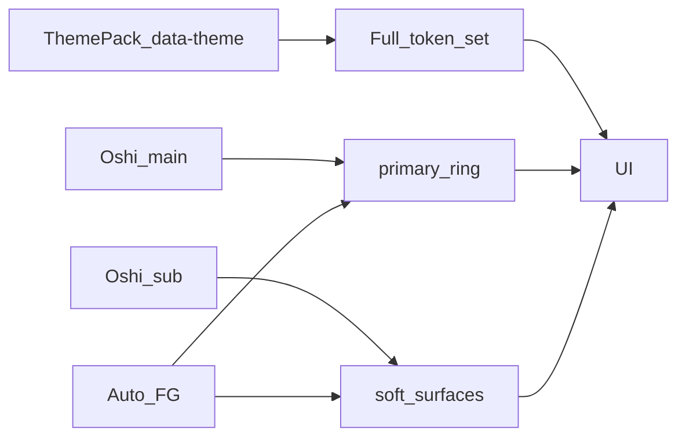

# 推し色スウォッチ（2色・有料前提）

## 結論（数・役割）

| 項目 | 決定 |
|------|------|
| 同時に効く色 | **2色固定**（メイン＋サブ） |
| 保存プリセット | 有料 **3組**（各組＝メイン＋サブ）。無料は保存不可 |
| テーマパック | 既存カタログのまま（ユーザーがフルテーマを「作成」するUIは作らない） |
| 無料 | **ロック＋プレビュー**（触って色は選べるが、全体適用・DB保存は不可） |
| 対象 | **Web 本線**。API/契約はモバイルでも使える形。Expo UIは後続 |

**役割の割り付け（髪／目のメタファー）**

- **メイン推し色** → 主ボタン・フォーカスリング・強い強調（`--primary` / `--ring` / `--primary-foreground`）
- **サブ推し色** → 柔らかい面・チップ下地・選択ハイライトの淡色（`--accent` 系や専用 `--oshi-soft`）。**画面全体のキャンバス背景（`--background`）はテーマパックのまま**（全面染めは可読性・テーマの意味を壊すため）

## UX（設定画面）

配置: [`apps/web/src/app/[locale]/settings/theme/page.tsx`](apps/web/src/app/[locale]/settings/theme/page.tsx) の「テーマ」直下に新セクション「推し色」。

1. ラベルを分かりやすく: 「メイン（ボタンなど）」「サブ（やわらかい背景）」＋短いヒント（髪／目の例は補助文のみ）
2. 各色: キュレート済みスウォッチ（Lab の6色をベースに拡張可）＋任意HEX（色入力）
3. **ライブプレビュー**: 小さな見本（主ボタン＋淡色チップ＋本文）をその場で更新。Design Lab の [`LabContrastHint`](apps/web/src/components/design-lab/LabContrastHint.tsx) / [`lab-contrast.ts`](apps/web/src/components/design-lab/lab-contrast.ts) を本番用に昇格
4. **文字色はユーザーが選ばない**: 選択色に対し自動で次から最適を採用（比率が最も高く、WCAG AA 目安 4.5:1 を満たすもの）
   - 白 `#ffffff`
   - ほぼ黒／濃灰（例 `#1a1614` ※ユーザー要望の「95%灰色」相当の読みやすい濃色）
   - 必要なら選択色のライト／ダーク派生（`color-mix` / 相対輝度調整）を候補に含め、満たせない場合はスウォッチ選択を拒否or補正
5. 無料UI: セクションに「プレミアム」バッジ。プレビューは可。**「この推し色を使う」はロック**（タップで短い説明＋将来 `/premium` 導線）。未課金でも色いじりは楽しめる
6. 有料時のみ: 適用ON、プリセット最大3組の保存・切替

Lab の3案再比較は不要（acceptance「Design Lab 後続」＝既存 Lab 推し色UIの本番化）。

## 技術設計

### 適用レイヤ（テーマとの境界）

- テーマ: 既存 `data-theme` フルパック（[`docs/design/themes.md`](docs/design/themes.md)）を維持
- 推し色ON時のみ `html` に `data-oshi-accent="on"`（プレビューは `preview`）を付け、**上書き対象を限定**
  - メイン → `--primary`, `--primary-foreground`, `--ring`（必要なら `--sidebar-primary`）
  - サブ → `--accent` / `--accent-foreground` または `--oshi-soft` + 既存部品が参照するセマンティックのみ
- [`docs/design/oshi-accents.md`](docs/design/oshi-accents.md) を更新: 「テーマ＝パック一式」「推し色＝2ロールのオーバーレイ」と明記。`themes.md` の「accentだけ差し替えは誤り」は **テーマ自体の話**であり、推し色レイヤとは両立する旨を1段落で訂正

### コントラスト（必須）

- 本番用モジュール例: `apps/web/src/lib/oshiContrast.ts`（Lab から抽出・強化）
- 入力: main/sub hex → 出力: 各 foreground と soft 面の派生色
- API側でも同じルールで検証（不正・読めない組み合わせは 400）
- skill `design-a11y` に沿い、AA 通常テキスト 4.5:1 をゲート条件に

### Entitlement（有料の土台）

- `premium` 本体（決済）は **deferred のまま**
- 薄い契約を先に置く例:
  - shared: `entitlements.oshi_accent` など
  - API: `GET` 設定に `entitled: false`（現状固定）。将来課金で true
  - サーバー: `entitled !== true` なら **永続化・active=true を拒否**（プレビューはクライアントのみ）
- 開発確認用に env オーバーライド（本番デフォルト false）を検討可。秘密は出さない

### データ / API

新規（`theme_settings` に無理に詰めない）:

- 表案 `oshi_accent_settings`（1ユーザー1行）
  - `members_id`, `members_type_name`
  - `main_hex`, `sub_hex`（text, `#RRGGBB`）
  - `active` boolean（entitled かつユーザーがONのときのみ true）
  - `presets` jsonb（最大3: `{ name, main_hex, sub_hex }[]`）※有料時のみ書込
  - RLS: `members_id = auth.uid()`、authenticated のみ GRANT（[`db-schema-change`](.cursor/skills/db-schema-change/SKILL.md)）

- FastAPI: `GET/PUT /oshi-accent-settings`（[`packages/shared`](packages/shared/src/index.ts) に `API_PATHS` 追加）
- サービス: 正規化・コントラスト検証・entitlement ゲート
- TDD: pytest で validation / entitlement 拒否 / 正常保存

### Web 実装ポイント

- `OshiAccentPanel` + `useOshiAccent`（localStorage はプレビュー用ドラフトのみ。active 適用はサーバー＋entitled）
- Root: [`ThemeRoot`](apps/web/src/components/layout/ThemeRoot.tsx) 近傍で CSS 変数注入
- i18n: `messages/ja.json` 正本 → `i18n-web-sync` で en
- 既存 ThemePicker の見た目言語（丸スウォッチ・枠＝明暗）に揃える

### 仕様ドキュメント

- [`docs/product/acceptance/settings.md`](docs/product/acceptance/settings.md) の推し色チェックを DoD 更新
- `feature_status`: `theme_colors` を推し色完了で shipped、または子機能 `oshi_accent` を追加して status 管理
- `roadmap` / `premium` に「推し色はプレミアム候補」と1行
- `python scripts/generate_product_docs.py` / DB docs 再生成

## 検証

- API pytest（コントラスト・entitlement・上限3）
- Web typecheck + `check_design_compliance`
- `check_api_contract_sync`
- `post-change-verify` / 該当時 `secure-change-checklist`

## やらない（今回）

- 決済UI・Stripe 等の本番課金
- ユーザーによるフルカスタムテーマパック生成
- キャンバス全面を推し色で塗りつぶす
- Expo 設定画面の本実装
- カラータグ枠との統合
