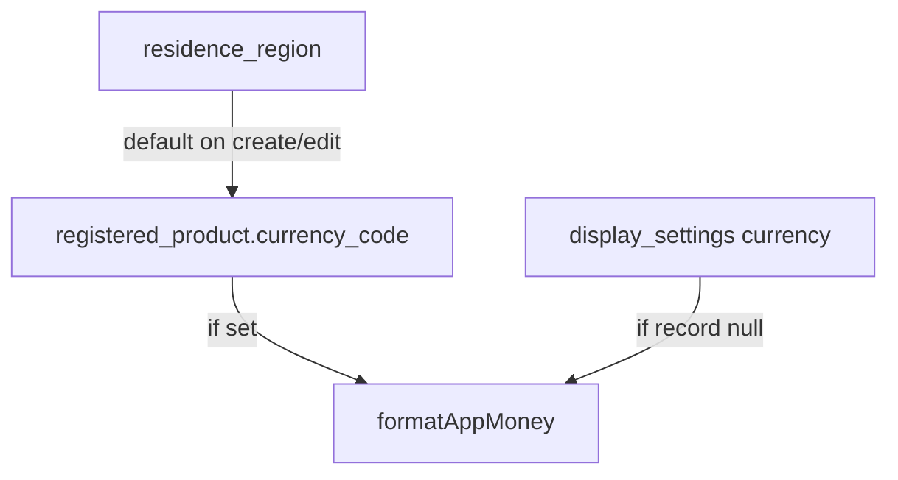

# 製品ごとの法定通貨記録（product_currency_fiat）

## 確定方針

- **保存:** [`registered_product`](docs/db/generated/schema_baseline.sql) に `currency_code text null`（ISO 4217、例 `JPY`）。既存 FK `currency_unit_id` / 表 `currency_unit`（schema_ready・データなし）は **本線で使わない**（後で整理可）。
- **カタログ:** Web/API とも既存 [`CURRENCY_OPTIONS` / `ALLOWED_CURRENCY_CODE`](apps/web/src/lib/residencePrefs.ts)（表示設定と同じ約31通貨）。
- **既定:** 登録・詳細で価格入力時、未指定なら **居住地の既定通貨**（[`findResidenceRegion(...).currencyCode`](apps/web/src/lib/residencePrefs.ts)）。
- **表示:** 製品 `currency_code` があればそれ、なければ [`FormattedAppMoney`](apps/web/src/components/format/FormattedAppMoney.tsx) の display_settings 経路。
- **やらない:** 為替換算、NFT／暗号、`list_price`、居住地変更時の既存製品一括書き換え。



## UX（利便性）

- **登録確認**（[`StepConfirm`](apps/web/src/components/register/StepConfirm.tsx)）: 価格の横（または直下）に検索付き通貨コンボ（既存 [`SearchableSelect`](apps/web/src/components/ui/SearchableSelect.tsx)）。価格が空でも通貨は選べるが、**価格なしで POST するときは `currency_code` も null**（ゴミ通貨だけ残さない）。
- **詳細編集**（[`ProductDetailEditor`](apps/web/src/components/ProductDetailEditor.tsx)）: 同様。価格クリア（null）時は通貨もクリア。価格を残して通貨だけ変更可。
- **詳細閲覧:** 記録通貨で `FormattedAppMoney`（prefs に製品通貨を渡すよう拡張）。
- **一覧:** 現状価格なし → 利便性のため **カードに短い金額**（記録通貨優先）を出す。一覧 API に `purchase_price` + `currency_code` を追加。

## データ / API

1. **migration**（`db-schema-change`）  
   - `alter table registered_product add column currency_code text null`  
   - CHECK なし（検証は API）。comment: 購入価格の記録通貨 ISO 4217。  
   - glossary: `currency_code` → 通貨コード  
   - docs/db 再生成

2. **API TDD**（[`test_product_detail.py`](apps/api/tests/test_product_detail.py) 等）  
   - create/patch で `currency_code` 受理・正規化（大文字・allowlist）  
   - 不正コード 400  
   - `purchase_price` null と同時に currency クリア可  
   - GET detail / list に `currency_code` 含む

3. **実装箇所**  
   - [`schemas/products.py`](apps/api/app/schemas/products.py)、[`routers/products.py`](apps/api/app/routers/products.py) allowlist  
   - [`product_service.py`](apps/api/app/services/product_service.py) + [`supabase_user.py`](apps/api/app/infra/supabase_user.py) select/insert/patch/`normalize_product_detail`  
   - 正規化は display_settings の `_normalize_currency_code_override` と同等ロジックを共有または products 側に薄い関数

## Web

1. **format** — [`formatAppMoney`](apps/web/src/lib/residencePrefs.ts) / `FormattedAppMoney` に任意の `currency_code`（記録）を渡せるようにする。優先: 引数 → display_settings。
2. **登録** — draft に `currencyCode`、確認ステップ UI、POST body に `currency_code`。ウィザード初期値は `useDisplaySettings().residenceRegion` から。
3. **詳細** — editor + 閲覧表示。
4. **一覧** — list 型・グリッドに価格行（なければ非表示）。
5. **i18n** — `Residence.currencies.*` 再利用 or Register/Gallery 用短いラベル。`i18n-web-sync` + キー検査。

## Docs / ステータス

- [`product_currency_fiat`](docs/product/meta/feature_status.json): `planned` → `shipped`（evidence 更新）。notes を「ISO 列採用・currency_unit 未使用」に更新。
- [`acceptance`](docs/product/acceptance/settings.md) または register/detail DoD に1行。
- [`cursor.md`](cursor.md) 1行。
- `generate_product_docs.py`（as-built）。

## 検証

```powershell
$env:PYTHONPATH="apps/api"
python -m pytest apps/api/tests/test_product_detail.py apps/api/tests/test_display_settings.py -q
pnpm -C apps/web exec tsc --noEmit
python scripts/check_i18n_message_keys.py
```

skill: `tdd-workflow` → `db-schema-change` → `post-change-verify`。
