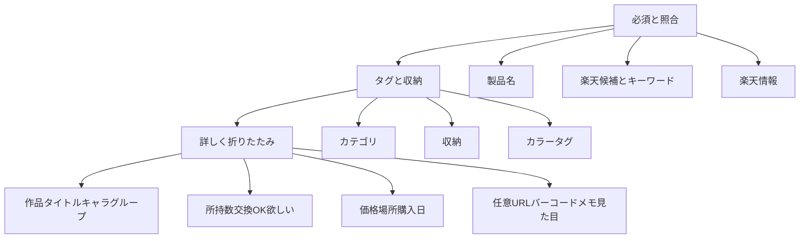

# 登録確認の段階化＋イベント束引き継ぎ

## 決めたこと

- **続けて登録の既定**: イベント束を残す（作品シリーズ名・キャラ・収納・購入日）＋現行どおりカテゴリ／カラースロット／通貨。
- **全部消す**: 設定ダイアログではなく、**確認画面（`StepConfirm`）に常設ボタン**。引き継いだ束をその場でクリアして「別イベント／別推し」に切り替えられる。確認ダイアログは付けない（誤タップ時は再入力コストが低いため）。
- **折りたたみ**: 新規 Design Lab 3案はしない。ギャラリー詳細の編集折りたたみと同様に **ネイティブ `
`** を採用（既存採用パターンの流用）。

## UX 構成（確認画面）

**常時表示（会場モードの本線）**

1. ヘッダー／アシストヒント／写真サムネ
2. 楽天候補＋キーワード検索＋楽天情報ブロック
3. 製品名（必須）
4. カテゴリ・収納・カラータグ（続けて登録で残るので上に置く）
5. エラー／登録 CTA
6. 二次アクション: **全部消す**（アウトライン、登録の横ではなくフォーム下部または詳しく見出し付近）

**`
`「詳しく」（既定クローズ）**

- 作品シリーズ名・タイトル・グループ名・キャラ
- 所持数・交換OK・欲しい
- 購入価格・通貨・購入場所・購入日
- バーコード・任意 URL・メモ・見た目タグ

照合ブロックはたたまない（スキップ後の救済が主用途のため）。

## 続けて登録（イベント束）

[`buildContinueDraft.ts`](apps/web/src/components/register/buildContinueDraft.ts) を拡張:

| 残す | 消す（現状どおり＋明示） |
|------|--------------------------|
| `worksSeriesName`, `characterName`, `purchaseDate` | 製品名・グループ・タイトル |
| `storageLocationId`, `categoryTagId`, `selectedSlots`, `currencyCode` | バーコード／写真／メモ／価格／購入場所 |
| | 数量フラグ（所持は `"1"`、交換OK／欲しいオフ） |
| | 楽天・任意 URL・候補・Vision 由来 |

「全部消す」は **現在ドラフト上**で次をクリアする（登録済みデータは触らない）:

- イベント束: 作品・キャラ・購入日・収納
- タグ束: カテゴリ・色
- 通貨は設定の既定通貨へ戻す（空のままにしない）
- 収納は `defaultStorageLocationId` があればそれ、なければ未選択

実装は `clearEventBundle(draft, defaults) -> RegisterDraft` を [`buildContinueDraft.ts`](apps/web/src/components/register/buildContinueDraft.ts) 隣に置き、Wizard から呼ぶ（TDD 対象）。

成功後 UI（`showContinue`）でも同じ「全部消す」を出せると、次の束に入る前にリセットできる。**確認フォーム表示時＋続けて登録 CTA 表示時の両方**に置く。

## 主な変更ファイル

- [`StepConfirm.tsx`](apps/web/src/components/register/StepConfirm.tsx) — セクション再配置、`
`、全部消すボタン props
- [`RegisterWizard.tsx`](apps/web/src/components/register/RegisterWizard.tsx) — `onClearEventBundle` 配線、`resetForContinue` は新 keep リストに追随
- [`buildContinueDraft.ts`](apps/web/src/components/register/buildContinueDraft.ts) + [`.test.ts`](apps/web/src/components/register/buildContinueDraft.test.ts) — keep 拡張＋ clear 関数の Red/Green
- [`docs/product/flows/register.md`](docs/product/flows/register.md) / [`acceptance/register.md`](docs/product/acceptance/register.md) — continue keep と折りたたみ・全部消す
- [`ja.json`](apps/web/messages/ja.json) / [`en.json`](apps/web/messages/en.json) — `detailsSummary`, `clearEventBundle`, `clearEventBundleHint` 等
- skill: `product-spec-sync`（文言・acceptance）、`i18n-web-sync`、`design-a11y`（details のキーボード／要約文言）、完了後 `post-change-verify`

## やらないこと

- 設定画面への引き継ぎプリセット追加
- 続けて登録ごとのチェックダイアログ
- 数量・交換OK・URL・タイトルの引き継ぎ
- CLIP／交換専用画面
- Design Lab 3案（ギャラリーと同様の details 流用）

## 実装順（TDD）

1. `buildContinueDraft` / `clearEventBundle` の失敗テスト → 実装
2. 仕様 flows / acceptance 更新
3. `StepConfirm` 段階化＋全部消す UI
4. Wizard 配線
5. i18n → post-change-verify
