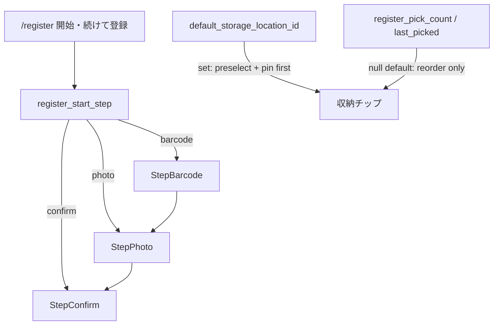

# 登録ウィザード既定（register_wizard_defaults）

## 確定方針（C）

- **開始手順:** `register_start_step` = `barcode`（既定）／`photo`（バーコードを飛ばす）／`confirm`（手動入力から）
- **収納（C）:**
  - **A 本線:** `default_storage_location_id` を設定で1つ指定 → 確認画面で **最初から選択済み** ＋ チップ先頭
  - **B フォールバック:** 指定なしのときだけ、登録時の選択履歴（回数＋最終日時）でチップを並べ替え。**自動選択はしない**（勝手に入ると怖い）
- **保存:** 既存 [`display_settings`](apps/api/app/services/display_settings_service.py) を拡張（localStorage + debounced PUT）。頻度カウンタは [`storage_location`](docs/db/generated/tables.md) 行に持つ
- **モバイル専用 UI は今はやらない**（同じ API 列なので後から共有可）
- **やらない:** 照合方式そのものの切替 UI、一括／CLIP、店頭専用画面、カテゴリ／色の「いつもこれ」



## UX（すぐ体感・初学者にも分かる）

### 設定画面

- [`/settings`](apps/web/src/app/[locale]/settings/page.tsx) にセクション **「登録」** を追加 → [`/settings/register`](apps/web/src/app/[locale]/settings/register/page.tsx)（新規）
- 見た目（theme）と分離し、将来の照合オプションを足しやすくする
- パネル構成（上＝よく触る）:
  1. **登録の始め方** — 大きな3択（ラジオ or カード）。各選択肢に短い説明（例: 「バーコードがないグッズが多い」）
  2. **いつも選ぶ収納** — 「指定しない」／既存収納の検索付き select（[`SearchableSelect`](apps/web/src/components/ui/SearchableSelect.tsx)）。削除済み ID は「指定しない」にフォールバック
  3. **ヒント** — 「指定しない場合、最近よく選んだ収納が上に出ます」（B の説明を1行）

### ウィザード本体

- 初回マウントと「続けて登録」は **どちらも** `register_start_step` に従う（現状の常に `barcode` 固定をやめる）
- `photo` 開始時も **戻るでバーコードへ** は残す（その回だけ例外できる）
- `confirm` 開始時はバーコード／写真なしの手動経路（既存「すべて手動」と同等）
- 進捗表示は開始ステップに合わせてラベル／番号を嘘なく出す（飛ばした手順は「スキップ済み」扱い）

### ウィザード内の軽い提案（設定を開かなくても覚えられる）

- バーコードを **スキップ** して写真へ進んだ直後、非ブロッキングの短い提案: 「次から写真から始める」→ `register_start_step=photo` を保存して閉じる
- 同様に「すべて手動」選択時: 「次から確認画面から始める」
- 提案は **セッション中1回**（うっとうしさ防止）。既に同じ値が設定済みなら出さない
- 収納の「この場所をいつもにする」は設定画面が本線。確認画面に小さなリンク「登録の進め方」で設定へ誘導（任意・控えめ）

### 収納チップの並びルール（確認画面）

1. `default_storage_location_id` あり → その ID を先頭＋ `draft.storageLocationId` 初期値にセット。残りは既存 `display_order`
2. なし → `last_register_picked_at` desc → `register_pick_count` desc → `display_order` asc。選択は空のまま
3. 設定の収納 ↑↓（`display_order`）は **設定画面の正**。登録確認だけが上記オーバーレイ

## データ / API

### 1. `display_settings` 追加列（`db-schema-change`）

| 列 | 型 | 既定 | 意味 |
|----|-----|------|------|
| `register_start_step` | text | `'barcode'` | `barcode` \| `photo` \| `confirm` |
| `default_storage_location_id` | int null | null | ユーザー所有の収納 FK。null = 指定なし |

- CHECK で start_step allowlist
- FK → `storage_location(storage_location_id)` ON DELETE SET NULL（削除で自動クリア）
- glossary 更新 → docs/db 再生成

### 2. `storage_location` 使用履歴列

| 列 | 型 | 既定 |
|----|-----|------|
| `register_pick_count` | int | 0 |
| `last_register_picked_at` | timestamptz null | null |

- `POST /products` 成功時、`storage_location_id` があるなら **同一ユーザー行** だけ count+1 / now（[`product_service`](apps/api/app/services/product_service.py)）。詳細 PATCH での収納変更は **カウントしない**（「登録の繰り返し」に限定）
- 一覧 GET `/storage-locations` のレスポンスに2列を含める（並び替えは Web。API の既定 order は従来どおり `display_order`）

### 3. API TDD（先に Red）

- [`test_display_settings.py`](apps/api/tests/test_display_settings.py): start_step allowlist・不正値・default_storage の正規化
- products create 後に pick_count が増えるテスト（mock DB／既存パターンに合わせる）
- 実装: service SELECT/upsert、[`display_settings` router](apps/api/app/routers/display_settings.py)、[`tag_service` list](apps/api/app/services/tag_service.py)

## Web

1. [`displayPrefs.ts`](apps/web/src/lib/displayPrefs.ts) + sanitize、[`useDisplaySettings`](apps/web/src/hooks/useDisplaySettings.ts) に2フィールド
2. 純関数 `orderStorageLocationsForRegister(items, defaultId)` + selftest（A優先／B頻度／タイブレーク）
3. [`RegisterWizard`](apps/web/src/components/register/RegisterWizard.tsx): 開始 step・continue・draft 初期収納・チップ並び・スキップ後の提案 UI
4. `RegisterDefaultsPanel.tsx` + `/settings/register` + settings hub リンク
5. i18n（`RegisterDefaults` NS）— skill **`i18n-web-sync`** + `check_i18n_message_keys.py`
6. UI は既存トークン／shadcn。大きな見た目刷新や Design Lab 3案は不要（設定パネル追加レベル）。skill **`design-change`** の軽いチェック（コントラスト・タップ領域）のみ

## Docs / ステータス

- 新規 feature id `register_wizard_defaults` → `planned` 実装後 `shipped`
- [`acceptance/settings.md`](docs/product/acceptance/settings.md) / [`acceptance/register.md`](docs/product/acceptance/register.md) に DoD
- [`flows/register.md`](docs/product/flows/register.md) に「開始手順は設定で変えられる」を1節
- `generate_product_docs.py`、`cursor.md` 1行

## 拡張の余地（今回は枠だけ意識）

- 照合モード切替などが来たら **同じ `/settings/register` にセクション追加**＋ `display_settings` に allowlist 列を足す（JSON 黒箱は増やさない）
- 頻度ロジックは Web の純関数に閉じ、API はカウンタ更新のみ → 並び替え仕様の変更が容易

## 検証

```powershell
$env:PYTHONPATH="apps/api"
python -m pytest apps/api/tests/test_display_settings.py apps/api/tests/test_product_detail.py -q
pnpm -C apps/web exec tsc --noEmit
python scripts/check_i18n_message_keys.py
python scripts/generate_product_docs.py
python scripts/generate_db_docs.py
```

skill 順: `tdd-workflow` → `db-schema-change` → `product-spec-sync` → `i18n-web-sync` → `post-change-verify`。

手動: 開始を写真にすると `/register` と続けて登録が写真から／収納指定ありで選択済み／指定なしで頻度順のみ／スキップ提案で設定が書き換わること。
