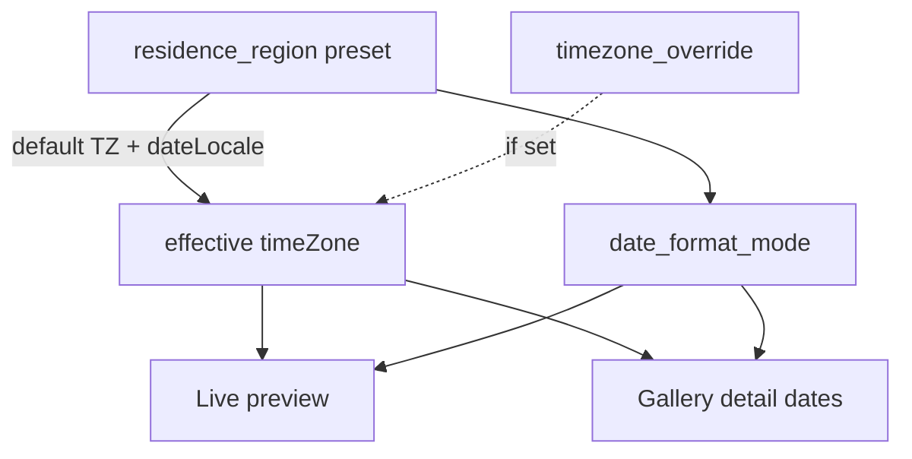

# 居住地・日時表示設定

## 確定仕様

- 居住地 = **地域プリセット**（既定 `jp` / `Asia/Tokyo` / 日付ロケール `ja-JP`）
- 個別 = **アカウント全体の上書きのみ**（製品行ごとではない）
- UI 言語（ja/en）とは独立。日付の「見た目」は居住地が既定、上書きで変更可
- 保存先は既存 [`display_settings`](supabase/migrations/20260903123000_create_display_settings.sql)（未ログインは localStorage、既存 display 設定と同じ）

## UX（設定しやすさ）

置き場: [`/settings/theme`](apps/web/src/app/[locale]/settings/theme/page.tsx) に新セクション **「日時・居住地」**（表示言語の直下。言語と紛らわしいが「言葉」と「時計」を隣に置いて対比を明確にする）。

構成（上＝よく触る／下＝個別）:

1. **居住地** — 大きな選択（チップ or ネイティブ select）。既定「日本」を先頭・強調  
   プリセット（短く固定）: `jp` / `kr` / `tw` / `us_pacific` / `us_eastern` / `uk` / `other`（UTC）  
   選ぶと **その地域の標準 TZ + 日付ロケール** に即連動
2. **いまの表示プレビュー** — 固定サンプル時刻を `Intl` で表示（例: `2026/09/03 16:30` ↔ `Sep 3, 2026, 4:30 PM`）。変更のたびに更新（即時反映は既存スライダーと同パターン）
3. **個別設定** — 折りたたみ（既定クローズ）。中身だけ:
   - タイムゾーン: 「居住地に合わせる」／「指定する」+ IANA 選択（主要 TZ の短いリスト）
   - 日付の書き方: 「居住地の形式」／「表示言語に合わせる」／「年-月-日（ISO 風）」



## データモデル（display_settings 追加列）

| 列 | 型 | 既定 | 意味 |
|----|-----|------|------|
| `residence_region` | text | `'jp'` | プリセット ID（allowlist） |
| `timezone_override` | text null | null | IANA。null = 居住地の標準 TZ |
| `date_format_mode` | text | `'residence'` | `residence` / `ui_locale` / `iso` |

CHECK で allowlist。migration 新規 + skill **`db-schema-change`**（docs/db 再生成）。

API: 既存 GET/PUT `/display-settings` を拡張（[`display_settings_service.py`](apps/api/app/services/display_settings_service.py)）。TDD で allowlist・既定値を先にテスト追加。

## Web

- カタログ定数: `apps/web/src/lib/residencePrefs.ts`（region → defaultTz / dateLocale）
- 純関数: `formatAppDateTime(value, prefs, uiLocale)` + selftest（TZ・mode の期待文字列）
- [`useDisplaySettings`](apps/web/src/hooks/useDisplaySettings.ts) に 3 フィールド追加（debounce 保存は既存流用）
- UI: `ResidenceSettingsPanel.tsx` を Appearance に配置。文言は `messages`（`Residence` NS）+ skill **`i18n-web-sync`**
- 表示差し替え: 製品詳細の `creation_date` など生文字列表示を `formatAppDateTime` 経由に（まず詳細。一覧に日付があれば同様）

## Docs

- [`docs/product/acceptance/settings.md`](docs/product/acceptance/settings.md) に DoD 追加
- [`docs/product/i18n.md`](docs/product/i18n.md) に「UI 言語 ≠ 居住地／日時」を 1 節
- `feature_status` は `display_settings` の evidence／note 更新（新規 feature ID は増やさない）
- `generate_product_docs.py` / db docs 再生成
- `cursor.md` 1 行

## やらないこと

- 製品ごとの TZ
- 全世界 TZ の巨大リスト（主要セット＋ other）
- モバイル専用 UI（同じ API 列なので後で共有可）
- 法務英語レビュー

## 検証

```powershell
python -m pytest apps/api/tests/test_display_settings.py -q
# format selftest
pnpm -C apps/web lint
pnpm -C apps/web exec tsc --noEmit
python scripts/check_i18n_message_keys.py
```

skill `post-change-verify`（Web+API）。手動: 居住地を US に変えプレビューと詳細の登録日が変わること、個別 TZ 上書きが効くこと。
