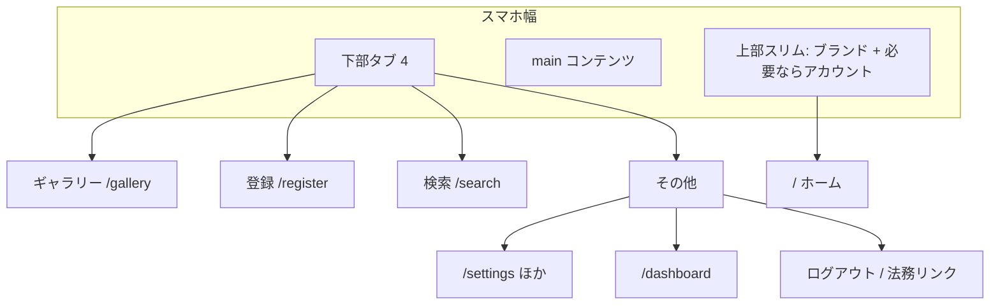

# スマホ Web 磨き（responsive_web）— 下部タブ

## 目標（成功条件）

- 店頭・外出先の本線（**ギャラリー / 登録 / 検索**）が片手・縦・横で迷わず届く
- 上部リンク6本の折り返しをやめ、小画面の主操作は **親指ゾーン（下部タブ）**
- 横長グッズ写真が「縦枠に押し潰されて意味不明」にならない
- `responsive_web` を **partial → shipped** に上げられる受け入れ（手動チェックリスト＋最低限の Playwright モバイル幅）を満たす

**やらないこと:** Expo 本番ナビ、safe-area ガイドライン線（Lab fb-001 は後回し）、dashboard 本実装、登録のライブプレビュー等 Must 外後続。

## UX IA（確定）

| 要素 | 方針 |
|------|------|
| タブ順 | ギャラリー → 登録 → 検索 → その他（店頭で登録を親指近く） |
| その他 | 設定ハブ・分析・ログアウト・プライバシー／ライセンスへの入口 |
| 上部 | ブランド（→ホーム）中心。ナビリンクは置かない |
| PC（`md+` 想定） | **下部タブ非表示**。既存に近い横ナビ（または同等の到達性）を維持し、デスクトップを壊さない |
| 認証画面 | タブ非表示（ログイン専用に集中） |
| 横向き | タブは **アイコン主・ラベル短縮／非表示**、高さ圧縮 + `safe-area-inset-bottom`。コンテンツ `pb` でタブに隠れない |
| 文字大・高密度 | `display_settings` でもタブが2行化・はみ出ししないことを Lab「文字大きめ」で確認 |

## フェーズ

### 0. 仕様・受け入れの土台（コード前）

- 新規 [`docs/product/acceptance/responsive_web.md`](docs/product/acceptance/responsive_web.md): 縦/横、タブ到達、その他ハブ、横長写真、キーボード時、一括バー、PC でタブ無し
- [`docs/product/meta/feature_status.json`](docs/product/meta/feature_status.json) / [`roadmap.md`](docs/product/roadmap.md) / [`v2_status.md`](docs/product/v2_status.md) のメモ更新（完了時に shipped）
- i18n: `Nav` にタブ／その他用キー追加方針（`i18n-web-sync`）

### 1. Design Lab（必須・本番一括禁止）

[`/dev/design-lab`](apps/web/src/app) で **配置差の3案**（色コピー禁止。全案テーマ色あり）。端末は **Web・モバイルの縦 / 横 / 縦+横** + 親指ゾーン。

| 案 | 配置の差 |
|----|----------|
| A 用途最適 | 4等分タブ・上部極薄・登録を最短 |
| B 推し活 | 同タブ構成＋登録の強調（短い押下反応）・写真余白寄り |
| C ブランド整合 | 同タブ＋余白・階層を原則どおり穏やかに |

Lab のアプリ枠タブ見本は [`LabDeviceFrame.tsx`](apps/web/src/components/design-lab/LabDeviceFrame.tsx)（現状ラベル不一致）。本番案に合わせて **ギャラリー／登録／検索／その他** に揃える。

**ゲート:** 人の本決定（案ID）があるまで本番シェルは変えない。

### 2. シェル採用（横断・最初の本番単位）

対象: [`apps/web/src/app/[locale]/layout.tsx`](apps/web/src/app/[locale]/layout.tsx)、[`Header.tsx`](apps/web/src/components/layout/Header.tsx)、新規 `BottomTabBar`（仮名）、[`Footer.tsx`](apps/web/src/components/layout/Footer.tsx)

- `md` 未満: `BottomTabBar`（`sticky`/`fixed` + `env(safe-area-inset-*)`）+ スリム Header
- `md` 以上: 現行に近いトップナビ（ダッシュボード・設定を含む）
- main にタブ分の `padding-bottom`
- アイコンは [`@/lib/icons`](apps/web/src/lib/icons.ts) / `icons.json`（`new-file-naming`）
- `design_adoption.json` + `decisions.md` にシェル採用を記録（`design-adoption`）
- a11y: タップ目安・`aria-current`・アイコンのみ時の `aria-label`（着手時 `design-a11y` で公式確認）

**リスク対策（敵対的検証の取り込み）**

- ギャラリー一括バー（[`GalleryBulkBar`](apps/web/src/components) sticky）とタブの二重 sticky → 選択モード時はバーをタブ直上に積む／オフセットを明示
- 登録カメラ・ソフトウェアキーボード → タブが被る場合はフォーカス時に退避 or コンテンツ側スクロール余白
- 横向きでコンテンツ高さ不足 → タブ圧縮を必須受け入れに含める

### 3. 本線画面の磨き（画面単位）

優先順（店頭離脱防止）:

1. **その他ハブ** — `/settings` を拡張するか薄い `/more` を追加（glossary / `product-spec-sync` でパス確定）。分析・法務・ログアウトをここに集約
2. **ギャラリー** — フィルタ／一括の縦占有を整理（折りたたみ・シート）。横向きでも最初の写真行が見える
3. **登録** — ステップ CTA を親指ゾーン（タブ上）に寄せる。長い確認フォームはセクション分割のままスクロール可能に
4. **検索・詳細** — フォームの縦積み維持。詳細ヒーローは次節
5. ホーム — 上部ブランド経由。重複 CTA を整理（1画面1仕事）

各画面: Lab 決定案に沿って採用 → `design-adoption` → 過剰な一括リデザイン禁止。

### 4. 横長製品写真

現状: 一覧は `aspect-[4/5]` + `object-cover`（横長が切れる）、詳細はスマホで縦寄り枠 + `object-contain`（[`ProductGalleryGrid`](apps/web/src/components)、詳細 `gallery/[id]`）。

方針（採用案に合わせて実装）:

- **詳細:** `(orientation: landscape)` でも横長に近いヒーロー（例: `16/10`）+ `object-contain` + 落ち着いた余白背景。`sm:` 幅だけに依存しない
- **一覧:** 全面 `contain` 化は密度が落ちるため、既定は cover 維持。横向きビューポートではカード aspect を少し横寄りにする、または large レイアウトで contain を選べるなら表示設定と矛盾しない範囲で
- ライブプレビューはスコープ外（v2_status のとおり）

### 5. 検証・ステータス更新

- Playwright: Desktop のみ → **Pixel/iPhone 相当プロジェクト**を追加し、タブ可視・主要3経路の smoke（レイアウト崩壊の有無）
- 手動: Lab 縦+横、実機 Safari/Chrome、文字大きめ、一括選択、登録カメラ
- `check_design_compliance` → `post-change-verify`（Web）→ `generate_product_docs.py`
- 受け入れ全部満たしたら `responsive_web` = **shipped**

## 主要タッチファイル

- シェル: `layout.tsx` / `Header.tsx` / 新規 BottomTabBar / 必要なら More ページ
- 本線: `gallery/page.tsx`, `GalleryBulkBar`, `register/*`, `search/*`, `gallery/[id]`, `ProductGalleryGrid`
- 文言: `messages/ja.json` → en 同期
- 仕様: `acceptance/responsive_web.md`, `feature_status.json`, `v2_status.md`
- デザイン記録: `design_adoption.json`, `decisions.md`, Lab モック

## 実装ゲート（順序厳守）

1. 受け入れドラフト + Lab 3案実装  
2. **人の本決定**  
3. シェル本番採用  
4. 本線画面 → 写真 → テスト・shipped
