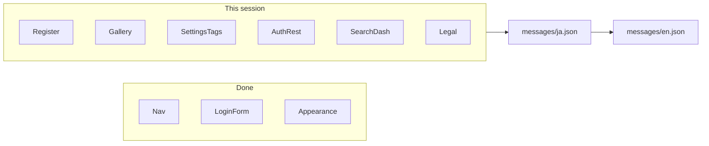

# Web 既存文言の全部キー化

## 前提（壊さない）

- ルーティング・middleware・`localePrefix: 'as-needed'`・Auth confirm の `next/navigation` はそのまま
- 既存 NS（`Nav` / `Footer` / `HomePage` / `LoginForm` / `Appearance` / `DisplaySettings` / `SettingsIndex`）は拡張のみ
- Design Lab（`components/design-lab/**`・`/dev/design-lab`）は対象外
- コミットしない。仕組み化（欠落 CI・自動翻訳）はしない

## スコープ判断（この計画の既定）

| 含む | 含まない |
|------|----------|
| `[locale]` 配下の主要画面＋共有部品の表示文言・aria・エラー・空状態 | Design Lab |
| Auth 英語ハードコード（forgot / sign-up / update-password / error / success） | API・DB・メール |
| `displayPrefs` / テーマカタログ / タグプリセットの **表示ラベル** | ID・path・swatch hex |
| `/privacy` 本文・`/licenses` の UI 枠（EN は機械下書き） | 新言語・デプロイ |

**`i18n_web`:** 完了後 **`shipped`**（主要経路の文言が辞書経由。自動翻訳・欠落 CI は未着手と `updated_note` / `i18n.md` に明記）。

## 現状

- 辞書利用は 7 ファイルのみ（Header / Footer / Home / LoginForm / Appearance / LocaleSwitcher / DisplaySettingsPanel 一部 / SettingsIndex 一部）
- 残ハードコードの中心: 登録ウィザード、設定タグ CRUD、ギャラリー／詳細／編集、Auth 他フォーム、検索／ダッシュボード、Me／Privacy／Licenses、`displayPrefs` ラベル



## 置換パターン（統一）

1. **正本**は必ず [`apps/web/messages/ja.json`](apps/web/messages/ja.json)。同キーを [`en.json`](apps/web/messages/en.json) に追加（機械下書き可）
2. Client: `useTranslations("Ns")` / Server: `getTranslations("Ns")`
3. 補間は `{name}` 等の ICU。複数形が要る箇所だけ最小で
4. **定数ファイル**は ID のみ残し、ラベルは辞書へ:
   - [`displayPrefs.ts`](apps/web/src/lib/displayPrefs.ts): `label`/`hint` 削除。UI は `t(\`listSort.${id}\`)` 等
   - [`themes/catalog.ts`](apps/web/src/lib/themes/catalog.ts): `label` 削除 → `Themes.${id}`
   - [`tagPresets.ts`](apps/web/src/lib/tagPresets.ts): 表示名は `TagPresets.category.${slot}` / `storage.${slot}`（数値キー）
5. [`assistMessages.ts`](apps/web/src/components/register/assistMessages.ts): 日本語文を返さず **メッセージキー**を返す純関数に変更（既存挙動の TDD: キー対応表の selftest / 小テスト）
6. 共有 CRUD 動詞は **`Common`** NS（保存・削除・編集・キャンセル・読み込み中…）を新設し、設定系・編集系で再利用
7. Link / router は現状どおり `@/i18n/navigation`（変更しない）

## 名前空間案（新規・拡張）

| NS | 主なファイル |
|----|----------------|
| `Common` | 共有動詞・汎用エラー |
| `SettingsIndex`（拡張） | [`settings/page.tsx`](apps/web/src/app/[locale]/settings/page.tsx) 残ハードコード |
| `DisplaySettings`（拡張） | プレビュー文・`listSort.*` / `galleryLayout.*` / `landingPage.*` |
| `Themes` | ThemePicker + catalog |
| `CategoryTags` / `StorageLocations` / `ColorTags` | 各 settings ページ |
| `TagPresets` | DismissedPresetsPanel / TagOrderControls / preset 名 |
| `Gallery` | gallery page / Browse / FilterChips / ProductGalleryGrid |
| `ProductDetail` | 詳細 page + ProductDetailEditor + TagChipPicker |
| `Search` | search page + ProductSearchForm |
| `Dashboard` | dashboard page |
| `Register` | RegisterWizard + Step* + BarcodeScanner + assist keys |
| `ForgotPassword` / `SignUp` / `UpdatePassword` / `AuthError` / `SignUpSuccess` | auth 系（LoginForm に揃える） |
| `Nav`（拡張） | HeaderAuthActions「ログイン」、logout-button |
| `Me` / `Privacy` / `Licenses` | アカウント・法務 |

## 実装バッチ（承認後この順）

各バッチ後にキー集合一致を目視（または一時 diff）し、lint/tsc を回す。

1. **基盤**: `Common` + `displayPrefs` / Themes / DisplaySettings 残り + SettingsIndex 残り + ThemePicker
2. **設定 CRUD**: Category / Storage / Color + TagPresets / Dismissed / OrderControls
3. **ギャラリー束**: Gallery + ProductDetail + Search + Dashboard
4. **登録**: Register NS（assistMessages をキー返却に変更＋テスト）
5. **Auth 残り + Nav 拡張**: 英語フォームを ja 正本に寄せて双方辞書化
6. **Me / Privacy / Licenses**
7. **docs**: [`docs/product/i18n.md`](docs/product/i18n.md)（キー化完了境界・次セッション「自動翻訳 skill / 欠落 CI」メモ）、[`acceptance/settings.md`](docs/product/acceptance/settings.md)（主要画面が辞書経由の DoD）、`feature_status.json`（`i18n_web` → `shipped` + `updated_note`）、`python scripts/generate_product_docs.py`、必要なら [`cursor.md`](cursor.md) 1 行

## 検証（必須）

```powershell
node --experimental-strip-types apps/web/src/lib/auth-path-policy.selftest.ts
pnpm -C apps/web lint
pnpm -C apps/web exec tsc --noEmit
# 可能なら
pnpm -C apps/web build
```

- skill **`post-change-verify`**（Web 範囲）
- 文言のみのため design-change は軽く（hex 直書きを増やさない。color-tags 例外維持）
- 手動: `/` と `/en` で設定・ギャラリー・ログイン周りが言語どおり
- **ja / en のキー集合一致**を完了条件として確認（恒久 CI は入れない）

## 次セッション用メモ（docs に短く残す）

- ja 変更時の en 同期 / 欠落検知 CI
- 翻訳レビュー（特に Privacy の法務英語）
- モバイル文言は別途

## リスクと注意

- プリセット名は API 既定値と意味を揃える（表示だけ辞書化。DB に入ったユーザー編集名はそのまま）
- `assistMessages` の戻り値変更は呼び出し側を同時更新
- metadata（title/description）も主要ページは `getTranslations` で揃える（可能な範囲）
