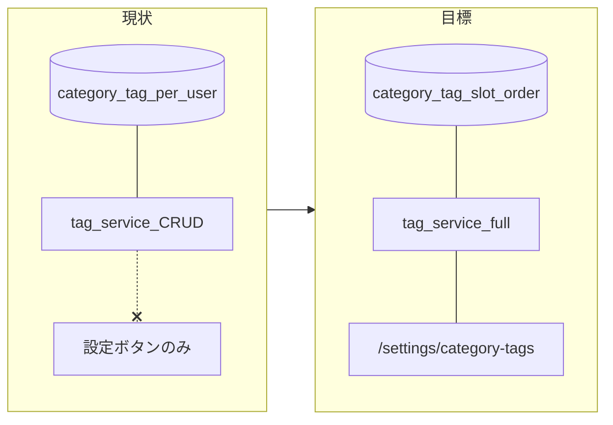

# カテゴリータグを「収納場所タグ」と同型のユーザー別設定にする

## Step 1: 現状整理（原因とギャップ）

**既にユーザー別の層**

- テーブル定義: [`supabase/migrations/20260112_members_id_uuid_auth_users_fk.sql`](supabase/migrations/20260112_members_id_uuid_auth_users_fk.sql) の `category_tag` は `members_id uuid not null references auth.users(id)`、`category_tag_icon` / `category_tag_use_flag` 付き。
- RLS: `category_tag_self_all`（`auth.uid() = members_id`）。
- サービス: [`services/tag_service.py`](services/tag_service.py) の `get_category_tags` / `update_category_tag` / `create_category_tag` はいずれも `_current_members_id()` で絞り込み。

**ギャップ（ユーザーの体感が「共通」のままになる理由）**

- **設定 UI**: [`pages/settings/index.py`](pages/settings/index.py) の「カテゴリータグ」は [`html.Button`](pages/settings/index.py) のままで、[`収納場所タグ` のように `dcc.Link`](pages/settings/index.py) ＋専用ページがない。
- **他コードから未使用**: リポジトリ内で `get_category_tags` を呼ぶのは `tag_service` のみ。登録・レビュー等に **カテゴリ選択 UI が未接続**（`category_tag_id` を触るフローが見当たらない）。
- **プリセット・並び・削除**: 収納場所側にある [`ensure_default_receipt_locations`](services/tag_service.py)、[`get_receipt_location_tags_ordered`](services/tag_service.py)、[`delete_receipt_location_tag`](services/tag_service.py)、[`move_receipt_location_tag`](services/tag_service.py)、`display_order` / `slot` / `receipt_location_preset_slot_dismissed` 相当が **カテゴリには無い**。
- **入力検証の非対称**: 収納場所は [`normalize_receipt_location_icon`](services/tag_service.py) で `bi-` ホワイトリスト化。カテゴリは **正規化なし**で任意文字列が入り得る。

## Step 2: データモデル方針（収納場所と揃える）

**推奨**: 既存 `category_tag` に列を追加し、挙動を [`receipt_location`](supabase/migrations/20260418120000_receipt_location_members_rls.sql) / [`20260419130000_receipt_location_display_order.sql`](supabase/migrations/20260419130000_receipt_location_display_order.sql) / [`20260419140000_receipt_location_preset_slot_dismissed.sql`](supabase/migrations/20260419140000_receipt_location_preset_slot_dismissed.sql) に寄せる。

| 項目 | 方針 |
|------|------|
| プリセット | `slot` を **NULL 可**。固定レンジ例: **1..6**（収納場所と同数で運用が単純）。初回アクセスで欠け slot のみ `INSERT`（既存行は上書きしない）。 |
| 追加タグ | `slot IS NULL` の行として **件数上限なし**（収納場所と同じ商品方針）。 |
| 表示順 | `display_order`（整数）。プリセットと追加行をまとめて並べ替え可能にする。 |
| プリセット削除の永続化 | `category_tag_preset_slot_dismissed(members_id, slot)` を新設し、削除した slot を `ensure_default` が再作成しないようにする（[`Cursor.md`](Cursor.md) の収納場所メモと同型）。 |
| 一意制約 | グローバル名ユニークは持たない。**部分ユニーク** `(members_id, slot) WHERE slot IS NOT NULL`。 |
| 整合性 | `registration_product_information.category_tag_id` は FK のみ。保存時は **選択 ID が現在ユーザーの `category_tag` か** をサービス層で検証（収納場所でやっている「他テナント ID 防止」と同思想）。 |

**マイグレーションでやること（例）**

1. `category_tag` に `slot integer`、`display_order integer`（既存行はバックフィル: slot NULL のまま or 連番付与は設計で決定）。
2. `check (slot is null or slot between 1 and 6)`、部分ユニークインデックス、`(members_id, display_order)` 用インデックス。
3. `category_tag_preset_slot_dismissed` テーブル＋RLS（`auth.uid() = members_id`）。
4. 既存本番データがある場合は **レガシー行の扱い**（`members_id` 付きの既存 category のみ残す前提で問題なし）をコメントで明記。

正本ドキュメント: 上記列・補助テーブルは [`.cursor/rules/database_configuration.md`](.cursor/rules/database_configuration.md) に追記（仕様の一貫性のため）。

## Step 3: `tag_service` / `icon_service` の拡張

**`tag_service.py`（収納場所の対になる API）**

- 定数: `DEFAULT_CATEGORY_TAGS`（例: 6 件）— 名称・初期色（`#RRGGBB`）・`bi-*` を並べる。ユーザ例に沿うなら **種類**（本・キーホルダー等）と **用途**（家庭用・仕事用）を混在させてよい（名称は後からユーザーが変更可能）。
- `normalize_category_icon` / `normalize_category_name` /（任意）`normalize_category_color`: 収納場所と同じ [`BOOTSTRAP_ICON_RE`](services/tag_service.py) と [`HEX_RE`](services/tag_service.py) を流用。
- `ensure_default_category_tags()`、`get_category_tags_ordered()`、`create_category_tag`（追加行: `slot NULL`、`display_order` 採番）、`update_category_tag`、`delete_category_tag`、`move_category_tag`、`_get_dismissed_category_preset_slots` / dismiss 記録。

**`icon_service.py`**

- `get_category_icons_sorted()` を追加（[`get_receipt_location_icons_sorted`](services/icon_service.py) と同様、`category_tag_use_flag = 1` を `icon_name` 昇順）。

## Step 4: UI・ルーティング（収納場所のコピー元）

**参照実装**

- ページ登録: [`pages/settings/receipt_location_tags.py`](pages/settings/receipt_location_tags.py)
- UI: [`features/receipt_location_tag/components.py`](features/receipt_location_tag/components.py)（タイルアイコン、行ツールバー、折りたたみ等）
- コールバック: [`features/receipt_location_tag/controller.py`](features/receipt_location_tag/controller.py)（`Store` + `ALL` パターン）

**新規**

- `pages/settings/category_tags.py` — `path="/settings/category-tags"`。
- `features/category_tag/components.py` — 行ブロック（名称・色・**アイコン**・プレビュー）。色はカラータグ同様 `type="color"` か既存パターンに合わせる（[`features/color_tag/components.py`](features/color_tag/components.py) を参照）。
- `features/category_tag/controller.py` — `register_category_tag_callbacks(app)`。`app.py` で収納場所と同様に登録。

**設定トップ**

- [`pages/settings/index.py`](pages/settings/index.py): 「カテゴリータグ」を `dcc.Link` に変更し `href="/settings/category-tags"`。

**サイトマップ正本**

- [`.cursor/rules/file_structure.md`](.cursor/rules/file_structure.md) の「設定：カテゴリータグ」行を追加（既存ルールの「残す・追記」の範囲で実装と同期）。

## Step 5: アイコン選定と DB（`icon_tag`）

**現状**: [`supabase/migrations/20251029212721_insert_initial_icons.sql`](supabase/migrations/20251029212721_insert_initial_icons.sql) に **`bi-book`（本）** 等、`category_tag_use_flag = 1` の行が既にある。

**追加を検討するアイコン例**（Bootstrap Icons の実在クラス名は実装時に 1 回確認）

| 用途イメージ | 候補クラス | メモ |
|-------------|------------|------|
| キーホルダー | `bi-key` または `bi-key-fill` | 現マスタに無ければ `INSERT ... ON CONFLICT (icon) DO NOTHING` |
| 家庭用 | `bi-house-door` | 家系。`bi-house` は収納専用なら category 側は door を推奨 |
| 仕事用 | `bi-briefcase` | 既に `receipt_location_use_flag=1` のみ — **category でも使う**なら `UPDATE icon_tag SET category_tag_use_flag=1 WHERE icon='bi-briefcase'` または共有行方針で整理 |

新マイグレーション（例: `supabase/migrations/20260419180000_category_tag_icons.sql`）で `icon_tag` に **不足分のみ**追加し、カテゴリ設定 UI は **`get_category_icons_sorted()` 経由**で一覧化（収納場所と同じ「タイル選択」UX）。

[`database_configuration.md`](.cursor/rules/database_configuration.md) の `icon_tag` 備考に、「カテゴリ設定 UI は `category_tag_use_flag=1` を `icon_name` 昇順で表示」と 1 行追記。

## Step 6: 登録フローとの接続（スコープの明示）

本依頼は **設定ページを収納場所と同様にする**が主目的。現状 **登録画面にカテゴリが無い**ため、次のいずれかをタスク境界として決めるとよい。

- **A（本計画に含める）**: 登録・保存処理で `category_tag_id` を選べる UI + [`photo_service.insert_product_record`](services/photo_service.py) 等への受け渡しまで一気に接続する。
- **B（段階分割）**: まず設定ページと `tag_service` まで完了し、登録画面は別 PR。

推奨: **B** で設定基盤を完成させ、登録はデータが揃ってから（別タスクで一覧取得が単純になる）。

## Step 7: 検証

- [`.cursor/skills/post-change-verify/SKILL.md`](.cursor/skills/post-change-verify/SKILL.md): リポジトリルートで `compileall` と `pytest tests/`。
- 手動: ユーザー A/B でカテゴリを変えて **相互に見えない**こと、プリセット削除後に **同 slot が勝手に復活しない**こと（dismiss テーブル適用後）。
