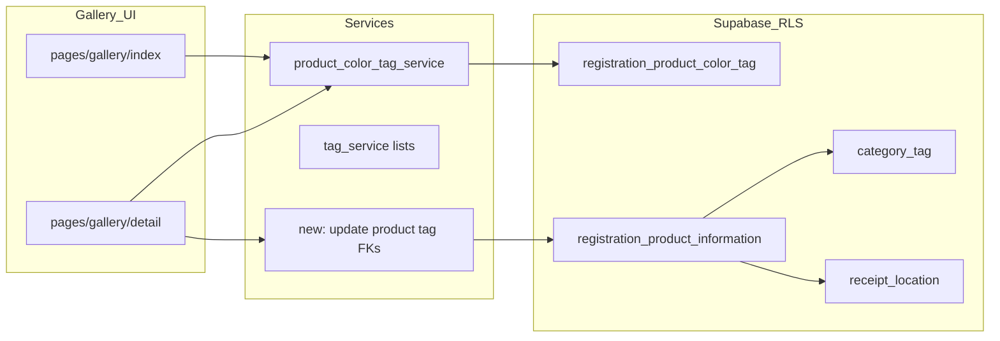

# ギャラリー製品写真へのタグ付与と付与CRUDの実装計画

## 前提の整理（重要）

- ギャラリー一覧・詳細が扱っている実体は [`registration_product_information`](services/photo_service.py) の行である。ユーザー視点では「写真」だが、**更新の単位は製品行**（[`database_configuration.md`](.cursor/rules/database_configuration.md) の `photo_id` / 各タグ列と一致）。
- **カラータグ**: 正は `registration_product_color_tag`（`members_id` + `registration_product_id` + `slot` 1..7）。既存の [`services/product_color_tag_service.py`](services/product_color_tag_service.py) の `set_product_color_tags` / `get_product_color_tag_slots` を流用する。
- **カテゴリータグ / 収納場所タグ**: 製品行の **`category_tag_id` / `receipt_location_id`（各 NULL 可の単一 FK）** で表現（多対多ではない）。
- **タグ定義（マスタ）の CRUD** は既に別 URL で提供済み（[`file_structure.md`](.cursor/rules/file_structure.md)）: [`pages/settings/color_tags.py`](pages/settings/color_tags.py)、[`pages/settings/category_tags.py`](pages/settings/category_tags.py)、[`pages/settings/receipt_location_tags.py`](pages/settings/receipt_location_tags.py) と各 `features/*/controller.py`。本計画の「CRUD」は主に **製品への付与（作成＝初回付与、読取、更新、削除＝解除）** を指す。

---

## Step 1: 要件の固定（スコープ合意）

- **付与の意味**: 一覧・詳細から、対象 `registration_product_id` のカラー slots・`category_tag_id`・`receipt_location_id` を変更できること。
- **マスタ操作**: 新規タグ名の追加や色の編集は **設定画面へ誘導**（ギャラリー内で重複 UI を作らない方針を推奨）。ギャラリーには「未設定のタグを選ぶ」ための **ドロップダウン等のみ**。
- **登録フローとの一貫性（任意フェーズ）**: 現状 [`services/registration_service.py`](services/registration_service.py) は保存時に **カラースロットのみ** `set_product_color_tags` している。カテゴリ・収納を登録時にも付けたい場合は別タスクとして [`insert_product_record`](services/photo_service.py) 後の `update` または引数拡張で揃える。

---

## Step 2: 読取（R）— 一覧用クエリと表示データ

- [`services/photo_service.py`](services/photo_service.py) の `_GALLERY_PRODUCT_SELECT` に `category_tag_id` と `receipt_location_id` を追加する。
- 表示用に、PostgREST の埋め込みで `category_tag(category_tag_name, category_tag_color, category_tag_icon)` と `receipt_location(receipt_location_name, receipt_location_icon)` 等を取得するか、転送量とコールバック複雑さのトレードオフで **ID のみ取得 + 既存の並びリストと突合** する（[`tag_service.get_category_tags_ordered`](services/tag_service.py) / receipt 側の同等関数を利用）を決める。**埋め込み1回**の方が一覧の整合性は取りやすい。
- [`pages/gallery/index.py`](pages/gallery/index.py) の `_attach_color_slots` に並行して、必要なら `_attach_category_receipt` で表示用フィールドを正規化（または select で十分なら省略）。
- [`_render_cards`](pages/gallery/index.py) / リスト行に、**小さなチップ**（カラーは既存スロット、`bi-*` アイコン＋短名）を追加。[`DESIGN.md`](DESIGN.md) のカード系トークンに合わせる。

---

## Step 3: サービス層 — 付与の更新ロジック（C/U/D）

- **カラー**: 変更時は既存の `set_product_color_tags(supabase, members_id, registration_product_id, slots)` を呼ぶ（削除＝空配列で junction 全削除済み）。
- **カテゴリ / 収納**: 新規に薄い関数を `services/` に追加（例: `product_assignment_service.py` または `photo_service` 内の明確な名前）:
  - 入力: `registration_product_id`, 任意の `category_tag_id`, `receipt_location_id`（`None` で解除）。
  - 検証: ID が整数であること、**付与先製品が現在ユーザーの `members_id` に属する**こと（クエリは `.eq("members_id", uid)` を必ず併用。RLS があってもアプリ側で業務エラー分岐しやすくする）。
  - 参照整合: 選択された `category_tag_id` / `receipt_location_id` が **同一ユーザーのマスタ行**であることを確認（存在しない・他人 ID は業務エラーまたは no-op＋メッセージ。情報漏えいを避ける文言は [AGENTS.md](AGENTS.md) の方針に従う）。
  - `registration_product_information` の `update` に `updated_date` を合わせる（既存トリガがあれば任せる）。
- **読取（詳細）**: [`pages/gallery/detail.py`](pages/gallery/detail.py) の `select` に `category_tag_id`, `receipt_location_id` と埋め込み、または junction＋マスタを同様に取得。

---

## Step 4: UI/コールバック — 詳細ページを編集の主戦場にする

- 理由: 一覧は [`MATCH` の `gallery-thumb` パターン](pages/gallery/index.py) が既にあり、**各カードに編集用 ALL コールバック**を載せると Dash の複雑度・初回コールバックが増えやすい（[`docs/dash_initial_callbacks_inventory.md`](docs/dash_initial_callbacks_inventory.md) 観点）。
- [`pages/gallery/detail.py`](pages/gallery/detail.py) に以下を追加:
  - 現在のタグ表示（カラーはスウォッチ群、カテゴリ・収納は名＋アイコン）。
  - 編集用: カラーはレビュー同様のトグル（[`features/review/components.py`](features/review/components.py) のパターン参照）、カテゴリ・収納は `dbc.Select`（先頭に「未設定」=`None`）。
  - 「保存」ボタンと結果メッセージ（成功/失敗）。保存後は Store 更新または `dcc.Location` の軽い refresh で一覧と整合。
- コールバックの置き場所: コールバック数が増えるため、**[`app.py`](app.py) から `register_gallery_callbacks(app)`** のように [`features/gallery/controller.py`](features/gallery/controller.py)（新規）へ切り出し、ページレイアウトには **編集対象 id 用の `dcc.Store`** を `pages/gallery/detail.py` 側で常設するか、既存の `gallery-detail-root` 配下に含め **ルートレイアウトから参照可能**にする（Dash 4 ではレビューと同様、レイアウト外参照 id はルートに常設が安全 — [`app.py`](app.py) のレビュー用コメントと同じ考え方）。

---

## Step 5: 一覧との同期（読取の反映）

- 詳細で保存したあと、ユーザーが `/gallery` に戻ったとき **session の `gallery-products-store` が古い**可能性がある。
  - 方針 A: 保存成功時に `gallery-products-store` を触るコールバックは詳細ページにコンポーネントが無いと困難 → **戻るリンクにクエリ `?refresh=1` を付け、一覧側 pathname/search で store を再フェッチ** など明示的な無効化が簡潔。
  - 方針 B: 詳細ページにのみ存在する Store ではなく、**アプリ直下の `dcc.Store(id="gallery-tags-dirty")`** で dirty フラグを立て、一覧の表示コールバックがそれを見て再取得。

いずれか一つを実装時に選択（推奨: **dirty フラグ or refresh クエリ**のどちらか一貫）。

---

## Step 6: 検索・フィルタ（任意拡張）

- 現状の [`_filter_products`](pages/gallery/index.py) はテキスト AND + カラー slots OR。
- 拡張するなら: カテゴリ ID / 収納 ID での OR フィルタを同じカード内にチップ選択で追加（コールバック数増に注意）。

---

## Step 7: テストと検証

- [`.cursor/skills/post-change-verify/SKILL.md`](.cursor/skills/post-change-verify/SKILL.md) に従い、`compileall` と `pytest tests/`。
- サービス関数に対し、`members_id` 不一致や無効 ID のユニットテストを追加（Supabase を mock）。

---

## Step 8: ドキュメント（必要最小）

- 仕様ファイルは [`.cursor/rules/spec.md`](.cursor/rules/spec.md) の方針に従い、**依頼があれば**ギャラリー項目を追記。通常は `file_structure.md` のギャラリー節に「詳細でタグ編集可」の一文程度で足りる場合はユーザー確認の上。

---

## リスク・注意点

- **情報漏えい**: `registration_product_id` をクエリで受けるため、存在しない ID や他人の ID は **同一のユーザー向け文言**で返す。
- **パフォーマンス**: `_GALLERY_PRODUCT_SELECT` の埋め込みで行サイズが増える。必要な列のみに限定。
- **複数写真 per 製品**: 現スキーマは `photo_id` 単一。将来複数写真に拡張する場合はタグの粒度見直しが必要（本計画の範囲外）。
