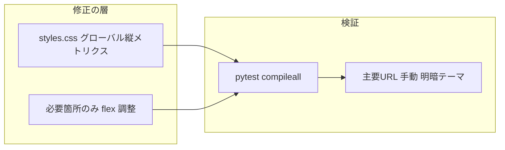

# 入力文字の上下欠け修正計画

## 想定原因（優先度順）

1. **テキストボックス系の縦メトリクス不足**  
   Bootstrap の `.form-control` は `line-height` と `padding` の組み合わせがテーマ・フォント（日本語のベアライン）によってはギリギリになり、**上端・下端がクリップされたように見える**ことがある（特に iOS / Windows のシステムフォント差）。

2. **フレックス行の `align-items-center`**  
   例: [`features/receipt_location_tag/components.py`](features/receipt_location_tag/components.py) の名称行が `className="d-flex align-items-center gap-3"` のまま `dbc.Input` を抱えている。親が子の**デフォルト `min-height: auto`** 扱いで入力の**内側ボックスが縮む**と、文字の上下が欠ける現象が起き得る。

3. **局所的な `height` / `overflow`**  
   現状 [`assets/styles.css`](assets/styles.css) の `overflow: hidden` は主に [`.photo-card`](assets/styles.css) 向けで、レビューフォーム直下ではない。ただし今後の追加分や `style` 直指定があれば個別確認する。

## 方針

- **第一対処は CSS 集約**（[`assets/styles.css`](assets/styles.css)）。`dcc.Input` / `dbc.Input` が出す `input.form-control` に対し、**`line-height`（1.5〜1.6）・`padding-block` の下限・`box-sizing`** を明示し、必要なら **`min-height`** を DESIGN の「主要入力 16px 以上」に整合した値で確保する。  
- **第二対処はホットスポットのみ DOM クラス変更**（収納場所タグの横並び行など）。グローバル CSS だけで直らない場合に限り、`align-items-stretch` とアイコン列だけ `align-self-center` 等に切り替え、**入力は伸ばして縮ませない**。

## 実装ステップ

### 1) ベースラインの測定（読み取りのみ・変更前）

- ブラウザ DevTools で **該当 `input` の computed `line-height` / `padding` / `height` / `align-items`** を1画面分メモする（例: `/register/review` の商品名、`/settings/receipt-location-tags` の名称欄）。
- これにより「グローバルで足りるか／フレックス修正が必須か」を判断する。

### 2) グローバル CSS（主戦場）

[`assets/styles.css`](assets/styles.css) に、**`.page-container` 配下**（アプリ主要 UI が載る領域）に限定したセレクタで追加する（ナビや無関係な要素への副作用を避ける）。

- 対象例: `.page-container input.form-control`、`.page-container textarea.form-control`、必要なら `.page-container select.form-control`。
- 設定案（実装時に数値は DevTools に合わせて微調整）:
  - `line-height: 1.5` または `1.6`（日本語可読性は [DESIGN.md](DESIGN.md) Typography と整合）
  - `padding-top` / `padding-bottom` を Bootstrap 既定よりわずかに増やす、または `min-height: calc(1.5em + …)` 方式
  - `box-sizing: border-box` の明示（既に多くはそうだが保険）
- 既存の [`.input-custom`](assets/styles.css)（バーコード手入力）と**縦方向の見た目が極端にずれない**よう、同じトークン（`--bs-body-color` 等）は維持しつつ **padding / line-height を揃えるか**、`.input-custom` 側にコメントで「フォーム共通ルールの上書き」と分かるようにする。

### 3) フレックス行のホットスポット（必要時のみ）

- [`features/receipt_location_tag/components.py`](features/receipt_location_tag/components.py): 名称行の `d-flex align-items-center` を、**入力が縮まない配置**に変更（例: 親を `align-items-stretch`、アイコン列に `align-self-center`）。
- 同様のパターンが他ファイルにあれば grep（`align-items-center` + 近傍に `form-control`）で列挙し、**同じ理由で欠ける箇所だけ**同型修正。

### 4) 回帰確認

- ルートで `compileall` と `pytest tests/`（[`.cursor/skills/post-change-verify/SKILL.md`](.cursor/skills/post-change-verify/SKILL.md)）。
- 手動: 少なくとも **2 Bootswatch テーマ**（明・暗）で  
  `/register/review`、[`features/review/components.py`](features/review/components.py) の入力群  
  `/settings/color-tags`、`/settings/receipt-location-tags`  
  `/gallery` の検索欄  
  を確認し、**フォーカス時・入力中・プレースホルダ表示時**で欠けが消えたか見る。

### 5) ドキュメント（任意・1行）

- [DESIGN.md](DESIGN.md) §3.1 に「**縦方向は line-height と padding の下限を CSS で保証**」を1文追記するかどうかは、実装で採用した数値が固まったあとで判断（正本の冗長化は避ける）。

## リスクと回避

- **セレクタを広げすぎない**（`.page-container` スコープ）ことで、将来追加する特殊 UI（極小ピッカー等）を壊しにくくする。
- `form-control-color`（[`features/color_tag/components.py`](features/color_tag/components.py) の色スウォッチ）など **正方形ピッカー**は上記グローバルルールから **`:not(.form-control-color)`** で除外するか、個別に上書きする。

## 成果物のイメージ

