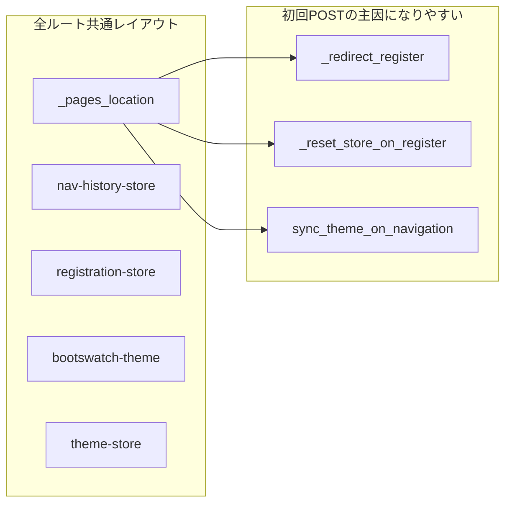
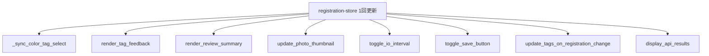

# 初回発火コールバック洗い出しと最適化計画

## 前提の整理（Dash の挙動）

- アプリ全体は [`app.py`](c:\Users\ryone\Desktop\oshi-app\app.py) で `prevent_initial_callbacks="initial_duplicate"` かつ `suppress_callback_exceptions=True`。
- **Output が現在のレイアウトに無い**コールバックは実行されない（ページ未表示ならレビュー系などはホーム初回では動かない）。
- **`prevent_initial_call` 未指定 = `False`** → レイアウトに Output があれば **初回描画後に1回サーバーへPOST** され得る。
- **`prevent_initial_call="initial_duplicate"`** → 重複 Output まわりの「初回どれを許すか」が絡む（[`features/review/controller.py`](c:\Users\ryone\Desktop\oshi-app\features\review\controller.py) の `process_tags` やギャラリーの `gallery-products-store` など）。

---

## Step 1: 計測で「事実」を固定する

1. ブラウザ DevTools の Network で、対象ルートごとに **`/_dash-update-component` の件数・順序・ペイロード** を記録する（[`Cursor.md`](c:\Users\ryone\Desktop\oshi-app\Cursor.md) の必須シナリオ: `/` と `/gallery` に加え、負荷が大きいなら **`/register/review`**）。
2. サーバー側では `DASH_DEBUG=1` のときだけ詳細ログ（[`services/debug_log.py`](c:\Users\ryone\Desktop\oshi-app\services\debug_log.py)）を使い、コールバック名や分岐を対応付ける。

**補足（コールバック外の初回コスト）**: [`pages/home.py`](c:\Users\ryone\Desktop\oshi-app\pages\home.py) の `render_home()` は **レイアウト生成時に同期実行**され、`get_product_stats` / `get_random_product_with_photo` が走る。これは `_dash-update-component` に出ないが **TTFB に直結**するため、コールバック調査と分けて記録する。

---

## Step 1b: セキュリティ観点（統合・遅延・クライアント化の判断ゲート）

パフォーマンス最適化は **攻撃面・データ漏えい・認可バイパス** を増やしやすい。次を満たさない案は採用しないか、対策をセットにする。

**運用**: 上記を **全 PR のレビュー観点**として使う。リポジトリ側の転記先は [`Cursor.md`](c:\Users\ryone\Desktop\oshi-app\Cursor.md) の「PRレビュー観点（Step 1b: セキュリティゲート）」セクション（要約チェックリスト）。

### 認可とデータ境界（サーバー側は最後の砦）

- **統合コールバック**は「1往復で楽」になる一方、分岐が肥大化すると **認可チェックの抜け**が起きやすい。DB/Storage へ触れる経路は、統合後も **現在ユーザー（RLS 有効クライアント）前提**を崩さない（[`services/supabase_client.py`](c:\Users\ryone\Desktop\oshi-app\services\supabase_client.py) の利用方針と整合）。
- **ギャラリー詳細**の `registration_product_id` は URL クエリ由来。**他ユーザーの ID を指定した場合は RLS で 0 件**になる設計を維持し、エラーメッセージに **内部 ID の列挙や存在有無の推測**を与えすぎない表現にする（列挙攻撃・情報漏えいの抑制）。
- **`registration-store`**: 画像 base64 等が `_dash-update-component` のリクエスト/レスポンスに載り得る。統合で **同じデータがより多くの Output に触れる**だけなら新規漏えいではないが、**ログ・エラートレース・デバッグ print** にストア全体を出さない（[`services/debug_log.py`](c:\Users\ryone\Desktop\oshi-app\services\debug_log.py)・`DASH_DEBUG`・`AUTH_DEBUG` は本番オフを検証手順に明記）。

### クライアント寄せ（XSS・オープンリダイレクト・テーマ）

- **`_redirect_register` の clientside 化**を検討する場合: 遷移先は **同一アプリ内の固定パス**（例: `/register/select`）に限定し、クエリ文字列をユーザー入力から組み立てない（オープンリダイレクト対策）。
- **`theme-store` → `bootswatch-theme` href**（[`components/theme_utils.py`](c:\Users\ryone\Desktop\oshi-app\components\theme_utils.py)）: `localStorage` 改ざんで **任意 URL の CSS を読み込む**リスクに備え、クライアント側でも **許可リスト（既存 `BOOTSWATCH_THEMES`）**外は無視する、またはサーバー保存値を正とする。CDN は信頼境界として文書化。

### 可用性・濫用（DoS / コスト）

- **重い処理を1コールバックに集約**すると、単一リクエストの CPU/メモリ・外部 API（IO Intelligence 等）コストが集中する。タイムアウト・レート制限・既存の `process_tags` ガードと **矛盾しないか**を確認する。
- **空クエリの `PreventUpdate`** 等はサーバー負荷低減にもなり、**無意味な DB 試行の削減**（ノイズログ・コスト）としてセキュリティ運用にもプラス。

### 計測・証跡

- Network 記録時、スクリーンショットや HAR に **Cookie・トークン・署名 URL** が含まれないようマスクする（チーム共有時の漏えい防止）。

---

## Step 2: コードベースからの「初回に撃ちやすい」コールバック一覧

### A. 全ルートでレイアウトに存在する入力（`_pages_location` 等）

| 箇所 | 初回 | `prevent_initial_call` | 主な処理 | 遅延・統合の示唆 |
|------|------|-------------------------|----------|------------------|
| [`app.py`](c:\Users\ryone\Desktop\oshi-app\app.py) `_redirect_register` | はい（常に `PreventUpdate`） | 未指定（False） | 無実処理だが **POST は発生** | **クライアントリダイレクト**または `prevent_initial_call=True` + 初回のみ別経路などで **往復削減** |
| [`app.py`](c:\Users\ryone\Desktop\oshi-app\app.py) `_reset_store_on_register` | はい | `False` | `nav-history-store` と条件付きで `registration-store` リセット | [`app.py`](c:\Users\ryone\Desktop\oshi-app\app.py) の pathname 系 **1本化**（下記 C）で POST 集約 |
| [`app.py`](c:\Users\ryone\Desktop\oshi-app\app.py) `sync_theme_on_navigation` | はい | `False` | `load_theme()` → Supabase の可能性 | pathname 系と **統合**するか、テーマは **初回のみクライアント＋遅延サーバー同期**を検討 |

### B. テーマ（[`components/theme_utils.py`](c:\Users\ryone\Desktop\oshi-app\components\theme_utils.py)）

| 箇所 | 初回 | 備考 |
|------|------|------|
| `mark_active_card` | Output が設定画面にしか無ければ **そのページでのみ** | 未指定 → 設定表示時に初回発火し得る |
| clientside `applyThemeHref`（`theme-store` → `bootswatch-theme`） | `prevent_initial_call=False` | クライアントのみ。サーバー負荷ではないが **初回フック**として認識 |

### C. ギャラリー [`pages/gallery/index.py`](c:\Users\ryone\Desktop\oshi-app\pages\gallery\index.py)

| 箇所 | 初回 | 備考 |
|------|------|------|
| `_update_swatch_styles` | `prevent_initial_call=False` | フィルタ Store 初期値で **スウォッチ一括スタイル更新** |
| `_gallery_on_pathname` | `initial_duplicate` | `/gallery` でデータ取得（重い） |
| `_gallery_on_pager` | `initial_duplicate` | ボタン系 |
| `_gallery_disable_load_more` | `False` | Store 依存 |
| `_render_filtered_content` | `False` | Store + 検索 + ビュー。**表示の中心**で重めになりやすい |

**統合案**: `_gallery_disable_load_more` と `_render_filtered_content` を **同一コールバックの複数 Output** にまとめ、`gallery-products-store` の1回の更新で **POST を1回に近づける**（Dash が同一トリガーでバッチする前提を確認しつつ実装）。

### D. ダッシュボード [`pages/dashboard.py`](c:\Users\ryone\Desktop\oshi-app\pages\dashboard.py)

| 箇所 | 初回 | 備考 |
|------|------|------|
| `_dashboard_chart_slot` | `prevent_initial_call=False` | `n_clicks==0` ならプレースホルダ返却だが **サーバー往復は発生** |

**遅延案**: レイアウト側にプレースホルダ文言を置き、本コールバックは `prevent_initial_call=True` に変更（初回 POST 1本削減）。表示ボタン押下後のみサーバーへ。

### E. ギャラリー詳細 [`pages/gallery/detail.py`](c:\Users\ryone\Desktop\oshi-app\pages\gallery\detail.py)

| 箇所 | 初回 | 備考 |
|------|------|------|
| `_on_query_change`（`Input("_pages_location", "search")`） | デフォルト False | `search` が `None` なら `PreventUpdate`。**空文字 `""` のときは** [`render_detail_page`](c:\Users\ryone\Desktop\oshi-app\pages\gallery\detail.py) がエラーUIを返し **無駄な往復**になり得る |

**改善案**: コールバック先頭で `pid` が無い場合は `PreventUpdate`、または `prevent_initial_call` と `pathname` の組み合わせで **クエリ確定後だけ**実行。

### F. レビュー [`features/review/controller.py`](c:\Users\ryone\Desktop\oshi-app\features\review\controller.py)（`/register/review` 表示時に Output が揃う）

以下は **`registration-store` または複数 Input** で、レビュー表示時に **初回バースト**の主因になりやすい。

- `_sync_color_tag_select` — `prevent_initial_call=False`
- `render_tag_feedback` — 未指定
- `render_review_summary` — 未指定（`review-summary-refresh` + store）
- `update_photo_thumbnail` — 未指定（**画像処理は重い**）
- `toggle_io_interval` — `False`
- `toggle_save_button` — 未指定
- `update_tags_on_registration_change` — 未指定（`callback_context.triggered` 分岐あり）
- `display_api_results` — 未指定（pathname が review でなければ `PreventUpdate`）

既に `process_tags` / 一部 Output は `initial_duplicate` で調整済み。

**統合案（優先度高）**: `registration-store` を **単一 Input** にした **マルチ Output コールバック**にまとめ、内部で現在の各関数相当を順呼び出し（または小さなヘルパに分割）。**往復数削減が最も大きい**一方、ファイル肥大とデバッグ難度が上がるので **段階的**（まず軽い2〜3本から）が現実的。

**セキュリティ上の注意（統合時）**: マージ後の1関数の先頭で **`pathname` が期待ルートか**（レビュー専用ロジックが他ページで誤実行されないか）を明示し、外部 API・画像処理へ入る前に **状態フラグ**（例: `tags.status == "loading"`）を再検証する。ログに画像・トークン・全文ストアを出さない。

**遅延案**: `update_photo_thumbnail` を **明示操作または `dcc.Loading` + 別トリガー**に寄せる、`render_review_summary` は既存方針どおり **ボタン主トリガー**へ寄せる（store は State 化）など。

### G. すでに初回抑制されているもの（参照）

- [`features/photo/controller.py`](c:\Users\ryone\Desktop\oshi-app\features\photo\controller.py) / [`features/barcode/controller.py`](c:\Users\ryone\Desktop\oshi-app\features\barcode\controller.py): 主要アクションは `initial_duplicate` または `PreventUpdate` 前提。
- [`pages/register/select.py`](c:\Users\ryone\Desktop\oshi-app\pages\register\select.py): `prevent_initial_call=True`
- [`features/color_tag/controller.py`](c:\Users\ryone\Desktop\oshi-app\features\color_tag\controller.py): `prevent_initial_call=True`

---

## Step 3: 実装優先度（効果 × 難易度 × セキュリティ）

1. **即効・低リスク**: `_redirect_register` の無駄 POST削減、`gallery/detail` の空クエリ時 `PreventUpdate`、ダッシュボード `_dashboard_chart_slot` の `prevent_initial_call=True` 化（レイアウトに初期文言を固定）。  
   - セキュリティ: リダイレクトは **固定パス**のみ。詳細の `PreventUpdate` は **無資格の推測を助けないエラー文**とセットで確認。
2. **中**: [`app.py`](c:\Users\ryone\Desktop\oshi-app\app.py) の pathname 系3本を **1コールバック・複数 Output** に統合（テーマ同期とストア更新の責務を明確に分離したまま同一往復に載せる）。  
   - セキュリティ: 統合後も **`load_theme` / ストアリセット**が未ログイン時に安全か（既存挙動の維持）、分岐ごとに副作用をドキュメント化。
3. **大**: ギャラリーの「無効化 + コンテンツ描画」統合、レビューの `registration-store` 扇の **段階的マージ**（まず `toggle_*` 系と軽量表示のみ）。  
   - セキュリティ: Step 1b のチェックリスト + **別ユーザーのギャラリー ID** での手動回帰（RLS が効いていることの確認）。

---

## Step 4: 検証

- 変更前後で Network の `/_dash-update-component` **件数比較**（`/`, `/gallery`, `/register/review`）。
- 回帰: テーマ保存・ギャラリーページング・レビュー保存・タグ生成フロー。
- セキュリティ回帰: 本番相当設定で **`DASH_DEBUG` / `AUTH_DEBUG` オフ**、他ユーザーの `registration_product_id` で詳細が **見えない**こと、テーマを不正文字列にしたとき **任意 CSS URL に飛ばない**こと（対策を入れた場合）。
