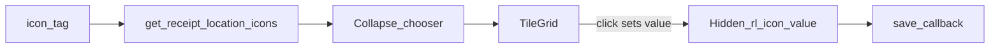

# 収納場所アイコンを「一覧（タイル）」から選ぶ

## 前提（ユーザー回答の反映）

- **対象**: DB の [`icon_tag`](.cursor/rules/database_configuration.md)（`receipt_location_use_flag = 1`）に載る **Bootstrap Icons クラス**を、**サムネイル状のグリッド**で並べて選ぶ。
- **保存形式は現状維持**: [`receipt_location.receipt_location_icon`](services/tag_service.py) は引き続き `bi-…` 文字列（ラスタ画像 URL にはしない）。

## Step 1: データ取得の整理

- 既存の [`services/icon_service.py`](services/icon_service.py) の **`get_receipt_location_icons()`** をそのまま利用（追加マイグレーション不要の想定）。
- UI 用に並び順を固定する（例: `icon_name` 昇順）。重複整理したければ薄いヘルパー（例: `list_receipt_location_icon_options()`）を同ファイルに追加してもよい（任意）。

## Step 2: UI 構成（[`features/receipt_location_tag/components.py`](features/receipt_location_tag/components.py)）

### 客先に見せる範囲（確定方針）

- **常時表示は「名称」＋「現在選ばれているアイコン（プレビュー）」のみ**でよい。読みやすさ・カード高さの両立を優先する。
- **出さないもの**: 「アイコン（Bootstrap Icons クラス）」のような **実装・技術向けラベル**、icons.getbootstrap.com の案内文、プリセット用の「slot N」など **内部用の文言**（必要なら開発者向けドキュメントやコメントに寄せる）。

### 実装パターン

1. **`build_receipt_location_row_blocks(rows, icon_rows)`** にマスタ `icon_rows` を渡す。
2. **値の保持**: 保存コールバック互換のため、従来の **`{"type": "rl-icon", "rid": …}` の `dbc.Input`（または `dcc.Input`）は残すが `style={"display": "none"}`** 等で **画面に出さない**（`bi-…` は内部状態としてのみ存在）。タイルクリックでこの `value` を更新する。
3. **タイルグリッド**は **`dbc.Collapse` + 「アイコンを選ぶ」等の中立なトグル**の内側に配置（一覧はここだけ）。
   - 各セル: `dbc.Button` + `html.I(className=f"bi …")` と、マスタの **`icon_name` を `title` ツールチップ**程度に使うのは可（画面上の主ラベルに技術用語を出さない）。
   - タイル `id`: **`{"type": "rl-icon-tile", "rid": rid_key, "icon": "bi-archive"}`**（`rid_key` は既存どおり int / `new_*`）。
4. **グリッド**: `row` / `col-*` で折返し（モバイル 3〜4 列目安）。一覧が長い場合も **Collapse 内に閉じる**ことで、閉じた状態のカードは名称＋現在アイコンのみになる。

### アクセシビリティ・不具合回避

- **`html.Label` の `htmlFor` に dict 型 `id` を渡さない**（`for="[object Object]"` になる）。名称欄は **`aria-label` / 視覚ラベルをシンプルな日本語**（例:「収納場所の名前」）に限定するか、プレースホルダで足す。

## Step 3: コールバック（[`features/receipt_location_tag/controller.py`](features/receipt_location_tag/controller.py)）

1. 新規コールバック 1 本:
   - **Input**: `{"type": "rl-icon-tile", "rid": ALL, "icon": ALL}, "n_clicks"`（必要なら `MATCH` で行単位に分割してもよいが、ALL + `callback_context` で押下タイルを特定するのが単純）。
   - **Output**: `{"type": "rl-icon", "rid": MATCH}, "value"` とする場合、`MATCH` は `rid` のみ一致で `icon` は可変のため、**`Output` を単一の `rl-icon` に対して `MATCH`（rid のみ）**にし、**`State` で押したタイルの `icon`** を読む設計が安全（Dash の `MATCH` 制約に注意）。
2. 実装パターン例:
   - `Input({"type": "rl-icon-tile", "rid": ALL, "icon": ALL}, "n_clicks")`
   - `Output({"type": "rl-icon", "rid": MATCH}, "value")` は不可（MATCH が合わない）→ **代案**: `Output({"type": "rl-icon", "rid": ALL}, "value")` + `State(..., "id")` で、クリックされたタイルの `rid` に対応する入力だけ更新し、他は `no_update`。
3. `n_clicks` が None/0 の初期発火に注意し `prevent_initial_call=True`。クリック時のみ `icon` 文字列を該当 `rl-icon` の `value` にセット。

## Step 4: 保存フローとの整合

- 既存の **`_save_rows`** は `State({"type": "rl-icon", "rid": ALL}, "value")` を読むだけなので、**タイル選択は非表示 `rl-icon` の `value` を書き換えるだけ**で保存ロジックは変更不要（[`tag_service.normalize_receipt_location_icon`](services/tag_service.py) もそのまま）。

## Step 5: ドキュメント（任意・短く）

- [`.cursor/rules/database_configuration.md`](.cursor/rules/database_configuration.md) の `icon_tag` 近傍に、「収納場所設定 UI のアイコン一覧は `receipt_location_use_flag=1` の行を表示」と **1 行追記**する程度で足りる（正本の冗長複製は避ける）。

## Step 6: 検証

- [`.cursor/skills/post-change-verify/SKILL.md`](.cursor/skills/post-change-verify/SKILL.md): `compileall` と `pytest tests/`。
- 手動: 折りたたみ閉じた状態で **名称＋アイコンのみ**になっていること。タイルタップで非表示入力の値が更新され、保存・再表示で一致すること。画面上に **Bootstrap Icons / クラス名の説明ラベルが出ていない**こと。

