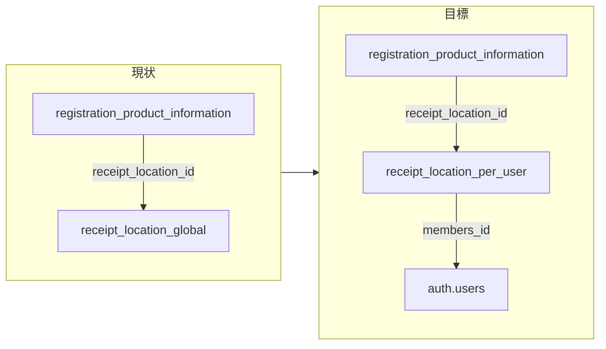

# 収納場所タグのユーザー別化（設計計画）

## Step 1: 現状とギャップ

- **DB**: [`public.receipt_location`](supabase/migrations/20251029034139_create_remaining_tables_and_clear_test_data.sql) は **全ユーザー共通** の行モデル。[`registration_product_information`](supabase/migrations/20260112_members_id_uuid_auth_users_fk.sql) は `members_id` 付きだが、`receipt_location_id` の参照先に **テナント境界がない**（他ユーザーの行 ID を指し得る）。
- **RLS**: [`20260112_members_id_uuid_auth_users_fk.sql`](supabase/migrations/20260112_members_id_uuid_auth_users_fk.sql) で `photo` / `color_tag` / `category_tag` 等は `auth.uid() = members_id` だが、**`receipt_location` は対象外**（従来の緩いポリシーのままの可能性）。
- **アプリ**: [`services/tag_service.py`](services/tag_service.py) の `get/update/create_receipt_location_*` は **`_current_members_id()` を使っていない**（167–176行付近）。設定 UI は [`pages/settings/index.py`](pages/settings/index.py) の **プレースホルダーボタン**のみ（227–231行）。

## Step 2: データモデルとマイグレーション方針

**推奨**: 既存テーブル `receipt_location` に **`members_id uuid not null references auth.users(id) on delete cascade`** を追加し、`color_tag` / `category_tag` と同様に **行単位でユーザー所有** とする（新テーブルより FK 変更が少ない）。

1. **スキーマ**
   - `members_id` 追加（移行手順により一時 NULL 可 → バックフィル後 NOT NULL）。
   - **スロット（プリセット6件）**: **`slot` は整数 NULL 可**。`slot in (1..6)` の行だけが **初期シード対象**（`ensure_default` が不足分のみ補い、既存行は上書きしない）。**7件目以降は `slot IS NULL`** の通常行として **件数上限なしで追加**する（方針: **行追加に制限を掛けない**）。
   - **一意制約**: グローバルな `receipt_location_name` UNIQUE は廃止。プリセット衝突防止のため **部分ユニークインデックス** `unique (members_id, slot) where slot is not null`（PostgreSQL）。追加行同士は `slot` が NULL のためこの制約に掛からず、**同一ユーザー内で名称の重複を許すか**は製品都合で選択（許す方が入力自由度は高い）。
   - **インデックス**: `(members_id)`、表示順用に `(members_id, slot nulls last)` や `created_at` など。
2. **既存データの扱い**（環境により調整が必要）
   - `members_id` が無い既存行は、**本番で参照ゼロなら削除**、参照ありなら **一旦 `registration_product_information.receipt_location_id` を NULL にしてから削除**し、ユーザー別データはアプリの `ensure_default_*` で再付与（下記）。
3. **RLS**
   - `alter table public.receipt_location enable row level security;`
   - ポリシー例: `using (auth.uid() = members_id) with check (auth.uid() = members_id)`（他テーブルと同型）。
   - 旧ポリシー（`true` 相当）は **必ず除去**。
4. **整合性（推奨）**
   - DB だけでは `rpi.members_id` と `receipt_location.members_id` の一致は FK 1本では表現しづらい。**登録・更新サービス層**で「選択した `receipt_location_id` が現在ユーザーのものか」を検証する。余力があれば **トリガー or 制約付きビュー**も検討。

実装後、用語正本の [`.cursor/rules/database_configuration.md`](.cursor/rules/database_configuration.md) に `members_id` を追記する（実装タスクに含める）。

## Step 3: サービス層（`tag_service.py`）

[`color_tag` のパターン](services/tag_service.py)（`DEFAULT_COLOR_TAGS` / `ensure_default_color_tags` / `_current_members_id`）に揃える。

1. **定数** `DEFAULT_RECEIPT_LOCATIONS`: 各要素に **`slot` 1..6** と、既存シードと揃えた **初期表示用の名称・アイコン**（例: タンス `bi-archive` … — 正本は [`20251029211613_insert_initial_tag_data.sql`](supabase/migrations/20251029211613_insert_initial_tag_data.sql) 24–30行）。
2. **`ensure_default_receipt_locations()`**: **slot 1..6 のうち欠けているものだけ** `insert` する（既存の `receipt_location_id` は維持）。**追加で作成した行（`slot` NULL）には触れない**。これにより **プリセット6件は常に使える**一方、ユーザーは **任意件数まで行追加**できる。
3. **`get_receipt_location_tags()`**: `.eq("members_id", members_id)`。**`members_id` 未取得時は `[]`**。
4. **`update_receipt_location_tag`**: **`members_id` + `receipt_location_id`** で更新（プリセット行・追加行の両方）。
5. **`create_receipt_location_tag`**: **`members_id` を付与し `slot` は NULL** で `insert`。**件数・レートの上限は設けない**（必要なら将来のみソフト上限やUI注意書き）。削除は仕様未確定のため計画では **任意**（実装する場合は `receipt_location_id` を参照する商品は `ON DELETE SET NULL` 前提で UX 文言を用意）。
6. **バリデーション**
   - 名称: 空禁止、最大長（DB `text` に合わせた上限をアプリ側でも）。
   - アイコン: 仕様上 Bootstrap Icons（[spec.md](.cursor/rules/spec.md)）。**自由入力**しつつ、`bi-[a-z0-9-]+` 程度に **サーバ側でホワイトリスト**し、HTML `className` への直挿しで **クラスインジェクション**にならないようにする。

[`services/icon_service.py`](services/icon_service.py) の `get_receipt_location_icons()` は **マスタ `icon_tag` の提案用**として維持し、設定 UI では **テキスト入力＋（任意）候補ドロップダウン**で併用可能。

## Step 4: UI・ルーティング（Dash Pages）

[`pages/settings/color_tags.py`](pages/settings/color_tags.py) と同型で追加する。

| 項目 | 内容 |
|------|------|
| 新ページ | 例: [`pages/settings/receipt_location_tags.py`](pages/settings/receipt_location_tags.py) → パス `/settings/receipt-location-tags`（英語スラッグで `color-tags` と揃える） |
| 機能モジュール | [`features/receipt_location_tag/components.py`](features/receipt_location_tag/components.py)（レイアウト）、[`features/receipt_location_tag/controller.py`](features/receipt_location_tag/controller.py)（保存コールバック） |
| 設定トップ | [`pages/settings/index.py`](pages/settings/index.py): `html.Button` を **`dcc.Link` に変更**し、上記パスへ遷移 |
| コールバック登録 | [`app.py`](app.py): `register_color_tag_callbacks` と同様に `register_receipt_location_tag_callbacks(app)` を追加 |
| サイトマップ記述 | [`.cursor/rules/file_structure.md`](.cursor/rules/file_structure.md) に 1 行追加（ルールファイルの修正方針に従う） |

**画面要件（ユーザー要望への対応）**

- **一覧**: `ensure_default_receipt_locations()` のあと `get_receipt_location_tags()` で **slot 1..6 を先頭に**、続けて **`slot` NULL の追加行**（作成日時順など）を表示。
- **追加**: **「収納場所を追加」** 等のボタンで空行またはモーダルから **名称・アイコンを入力して `create`**。回数制限なし。
- **自由入力**: 各行に **収納場所名**（`dcc.Input`）、**アイコン**（`bi-…` 文字列。プレビュー用に `html.I(className=...)` は **検証済みクラス名のみ** 反映）。
- **保存**: 「まとめて保存」または行ごと — 実装コスト最小は **カラータグ同様の一括保存＋結果メッセージ**。
- **モバイル**: [`DESIGN.md`](DESIGN.md) のカードクラス・余白に合わせ、横スクロールや折返しを意識。

**Dash 制約**: コールバックが参照するコンポーネント ID は **当該ページのレイアウトに常に存在**すること（[file_structure.md](.cursor/rules/file_structure.md) の Dash Pages 注意）。

## Step 5: 登録フローとの接続（スコープ確認）

現状 grep では **レビュー画面等から `get_receipt_location_tags` は未使用**。今回のスコープを **「設定ページ＋DB＋サービス」** に限定するなら追加作業は不要。  
**商品に収納場所を紐づける UI** を同時にやる場合は、レビュー／登録コントローラで `get_receipt_location_tags()` を呼び **ドロップダウン**を差し込む — これは別タスクとして切り出すと差分が小さい。

## Step 6: 検証

- [`.cursor/skills/post-change-verify/SKILL.md`](.cursor/skills/post-change-verify/SKILL.md): リポジトリルートで `compileall` と `pytest tests/`。
- 手動: ユーザーAで **プリセット6＋任意件の追加** が保存・再表示されること、ユーザーBとは **相互に見えない**こと（RLS）。

## リスク・判断ポイント

- **既存 DB にグローバル行が残っている場合**の移行順序（NULL 化 → 削除 → NOT NULL）を誤るとデプロイ失敗。**ステージングでマイグレーションを一度通す**こと。
- **件数**: **プリセット6は常に確保**しつつ、**追加行は無制限**（本計画の確定方針）。大量登録時のUI（スクロール・検索）は実装時に軽く考慮。
