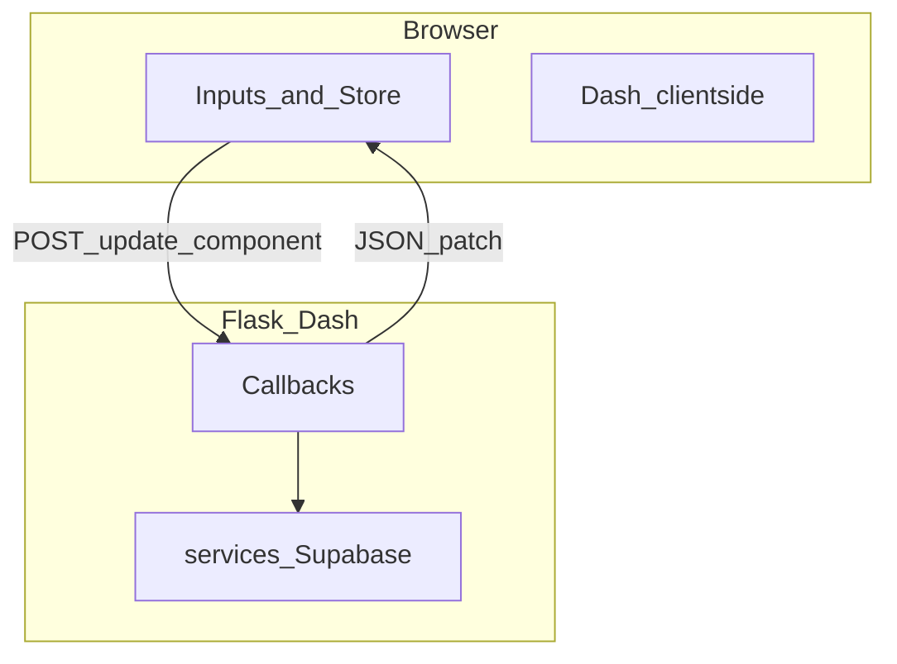

# 表示速度改善（フロントエンド視点・段階計画）

## ユーザー観測に基づく優先順位

**特に遅い画面（最優先で計測・改善する）**

| URL | 主な負荷の型 | 主な参照 |
|-----|----------------|----------|
| **`/`（ログイン後ホーム）** | サーバー同期レンダリングで Supabase 複数クエリ＋多行取得の可能性、署名 URL 生成 | [`pages/home.py`](c:\Users\ryone\Desktop\oshi-app\pages\home.py)、[`services/photo_service.py`](c:\Users\ryone\Desktop\oshi-app\services\photo_service.py) の `get_product_stats` / `get_random_product_with_photo` |
| **`/gallery`** | **全件** `get_all_products` + 全行 `_with_signed_photo_urls`、大量 `html.Img` | [`pages/gallery/index.py`](c:\Users\ryone\Desktop\oshi-app\pages\gallery\index.py)、同上 `get_all_products` |

レビューの Callback 過密・Plotly 等は **その次**（体感の二次ボトルネック）。

---

## セキュリティを維持したままの (A)(C) 方針（実装のガードレール）

Private Storage の **署名 URL は「漏えい＝その期間は誰でも取得可」** になるため、(A)(C) は次の範囲に収める。

### (A) 署名 URL の削減とサーバー側短 TTL キャッシュ

| レベル | 内容 | セキュリティ |
|--------|------|----------------|
| **A1（必須・最初にやる）** | **画面に出す行だけ**に `_with_signed_photo_urls` をかける。一覧は **ページング後 N 件**＋`select` 列を一覧用に絞る。 | **維持**（発行本数が減るだけ） |
| **A2（A1 の後）** | **プロセス内メモリ**で署名結果をキャッシュ。キーは **`members_id` + object_path`**。TTL **60〜120 秒**を初期値（計測で調整）。 | **ほぼ維持**（TTL を長くしすぎない。ユーザー間でキーを共有しない） |
| **A3（当面やらない）** | 署名付き URL の **長寿命化**（例 1 時間）だけで負荷を誤魔化す | **非推奨**（漏えい時の被害時間が伸びる） |

**禁止**: キャッシュキーやログに **署名 URL 全文**を出す。サービスロールキーをブラウザに出さない（既存方針のまま）。

### (C) `dcc.Store(storage_type="session")`

| レベル | 内容 | セキュリティ |
|--------|------|----------------|
| **C1** | Store には **ページング済みの軽いスナップショット**のみ（表示に必要な列＋その画面で使う signed URL）。**全件の生データは載せない** | 既に `img src` で渡す情報と同順位の露出に留める |
| **C2** | **再フェッチで無効化**するイベントを明示（例: 登録完了後にギャラリーへ戻る、手動「更新」、該当ルート離脱時は実装方針で決定） | 鮮度・整合は UX。秘密の拡大はしない |
| **C3** | Store に **秘密・内部エラー詳細・他ユーザー**を載せない | 不変 |

**注意**: Session Storage に載せるのは「サーバーがそのレスポンスで既にクライアントに渡してよいデータ」に限る。新たな権限境界は作らない。

### 実装順（(A)(C) だけ抜粋）

1. **A1**（表示分のみ署名・件数・列の絞り）を **ギャラリー＋ホームの取得経路**に入れる。  
2. **A2**（短 TTL・`members_id` スコープ）を `create_signed_url` / ラッパに追加。  
3. **C1〜C3** でギャラリー（必要ならホームの軽いキャッシュ）に `dcc.Store` を検討。

---

## 前提（その他のボトルネック仮説）

| レイヤー | 根拠（ファイル） |
|----------|------------------|
| **Dash コールバックの過密** | [`features/review/controller.py`](c:\Users\ryone\Desktop\oshi-app\features\review\controller.py) で `registration-store` を `Input` にしたコールバックが複数。store 更新1回で複数 POST が連鎖しやすい。 |
| **レビュー画面の入力1文字ごとの再計算** | `render_review_summary` が各フォーム `value` をすべて `Input` にしている（L85-94）。 |
| **Plotly の初回コスト** | [`pages/dashboard.py`](c:\Users\ryone\Desktop\oshi-app\pages\dashboard.py) の `dcc.Graph`。 |
| **開発時のログ I/O** | `print` / 認証デバッグログの大量出力。 |

---

## Step 1: 計測で「どこが遅いか」を固定する（着手前の必須）

- **必須シナリオ**: **`/` 初回表示**、**`/gallery` 初回表示**（ログイン済み同一ユーザー）。
- **ブラウザ**: DevTools **Network**（`/_dash-update-component`、静的アセット、`supabase.co` / storage）、**Performance**。
- **サーバー**: 同一シナリオで POST 回数/秒、または `app_run.log` で相関。
- **合格基準の例**: 「ギャラリー初回の Storage 署名 API 相当呼び出しが、件数に対して線形で頭打ち（ページサイズ上限）になる」など **数値で言える**ものを1つ以上。

---

## Step 2: ホーム・ギャラリー・署名 URL（観測優先・(A)(C)）

対象: [`pages/home.py`](c:\Users\ryone\Desktop\oshi-app\pages\home.py)、[`pages/gallery/index.py`](c:\Users\ryone\Desktop\oshi-app\pages\gallery\index.py)、[`services/photo_service.py`](c:\Users\ryone\Desktop\oshi-app\services\photo_service.py)

1. **ホーム**  
   - `get_product_stats`: 全行 `select` して Python 集計をやめ、**DB 側 count / 必要最小列**に寄せる。  
   - `get_random_product_with_photo`: **必要列＋ limit**、候補は小さく。署名は **最終1件（または表示数）だけ**。

2. **ギャラリー**  
   - **A1**: `get_all_products` の全件一括署名をやめ、**ページング後のリストだけ** `_with_signed_photo_urls`。クエリに **limit/offset（または keyset）** と列絞り。  
   - **A2**: 署名生成の短 TTL キャッシュ（上記ガードレール）。  
   - **C**: 同一ブラウザセッションでの再訪を `dcc.Store` でスキップするかは **A1 後**に効果測定してから。無効化条件は C2 で明文化。

3. **UI**  
   - `html.Img` に `loading="lazy"`。ページング UI と整合。

---

## Step 3: レビュー画面のコールバック密度を下げる

対象: [`features/review/controller.py`](c:\Users\ryone\Desktop\oshi-app\features\review\controller.py)

1. **`render_review_summary`**: debounce、または「更新」ボタン＋`State`、または部分 `Output`。  
2. **`process_tags`**: 主トリガーを `io-intelligence-interval.n_intervals`、`State` で store 参照、等。  
3. **同一 store 連鎖**: 統合可能な Output の整理、`PreventUpdate` の徹底。

---

## Step 4: ダッシュボード（Plotly）の初回負荷

対象: [`pages/dashboard.py`](c:\Users\ryone\Desktop\oshi-app\pages\dashboard.py)

- 初回レイアウトでは `dcc.Graph` を置かず、操作後にマウント。または軽量代替。

---

## Step 5: アプリ全体の基盤（中期的・別PRでも可）

- [`app.py`](c:\Users\ryone\Desktop\oshi-app\app.py) のモジュール先頭 `supabase` をリクエスト内 `get_supabase_client()` に。  
- ログの環境変数ガード。

---

## Step 6: CSS / レンダリング（微調整・最後）

対象: [`assets/styles.css`](c:\Users\ryone\Desktop\oshi-app\assets\styles.css)

- `filter` / 重い `box-shadow`、`@media (hover: hover)` で hover の限定、等。

---

## 推奨する実施順（要約）

1. Step 1（計測・**`/`, `/gallery` 必須**・合格基準）  
2. Step 2（**ホーム・ギャラリー・A1→A2→C** の順でセキュリティ方針順守）  
3. Step 3（レビュー Callback）  
4. Step 4（Plotly 遅延）  
5. Step 5（`app.py` supabase・ログ）  
6. Step 6（CSS）

---

## 完了条件（この計画のゴール）

- **`/` と `/gallery`** で、計測したボトルネック（DB 転送量・署名回数・DOM 数）が **改善前から有意に減っている**。  
- (A)(C) は **A1/A2/C のガードレール**に沿っており、**長寿命署名のみでの対処（A3）に頼っていない**。  
- レビューで **入力に追随する不要な全量サマリー再計算がない**。  
- `/dashboard` 非利用時に **Plotly バンドルが不要に読み込まれない**、または遅延マウントされている。
