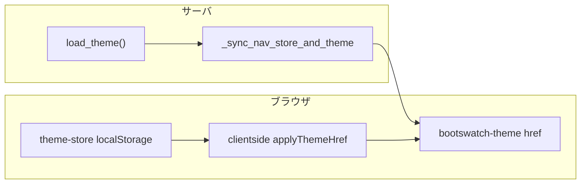

# 設定ページテーマ表示タイミングの修正計画

## 現象と期待

- **現象**: `/settings` に入った直後から、まだ別テーマカードをクリックしていないのに、保存済み（DB）のテーマと異なる Bootswatch が当たっている／カードの `active` や文言と体感がずれる。
- **期待**: 初期表示は常に **現在の保存テーマ**（[`load_theme()`](components/theme_utils.py) が返す値）。別テーマカードをクリックしたときだけ **プレビュー用に** 見た目が切り替わる（既存の [`update_preview_from_card`](components/theme_utils.py) の意図）。「テーマを保存」で永続化＋ localStorage 更新（現状どおり）。

## 原因（コード上の整理）

1. **二系統の「適用」**  
   - [`app.py`](app.py) の [`_sync_nav_store_and_theme`](app.py) が `_pages_location` のたびに `bootswatch-theme` の `href` を `get_bootswatch_css(load_theme())` で更新している。  
   - 一方 [`components/theme_utils.py`](components/theme_utils.py) で、`dcc.Store(id="theme-store", storage_type="local")` を **Input** にした clientside（[`applyThemeHref`](assets/themeScroll.js)）が **`prevent_initial_call=False`** のため、`theme-store` の再hydrateのたびに **同じ `href` を上書き**する。

2. **正本の不一致**  
   - `theme-store` は **保存ボタン成功時**のみサーバが `{"theme": ...}` を書き込む（[`save_theme_callback`](components/theme_utils.py)）。  
   - ブラウザに残った値は「前ユーザ・前セッション・古い保存」であり、**いまの `load_theme()`（Supabase + フォールバック）と必ずしも一致しない**（同一端末でのログイン切替が典型）。

3. **設定ページ側**  
   - [`pages/settings/index.py`](pages/settings/index.py) では `theme-preview-store` の初期値を `load_theme()` で埋め、`theme-preview-name` も同じ文字列で描画している。**サーバレンダリング時点の `load_theme()` が正しければ**「選択中」のデータは正本に沿う。  
   - 見た目が先にずれるのは、上記 **clientside が `href` だけを localStorage 優先で上書き**するためと整合的。

※ ルートレイアウトの `html.Link(..., href=get_bootswatch_css(load_theme()))` は **プロセス起動時**の `load_theme()` になり得る点は既知だが、pathname 同期で多くは補正される。**残る問題はその後の `theme-store` → clientside**。

## 修正方針（タイミングの変更）

**方針**: 「見た目の正本」を **常に `load_theme()` に揃える**よう、`theme-store`（localStorage）を **ナビゲーション確定のたびにサーバ値で上書き**する。プレビューは引き続き **`update_preview_from_card` が `bootswatch-theme` のみ更新**し、`theme-store` は触らない（保存まで永続ストアを汚さない）。

### 実装ステップ

1. **[`app.py`](app.py) の `_sync_nav_store_and_theme` を拡張**  
   - 既存の戻り値に加え、`Output("theme-store", "data", allow_duplicate=True)` を追加する。  
   - 各分岐で `theme = load_theme()` に対し `{"theme": theme}` を **常に** `theme-store` に返す（`reset_needed` の有無に関わらず、同じテーマ dict でよい）。  
   - これにより **ページ遷移のたびに localStorage がサーバ正本と一致**し、その後に走る clientside `applyThemeHref` も **同じテーマの href** を設定するだけになり、誤った上書きが消える。

2. **重複 Output の整合**  
   - `theme-store` は既に [`save_theme_callback`](components/theme_utils.py) から `allow_duplicate=True` で書かれているため、`_sync_nav_store_and_theme` 側も **`allow_duplicate=True`** で登録し、Dash の duplicate ルールに合わせる。

3. **動作確認シナリオ（手動）**  
   - ユーザーAでテーマ保存 → ログアウト → ユーザーBで別テーマの DB → `/settings` で **未クリック時** A の localStorage が残っていても **B のテーマで表示**されること。  
   - `/settings` で別カードクリック → 即プレビュー → 保存で DB + `theme-store` 更新 → 他ページへ移動して戻る → 保存済みで表示。  
   - プレビューのみで保存せずに他ページへ → **保存テーマに戻る**（pathname 同期で `href` と `theme-store` が揃う想定）。

4. **（任意・短文）**  
   - 設定カード上の説明文「カードを選ぶとすぐプレビュー…」は現状の意図と一致するため変更不要。必要なら「表示は保存テーマが基本」と1行追記する程度。

## 変更ファイル

- 主: [`app.py`](app.py)（`_sync_nav_store_and_theme` の Output / return のみ）
- 検証: [`components/theme_utils.py`](components/theme_utils.py)・[`assets/themeScroll.js`](assets/themeScroll.js) はロジック変更なし（挙動が整合するか確認のみ）

## リスクと留意

- **pathname 同期の頻度**: 全遷移で `theme-store` を上書きするため、**未保存のプレビューはページを離れると破棄**される（期待「基本は保存テーマ」と一致）。  
- **pytest / compileall**: 変更はコールバックの入出力のみ。リポジトリルートで [`post-change-verify` skill](.cursor/skills/post-change-verify/SKILL.md) に従い `python -m compileall` と `pytest tests/` を実行する。
