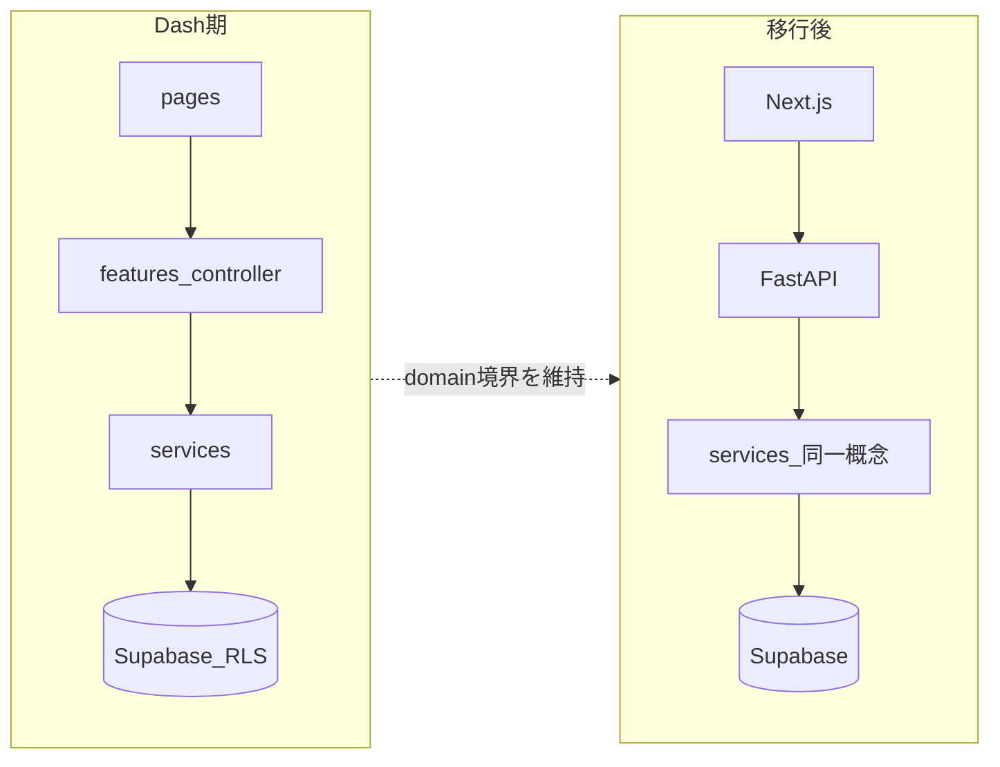

# エージェント向けルール（AGENTS.md）

このファイルは **AI / エージェントが常に守る境界と参照先** の入口である。長文の仕様や手順の複製はせず、正本は下記の各ドキュメントに任せる。

## 役割の切り分け

| ドキュメント | 役割 |
|-------------|------|
| **AGENTS.md**（本ファイル） | アーキ境界、認可・秘密情報、UI の正本への導線。短く保つ。 |
| [.cursor/rules/spec.md](.cursor/rules/spec.md) | 製品仕様・機能要件・登録フロー等の詳細正本（リポジトリ方針上の修正禁止の宣言あり）。 |
| [.cursor/rules/file_structure.md](.cursor/rules/file_structure.md) | URL・ディレクトリ・Dash Pages 制約の正本。 |
| [.cursor/rules/database_configuration.md](.cursor/rules/database_configuration.md) | スキーマ・テーブル用語の正本。 |
| [.cursor/rules/OAuth.md](.cursor/rules/OAuth.md) | 認証・環境変数・デプロイ手順の正本。 |
| [DESIGN.md](DESIGN.md) | デザインシステムの正本。 |
| [Cursor.md](Cursor.md) | 運用メモ・起動手順・計測シナリオ・PR レビュー観点（セキュリティゲート等）。 |
| [cursor_error.md](cursor_error.md) | 過去のエラーと解決メモ。 |
| [docs/dash_callback_baseline.md](docs/dash_callback_baseline.md) | `/_dash-update-component` の計測手順・ベースライン。 |
| [docs/dash_initial_callbacks_inventory.md](docs/dash_initial_callbacks_inventory.md) | 初回発火コールバックの棚卸し表。 |
| [.cursor/skills/post-change-verify/SKILL.md](.cursor/skills/post-change-verify/SKILL.md) | 変更後の検証: リポジトリルートで `compileall` と `pytest tests/`（[tests/](tests/)）。 |

## プロダクトと現在のスタック

- **プロダクト**: 推し活グッズの登録・管理・閲覧を行う Web アプリ。機能の詳細は [spec.md](.cursor/rules/spec.md) を正とする。
- **現在の実装**: Python 3.11 想定。Flask（[`server.py`](server.py)）＋ Dash Pages（[`app.py`](app.py)）、dash-bootstrap-components、Bootswatch、Bootstrap Icons。バックエンドは Supabase（Auth / Postgres RLS / Storage）。デプロイは Render を想定。
- **UI**: モバイルファースト。テーマは Bootswatch 全件を許容する方針は [DESIGN.md](DESIGN.md) に従う。

## 将来アーキテクチャ（Next.js × FastAPI）と、Dash 期に守ること

- **目標**: フロントを Next.js、HTTP API を FastAPI とし、認証・DB は Supabase を継続する想定（API で JWT 検証を行うパターンが一般的）。
- **Dash 期から維持すべき境界**:
  - **ドメイン・DB・外部 API**は [`services/`](services/) に置き、[`features/*/controller.py`](features/) と [`pages/`](pages/) は入力・表示・遷移・Dash 状態に寄せる（[file_structure.md](.cursor/rules/file_structure.md) の意図と一致させる）。
  - **テナント境界**: 行の `members_id` と RLS を前提とし、ユーザーコンテキストの Supabase クライアント（例: [`services/supabase_client.py`](services/supabase_client.py) の `get_supabase_client()`）でデータに触る。サービスロールキーは診断・限定用途のみ（詳細はコードと運用メモに従う）。
  - **URL クエリ・Store 由来の ID**でデータを取得する場合は、認可とエラーメッセージの情報漏えい（存在の推測を助けない表現等）に注意する。パフォーマンス改善・コールバック統合時は [Cursor.md](Cursor.md) の PR レビュー観点（セキュリティゲート）を崩さない。

## ファイル配置とルーティング

- レイアウト・ページ・コールバックの置き場は [file_structure.md](.cursor/rules/file_structure.md) の `pages/` / `features/` / `components/` / `services/` / `assets/` に従う。
- Dash Pages の制約（レイアウトに存在しないコンポーネント ID をコールバックが参照しない等）は変更時に必ず意識する。詳細は同ファイル。

## データとストレージ

- DB スキーマ・用語は [database_configuration.md](.cursor/rules/database_configuration.md) を正とする。
- Storage（Private bucket・object path・signed URL 等）は [file_structure.md](.cursor/rules/file_structure.md) の Storage 関連の記述と既存実装（例: `photo_service`）の流儀に合わせる。

## 認証・秘密情報・環境

- OAuth / PKCE / HttpOnly Cookie / 必須環境変数は [OAuth.md](.cursor/rules/OAuth.md) を正とする。起動・検証の具体手順は [Cursor.md](Cursor.md) を参照。
- **禁止**: `.env` の秘密を Git にコミットしない。本番相当のログにトークン・Cookie・署名 URL、`registration-store` の全文・画像の base64 などを出力しない。デバッグフラグ（`DASH_DEBUG` / `AUTH_DEBUG` 等）は本番でオフにする方針を守る（詳細は Cursor.md）。

## デザイン

- UI を生成・変更するときは **[DESIGN.md](DESIGN.md) の最新版に従う**。色付き主要カードや例外（中立カード）のルールも DESIGN に従い、実装では `assets/styles.css` のトークン・`card-main-*` 等の流儀を踏襲する。

## 品質と変更時の姿勢

- 変更は依頼範囲に留める。仕様変更が疑わしいときは [spec.md](.cursor/rules/spec.md) および DESIGN と矛盾がないか確認する。
- 外部通信は HTTPS。業務エラー（入力ミス等）とシステムエラー（IO・DB 障害等）を区別し、ユーザー向けフィードバックと例外の扱いはプロジェクトの既存パターンとユーザー方針に合わせる。
- **Dash の表示速度・コールバック削減**を扱うときは、計測手順・ベースラインとして [docs/dash_callback_baseline.md](docs/dash_callback_baseline.md)、初回発火の整理として [docs/dash_initial_callbacks_inventory.md](docs/dash_initial_callbacks_inventory.md) を参照する。運用上の必須シナリオやセキュリティチェックリストの詳細は [Cursor.md](Cursor.md)。

## 人間向けメモ

- 日々の運用・トラブルシュートは [Cursor.md](Cursor.md) と [cursor_error.md](cursor_error.md) を参照する。本ファイルでは導線のみ示す。

## 参照一覧（クイックリンク）

- [.cursor/rules/spec.md](.cursor/rules/spec.md)
- [.cursor/rules/file_structure.md](.cursor/rules/file_structure.md)
- [.cursor/rules/database_configuration.md](.cursor/rules/database_configuration.md)
- [.cursor/rules/OAuth.md](.cursor/rules/OAuth.md)
- [DESIGN.md](DESIGN.md)
- [Cursor.md](Cursor.md)
- [cursor_error.md](cursor_error.md)
- [docs/dash_callback_baseline.md](docs/dash_callback_baseline.md)
- [docs/dash_initial_callbacks_inventory.md](docs/dash_initial_callbacks_inventory.md)
