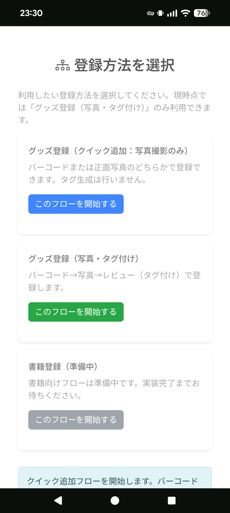
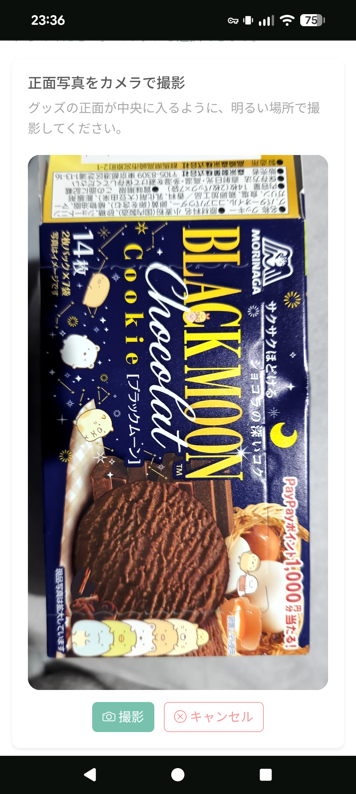
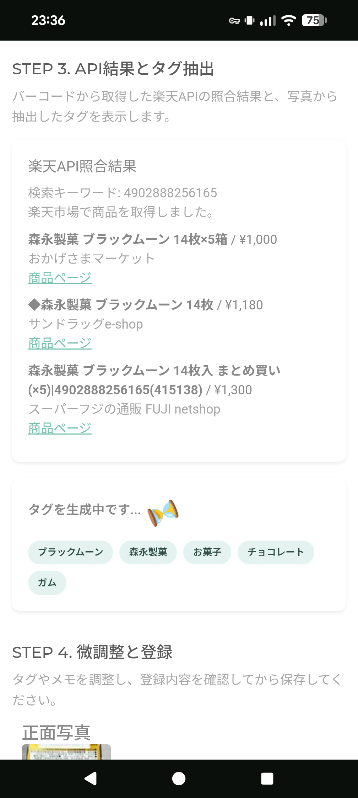
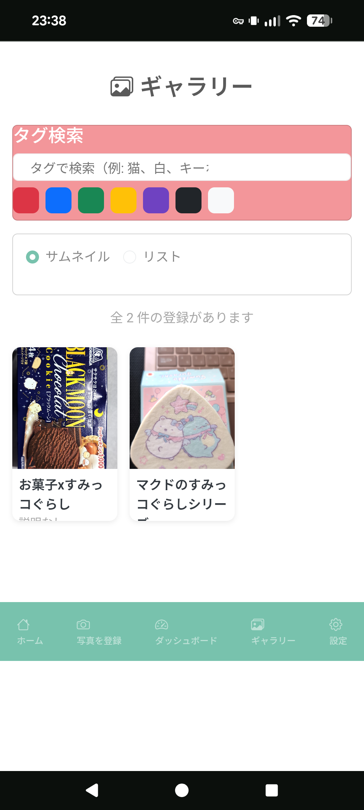
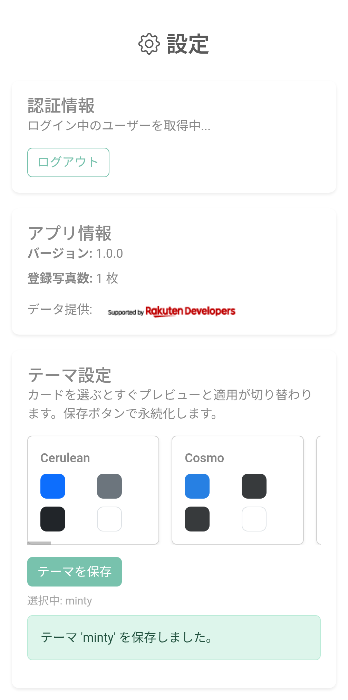
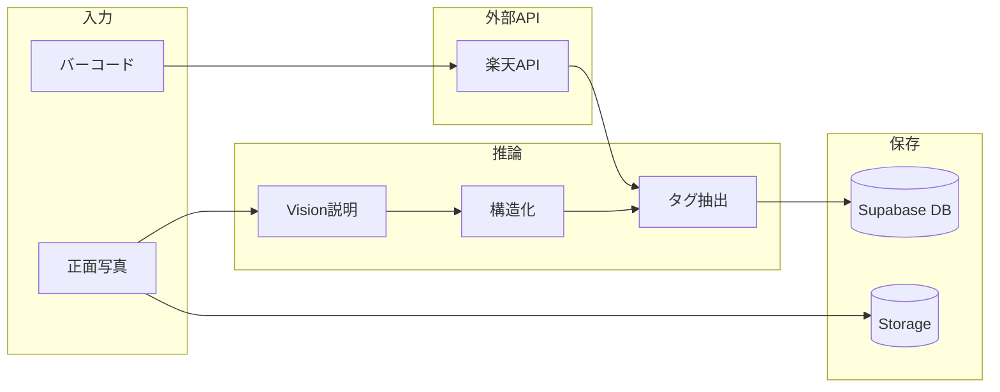

# 推し活グッズ管理アプリ

推し活で手に入れたグッズを、バーコード・写真から登録・検索できるモバイル向け Web アプリ。外部 API と Vision 推論で製品情報を自動補完し、ユーザー単位でデータを保存・分析しやすい形で保持する。

## ターゲット層

- 10代後半～30代の女性
- 機能だけではなく、文房具のように可愛くお洒落に使用したい層
- 推し活疲れにならずに無理なく長期的に推し続ける環境を作る

## 解決したい課題

- **重複購入を減らす**
  - 外出先でも「持っているか」をすぐ確認できる状態にする（スマホ前提）
- **登録の手間を減らす**
  - バーコード・写真を起点に、入力を最小化して継続できる登録体験にする
- **コレクションを“管理できるデータ”にする**
  - シリーズ/ガチャの所持状況、特典、購入情報などを後から集計・分析できる形で蓄積する
  - 「管理＝推しへの貢献度」を表現できるような空間作りをする
- **現実の収納場所と紐づけて探せるようにする**
  - 収納ケース/ディスプレイ/デジタル・アナログなど、所在の違いを吸収して検索できるようにする

---

## 開発背景

- **開発経緯**: 「大阪AIハッカソン2025」に参加した際の作品を改良中
  - テーマ：[IO intelligence×AIで創る社会課題解決プロダクト](https://osaka-ai-hackathon.connpass.com/event/366856/)
- **目的**: グッズ登録を「撮影・スキャン中心」にし、入力負担を下げつつ、登録データを分析可能な形で蓄積する。
- **データの流れ**: バーコード → 楽天 API 照合（正規化済み商品情報）、写真 → Vision（画像説明・構造化）→ タグ抽出 → Supabase（DB + Storage）に保存。欠損時もフォールバックで登録を継続できる設計。
- **データ設計**: DB は `owner_id`（= `auth.uid()`）で行レベル分離（RLS）。Storage は Private バケットで object path を保存し、表示時のみ signed URL を発行。時系列・タグ・価格・作品情報などを将来のダッシュボード・分析に利用しやすいスキーマ。
- **認証・運用**: Supabase Auth（Google OAuth、app_state + PKCE）、セッションは HttpOnly Cookie。Docker で Render にデプロイ可能。

---

## デモ・スクリーンショット

- **デモ URL**※コールドスタート：[https://oshi-app-1.onrender.com](https://oshi-app-1.onrender.com)

### スクリーンショット

<p>
  <a href="./docs/images/screenshot_flow.png"></a>
  <a href="./docs/images/screenshot_camera.png"></a>
  <a href="./docs/images/screenshot_tag.png"></a>
  <a href="./docs/images/screenshot_gallery.png"></a>
  <a href="./docs/images/screenshot_theme.png"></a>
</p>

---

## 1. できること

### 実装済み

- 登録フロー 3 ステップ: バーコード（スキャン/アップロード/手入力）→ 正面写真（撮影/アップロード）→ 確認・登録。スキップ可で次へ自動遷移。
  - **※フロー3種類の内、登録可能なフローは、真ん中の「グッズ登録（写真・タグ付け）」のみ**
- 楽天 API によるバーコード照合と商品情報の取得・正規化（[services/barcode_lookup.py](services/barcode_lookup.py)）。
- 画像説明・構造化: IO Intelligence Vision で日本語説明と構造化データ（キャラ名・作品・形状・色など）を取得（[services/io_intelligence.py](services/io_intelligence.py)）。
- タグ抽出: 楽天候補と画像説明から検索用タグを生成（禁止語フィルタ・フォールバックあり）（[services/tag_extraction.py](services/tag_extraction.py)）。
- Supabase 連携: 認証（Google OAuth）、DB（RLS でユーザー単位に分離）、Storage（Private バケット、表示時 signed URL）。未設定時は UI のみ動作し、保存・ギャラリー・テーマ永続化は無効。
- 写真一覧（登録済みカード）、設定（テーマ切替・登録件数・全データ削除）。
- バーコード検出: pyzbar + Pillow。ブラウザカメラは getUserMedia。

### 予定（仕様ベース）

- 「ダッシュボード」のページは、全てデモ状態
- グッズの重複を避ける
  - バーコードを読み取り時に、既に購入済みかを判定する
  - バーコードが存在しないガチャ等も既に購入済みか判定する
  - タグ付けを自動抽出・自動配置で登録の負担を減らす
- シリーズ物やガチャのコンプリート管理・特典管理
  - シリーズとしてギャラリーで管理できるようする
  - キャンペーンのように購入前から、予定として管理する
- 現実の収納場所の管理
  - ディスプレイや収納ケース、デジタル・アナログ等、様々な場所に収納されている情報を管理
  - 例：電子書籍と実際の本での重複所持防止
- 重複したグッズの交換やメルカリ等への販売管理
  - グッズの「求」・「譲」のテンプレートを簡単に提示して、SNSやリアルでのコミュニケーションに役立てる
  - メルカリ等への出荷管理
  - ダッシュボードで、一目で把握可能にする
- スマホの中で広がる推し空間の実現
  - 自分の推しのグッズを一覧で閲覧し、推しに関する情報を一纏めにする
  - ダッシュボードと詳細ギャラリーを組み合わせて、推しの空間を実現する

### やらないこと

- EC機能（決済）

---

## 2. 技術スタック

| 区分                    | 技術                                                                                                                                 |
| ----------------------- | ------------------------------------------------------------------------------------------------------------------------------------ |
| **Backend**             | Flask、Dash（Pages）、Gunicorn（本番）。エントリは [server.py](server.py)。                                                          |
| **Auth / DB / Storage** | Supabase（Auth: Google OAuth, app_state+PKCE, HttpOnly Cookie / Postgres + RLS / Storage Private + signed URL）。                    |
| **Data**                | 楽天 API（バーコード・キーワード照合）、IO Intelligence（Vision 説明・構造化、LLM タグ抽出）。データの正規化・禁止語フィルタは自前。 |
| **デプロイ**            | Docker、Render（docker_web_service）。                                                                                               |

### 利用バージョン

- **Python**: 3.11（Docker は `python:3.11-slim`）
- **主要 Python 依存（抜粋）**（詳細は [requirements.txt](requirements.txt)）
  - Dash: `>=3.0.0` / Flask: `>=2.0.0` / Gunicorn: `>=20.0.0`
  - Supabase SDK: `2.22.1`（互換性崩れ回避のため固定）
  - Pillow: `>=8.0.0` / pyzbar: `>=0.1.8`

### 外部ツール / 外部サービス

- **ZBar（ネイティブ依存）**: バーコード検出用。Docker では `libzbar0` を導入済み。ローカルは OS ごとにインストールが必要。
- **Supabase**: Auth（Google OAuth, app_state+PKCE, HttpOnly Cookie）/ Postgres（RLS）/ Storage（Private + signed URL）。
- **楽天 API**: 商品候補の取得（IchibaItem/Search/20220601）。`RAKUTEN_APPLICATION_ID` の設定が必要。
- **IO Intelligence API**: Vision（画像説明・構造化）/ LLM（タグ抽出）。エンドポイントは `https://api.intelligence.io.solutions/api/v1/chat/completions`。

### 使用技術の選定理由

- Python（フレームワーク：Dash）
  - 当時、Pythonを学習中で、Pythonのみで複数ページを作成可能だったため
  - 本当は、グッズ登録後のダッシュボード（推し空間と収納場所・グッズ重複管理）に力を入れたかったため
  - ハッカソンのために短期間で開発する必要があったため
    - フロント・バックの両方をPythonのみで作成可能なプロトタイプ向けだったため
- Flask
  - Dashは、Flaskをベースに作成されているので、親和性が高い
  - 認証を入れる際に、Flaskで入口を保護するのが安全だったため
- 楽天 API
  - 類似のグッズ管理アプリの競合を調査する中で、一番使用されていたAPIだったため
  - 商用利用時は、事前連絡必要（ポートフォリオ段階では、無料利用）
- Supabase・Render
  - 個人開発の際に、無料枠で利用可能なため
- UI：BootstrapのBootswatchテーマ
  - 推し活は、推しに合わせて、色を変更できる事が重要な要素となる
    - 普通のグッズ管理アプリでは、ライトとダークモードくらいしか無いため、差別化に繋がる
  - 簡単にアプリの雰囲気を変更するために、既存のBootswatchテーマを使用

---

## 3. データ設計（分析の土台）

- **主要エンティティ**: `photo`（サムネ・高解像の object path）、`registration_product_information`（製品情報・バーコード・価格・タグ・日付など）、`color_tag` / `category_tag`（ユーザー定義タグ）、`theme_settings`（テーマ永続化）。いずれも `owner_id`（= `auth.uid()`）でユーザー分離。
  - 【現状】ユーザー別のタグは、複数種類考えているが、デモ状態のままの物多数
- **保存方針**: 画像は Storage の **object path**（例: `{members_id}/{uuid}.jpg`）のみ DB に保存。公開 URL は保存せず、表示時に **signed URL** を発行（[services/photo_service.py](services/photo_service.py) の `create_signed_url_for_object`）。
- **RLS**: [supabase/sql/owner_rls_setup.sql](supabase/sql/owner_rls_setup.sql) で `registration_product_information`, `photo`, `theme_settings`, `color_tag`, `category_tag` に RLS を有効化し、自分の行のみ select/insert/update/delete。
- **分析への繋がり**: 作成日時・タグ・価格・作品/キャラ情報・バーコードなどを構造化して保存しているため、後の集計・可視化・ダッシュボード実装にそのまま利用可能。
  - 【現状】項目としては、作成しているが、自動で抽出して表示までは、未実装

---

## 4. セキュリティ・マルチテナント

- **認証**: Supabase Auth。Google OAuth は app_state を Cookie に持ち、PKCE で code 交換。セッションは HttpOnly Cookie に保存。`localhost` と `127.0.0.1` を混在させない（Cookie 不整合の原因）。
- **DB**: 全テーブルに `owner_id` を付与し、RLS で `owner_id = auth.uid()` の行のみアクセス可能。
- **Storage**: `photos` バケットは Private。アップロードは `{members_id}/{uuid}.ext`。取得・表示は signed URL のみ。

---

## 5. データ生成パイプライン（外部 API + ML）



- **バーコード → 楽天**: バーコードまたはキーワードで検索。レスポンスを正規化（商品名クリーニング、ブランド/シリーズ抽出）。認証未設定時は `missing_credentials`、通信失敗時は `error` を返し、UI はスキップ/手入力で継続可能。
- **写真 → Vision**: 画像（data URI / base64）を IO Intelligence Vision に送り、日本語説明と構造化データを取得。複数ペイロード・モデルでフォールバック。API キー未設定時は `missing_credentials` を返す。
- **タグ抽出**: 楽天候補テキストと画像説明から LLM でタグを抽出（禁止語除外・最大件数・ヒューリスティック補完あり）。画像のみ・楽天のみ・両方の組み合わせに対応。

---

## 6. クイックスタート

### 要件

- Python 3.11 推奨。バーコード検出用に **zbar** が必要。
  - macOS: `brew install zbar`
  - Ubuntu/Debian: `sudo apt-get update && sudo apt-get install libzbar0`
  - Windows: [ZBar Windows 版](http://zbar.sourceforge.net/) をインストール

### 手順

```bash
# 仮想環境
python -m venv .venv
# Windows (PowerShell):
.\.venv\Scripts\Activate.ps1
# macOS/Linux:
source .venv/bin/activate

# 依存関係（python -m pip で launcher エラーを回避）
python -m pip install --upgrade pip setuptools wheel
python -m pip install -r requirements.txt

# .env を作成し、必須項目を設定（下記）
# 起動
python server.py
```

- `pip install` で launcher エラーが出る場合は、仮想環境を作り直して `python -m pip ...` を使用してください。
- ブラウザ: `http://127.0.0.1:8050`（`localhost` と混在させない）
- スマホ: `http://<PCのIP>:8050`

### 必須環境変数（.env）

Supabase を使う場合（保存・ギャラリー・認証を有効にする場合）:

| 変数名                                    | 説明                                                                                   |
| ----------------------------------------- | -------------------------------------------------------------------------------------- |
| `PUBLIC_SUPABASE_URL`                     | Supabase の Project URL                                                                |
| `PUBLIC_SUPABASE_PUBLISHABLE_DEFAULT_KEY` | Publishable key（API Keys から取得）                                                   |
| `APP_BASE_URL`                            | アプリの URL（ローカル: `http://127.0.0.1:8050`、本番: 例 `https://xxx.onrender.com`） |
| `SECRET_KEY`                              | Flask 用ランダム文字列                                                                 |
| `COOKIE_SECURE`                           | 本番は `true`、ローカルは `false`                                                      |
| `COOKIE_SAMESITE`                         | `Lax` 推奨                                                                             |

例:

```
PUBLIC_SUPABASE_URL=https://<project-ref>.supabase.co
PUBLIC_SUPABASE_PUBLISHABLE_DEFAULT_KEY=sb-publishable-...
APP_BASE_URL=http://127.0.0.1:8050
SECRET_KEY=ランダム文字列
COOKIE_SECURE=false
COOKIE_SAMESITE=Lax
```

- Supabase を設定しない場合: UI は起動するが、保存・ギャラリー取得・テーマ永続化は無効。
- 楽天・Vision 用: `RAKUTEN_APPLICATION_ID`、`IO_INTELLIGENCE_API_KEY` を設定すると照合・タグ生成が有効。未設定時は該当機能がスキップまたは手入力で継続。
- 詳細な環境変数情報: [.env.example](.env.example) を参照。

---

## 7. Docker / Render でのデプロイ

```bash
cp .env.example .env
# .env を編集（上記の必須変数＋必要に応じて RAKUTEN_APPLICATION_ID, IO_INTELLIGENCE_API_KEY など）

docker build -t oshi-app .
docker run -d --name oshi-app -p 8050:8050 --env-file .env oshi-app
```

または Docker Compose:

```bash
cp .env.example .env
docker-compose up -d
```

- Web Service は Docker（Dockerfile） で作成（GitHub連携なら push で自動デプロイ）
- Environment Variables に `PUBLIC_SUPABASE_URL`, `PUBLIC_SUPABASE_PUBLISHABLE_DEFAULT_KEY`, `APP_BASE_URL`, `SECRET_KEY`, `COOKIE_SECURE=true`, `COOKIE_SAMESITE=Lax` などを設定

---

## 8. 既知の制約・トラブルシュート

- Supabase 未設定時は UI のみ動作。保存・ギャラリー・テーマ永続化は無効。環境変数を設定すると有効になる。
- 認証でループする場合: `APP_BASE_URL` とブラウザのアクセス URL を `http://127.0.0.1:8050` に統一し、Supabase の Redirect URLs に `http://127.0.0.1:8050/auth/callback` が含まれているか確認。`AUTH_DEBUG=1` でログ確認可能。

---

## 9. ディレクトリ構成（主要）

```
├── app.py                 # Dash 定義（Flask サーバは server.py で作成）
├── server.py              # エントリ（Flask + Dash）
├── components/            # レイアウト・ナビ・各ページの UI
├── features/              # 登録フロー等のコールバックロジック
├── services/              # Supabase、楽天 API、Vision、タグ抽出、写真 CRUD
│   ├── supabase_client.py
│   ├── barcode_lookup.py  # 楽天 API 照合
│   ├── io_intelligence.py # Vision 説明・構造化
│   ├── tag_extraction.py  # タグ抽出
│   └── photo_service.py   # Storage アップロード・signed URL・DB CRUD
├── assets/                # styles.css, camera.js
├── supabase/              # マイグレーション・RLS 用 SQL
├── cursor.md              # Cursorから開発者へのメモ（起動・認証・環境変数・不具合）
└── requirements.txt
```

---

# license

© 2026 Kazeneko.  
All Rights Reserved.  
本ポートフォリオの内容（コード、文章、画像、設計資料等）の無断利用・転載・改変を禁止します。
