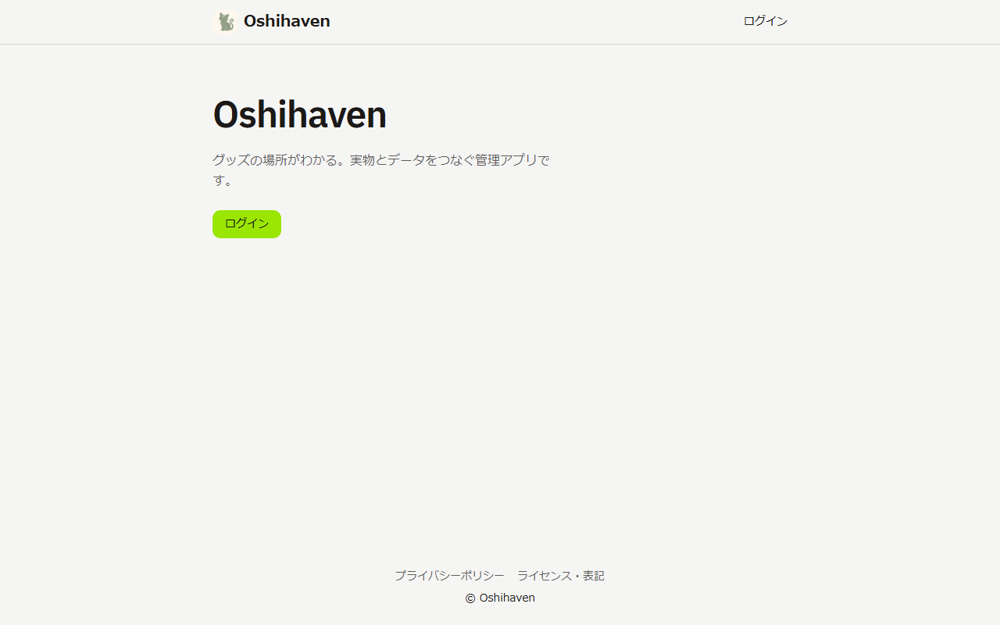
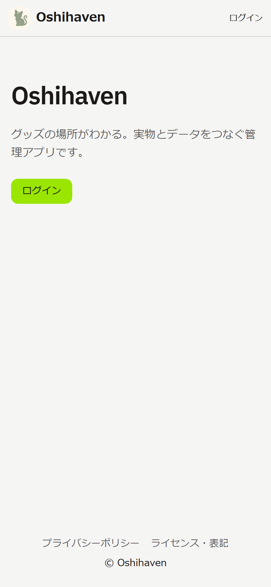
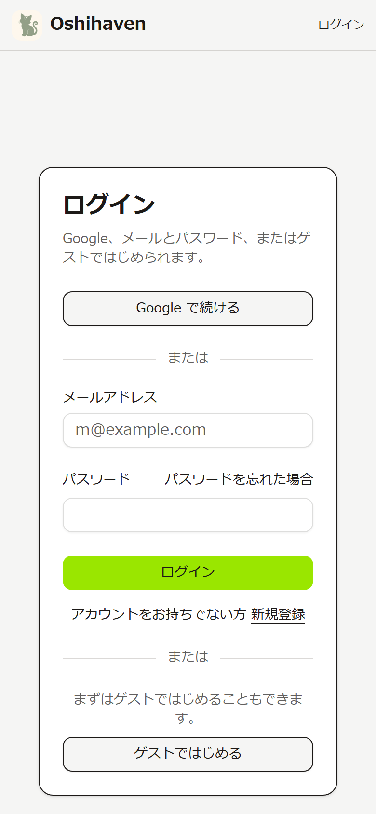
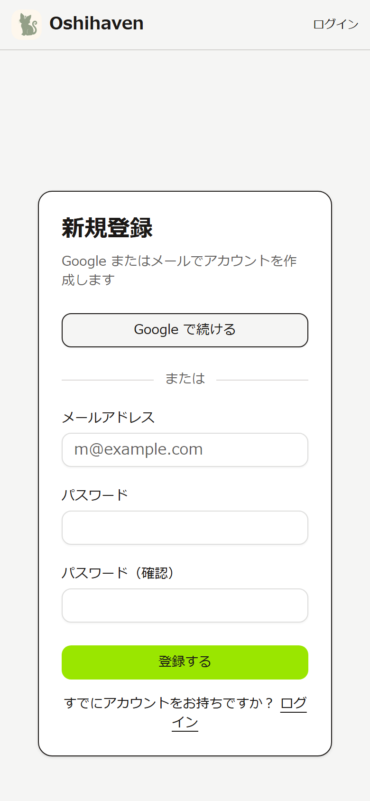
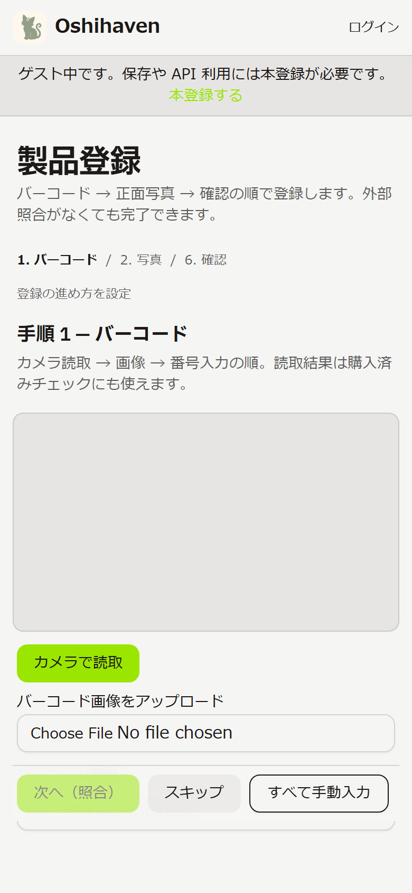

# Oshihaven

**推し活グッズの「場所」がわかる。** 実物の収納とデータをつなぐ管理アプリです。

| | |
|---|---|
| 製品 | [Oshihaven](https://oshihaven.com) |
| 技術名 | リポジトリ / パッケージは `oshi-app` |
| 作者・IP | 風ねこ / Kaze Neko（製品ブランドとは分離） |
| ライセンス | [LICENSE](LICENSE) — Copyright (c) 2026 neko-rr. **All Rights Reserved** |

<p align="center">
  
</p>

<p align="center">
  
  &nbsp;
  
  &nbsp;
  
  &nbsp;
  
</p>

---

## 解決したい課題

| 課題 | 方針 |
|------|------|
| 外出先で「もう持ってる？」が分からない | スマホ前提で、所持をすぐ確認できる一覧・検索 |
| 登録が面倒で続かない | バーコード・正面写真起点で入力を最小化 |
| グッズが「思い出」のままで集計できない | タグ・価格・作品情報などを構造化して蓄積 |
| 実物の置き場とデータがつながらない | 収納場所タグで所在を残し、ギャラリーからたどる |

**ターゲット:** 10代後半〜30代。機能だけでなく、推しに合わせて見た目を寄せながら長く使える道具であること。

**やらないこと:** EC・決済。

---

## 開発背景（プロトタイプ → 本リポジトリ）

大阪 AI ハッカソン 2025（テーマ: IO intelligence × AI で社会課題解決）の作品を起点に、個人開発として継続しています。

| 段階 | リポジトリ | スタック |
|------|------------|----------|
| プロトタイプ（検証） | **[oshi-app-prototype](https://github.com/neko-rr/oshi-app-prototype)** | Dash / Flask + Supabase |
| **本線（v2）** | **このリポジトリ** | Next.js + FastAPI + Supabase |

プロトタイプで価値仮説（登録負担の低減・RLS・楽天照合・Vision アシスト）を確かめ、長期運用を見据えて **UI と業務 API を分離**し直したのが本リポです。  
Dash 時代のコードを正本にはしません。経緯・当時の設計メモはプロトタイプ側 README を参照してください。

> プロトタイプの Render デモ URL は、バックエンドを本線と共有しているため **掲載しません**。動く製品は [https://oshihaven.com](https://oshihaven.com) を見てください。

---

## 技術ハイライト

短期間のハッカソン成果を、**境界のはっきりしたプロダクト**へ持ち直した点が中心です。

- **認証の正は Supabase Auth のみ。** Web は Cookie（`@supabase/ssr`）、API は `Authorization: Bearer` + **JWKS（非対称）**。Legacy JWT Secret に依存しない
- **マルチテナントは `members_id`（= JWT `sub`）+ RLS。** クライアントに service_role / JWT 秘密を載せない
- **業務ロジックは `apps/api` の `services/`。** Web は画面とセッション、Mobile は同一 Bearer 契約（Expo は枠のみ）
- **登録アシスト:** バーコード → 楽天 API 照合、写真 → Vision 構造化・タグ提案（キー未設定時は手入力で継続可能）
- **品質:** API は pytest、登録はフィクスチャ契約 + Playwright E2E（外部 API は mock）。CI で秘密検査・typecheck・デザイン検査・docs ドリフトも実行
- **運用想定:** API は Render、Web は Cloudflare。env 契約は [docs/deploy/env-contract.md](docs/deploy/env-contract.md)

### 現在のスタック

| 層 | 技術 | 配置 |
|----|------|------|
| Web | Next.js（App Router）+ next-intl | `apps/web` |
| API | FastAPI | `apps/api` |
| Auth / DB / Storage | Supabase（Auth・Postgres RLS・Private Storage + signed URL） | `supabase/` |
| Shared | パス定数・共有型（JSON は snake_case） | `packages/shared` |
| Mobile | Expo（枠・デザイン契約） | `apps/mobile` |

**v2 Must 本線**（登録・一覧・詳細・設定・認証・楽天）は一通り利用可能。詳細は [docs/product/v2_status.md](docs/product/v2_status.md)。

---

## できること（要約）

**実装済み（本線）**

- 登録ウィザード（バーコード / 正面写真 / 確認）。楽天照合・Vision アシスト
- ギャラリー（検索・カラータグ / カテゴリ / 収納の絞り込み・一括変更・保存ビュー）
- タグ設定（カラー・カテゴリ・収納場所）、テーマ色・文字パックなどの見た目設定
- Google / メール認証、ゲスト開始と本登録ゲート、データ書き出し・退会
- ダッシュボード（カラータグ割合など。深掘り分析は Phase 2）

**これから（要求に応じて）**

- 重複購入の本格判定、シリーズ / ガチャのコンプリート管理
- モバイル本番、支出分析の拡張、推し空間まわり（Later）

---

## リポジトリ構成

```text
apps/web         Next.js（Auth UI + 画面）
apps/api         FastAPI（JWKS で JWT 検証 + 業務 API）
apps/mobile      Expo（枠のみ）
packages/shared  共有型・API パス
supabase/        migrations / RLS
docs/product     製品仕様（価値・ロードマップ）
docs/db          スキーマ正本の人間向け入口
.cursor/rules    エージェント用ルール（*.mdc）
```

共同作業・別セッションの入口は **[AGENTS.md](AGENTS.md)**。

---

## セットアップ

**前提:** Node.js 24+ / pnpm 10+ / Python 3.11+

```powershell
pnpm install
cd apps/api
python -m venv .venv
# Windows:
.\.venv\Scripts\Activate.ps1
# macOS/Linux: source .venv/bin/activate
pip install -r requirements.txt
cd ../..
```

環境変数（**実値は Git に入れない**）:

| ファイル | 用途 |
|----------|------|
| `apps/web/.env.local` | `NEXT_PUBLIC_SUPABASE_URL` / `PUBLISHABLE_KEY` / `API_BASE_URL` |
| `apps/api/.env` | `SUPABASE_URL` / `PUBLISHABLE_KEY` /（任意）`JWKS_URL` |

例は各 `.env.example`。ルートの `.env` は API からは読まない。  
ホスト別の必須／禁止一覧: [docs/deploy/env-contract.md](docs/deploy/env-contract.md)

### 起動

```powershell
pnpm dev:api    # apps/api/.venv の Python を自動使用
pnpm dev:web
```

- Web: http://127.0.0.1:3000
- API: http://127.0.0.1:8000/health

### テスト

```powershell
pnpm test:api
pnpm test:register-contract   # 登録フィクスチャ契約 + ZXing
pnpm test:register-e2e        # ウィザード（合成画像。API は mock）
```

ルートで素の `python -m pytest` を使うと venv 外になり失敗しやすい。**必ず `apps/api/.venv` 経由**。  
登録テストの層: [docs/product/register_e2e.md](docs/product/register_e2e.md)

---

## 認証（要約）

- Web: `@supabase/ssr` + Cookie
- API: Bearer + **JWKS**（Legacy JWT Secret は使わない）
- Supabase Dashboard で JWT Signing Keys を有効化し、JWKS の `keys` が空でないこと
- 詳細: `.cursor/rules/auth.mdc`

クラウド側の人手作業: [docs/WAKE_UP.md](docs/WAKE_UP.md)

---

## ドキュメント地図

| 読むもの | 内容 |
|----------|------|
| [AGENTS.md](AGENTS.md) | 絶対ルール・用途マップ |
| [docs/README.md](docs/README.md) | 文書の更新区分（手 / 自動 / エージェント） |
| [docs/product/README.md](docs/product/README.md) | 製品仕様 |
| [docs/db/README.md](docs/db/README.md) | DB・スキーマ |
| [docs/design/README.md](docs/design/README.md) | デザイン（入口: [DESIGN.md](DESIGN.md)） |
| [oshi-app-prototype](https://github.com/neko-rr/oshi-app-prototype) | ハッカソン由来の旧プロトタイプ |
